# CHAOS_ENGINEERING_PLAN — Honest Fault Injection

**Layer:** PURIQ v12 → `resilience_observability/`
**Author:** Yachay (SZL reliability agent), under CTO authority
**Date:** 2026-06-01
**Doctrine:** v12 (= v11 + PURIQ). v11 LOCKED numbers preserved (749/14/163, 13-axis
`yuyay_v3`, replay-hash `bacf5443…631fc5`). SLSA L1 (honest); Khipu sig DSSE PLACEHOLDER.
**Tech:** LitmusChaos + Chaos Mesh, scheduled under UDS Core (k3d/k8s).

> We do not *assume* the degradation paths work — we *prove* them by breaking the system
> on purpose and asserting the documented fallback fired. Every chaos experiment has a
> **steady-state hypothesis**, a **blast-radius limit**, an **abort condition**, and a
> **Khipu receipt** of the run. A regression (a documented fallback that did NOT fire)
> raises an alarm and burns no production trust. No theater — real fault injection.

---

## 0 — Principles (Zero-Bandaid chaos)

1. **Hypothesis-first.** Each experiment states the steady state it expects to hold *even
   while the fault is injected* (e.g. "a11oy keeps serving answers at the T0/T1 tier with
   `degraded:true` while all providers are rate-limited").
2. **Bounded blast radius.** Faults are scoped to one flagship / one dependency at a time,
   with an automatic **abort** if SLO burn exceeds the experiment budget.
3. **Observed via the single pane.** Every experiment reads its verdict from Prometheus
   (`OBSERVABILITY_DASHBOARD.md`) — the fallback metric must move the way the degradation
   path says it should.
4. **Receipted.** Each run emits a `szl.chaos.receipt/v1` to the Khipu DAG: experiment id,
   target, injected fault, hypothesis result (HELD / VIOLATED), and the metrics snapshot.
5. **Regression = alarm.** If a previously-passing experiment fails, Alertmanager pages
   and the weekly autonomous run marks the regression in the dashboard.

---

## 1 — Experiment catalog

| ID | Experiment | Fault | Tool | Target | Steady-state hypothesis | Maps to |
|---|---|---|---|---|---|---|
| CE-1 | **Random Space-kill** | pod-kill / container-kill | Chaos Mesh `PodChaos` | one HF Space pod (or its UDS-bundle pod) | status page shows static fallback + cached snapshot within 30s; recovers when pod returns | D1 |
| CE-2 | **Random LLM-provider rate-limit** | inject 429 at the provider boundary | Litmus HTTP-chaos / Chaos Mesh `HTTPChaos` (replace→429) | one or all `llm_provider.*` | router serves T0→T1→honest-error; `szl_router_tier_total{tier="T0_cache"}` rises; no fabricated success | D2 |
| CE-3 | **Random network partition** | network-partition / loss / latency | Chaos Mesh `NetworkChaos` | between a11oy↔amaru, a11oy↔vessels, edge↔cloud | breakers OPEN; degraded badges; Khipu ingest buffers; reconcile on heal | D5, D7, breakers |
| CE-4 | **GPS spoof simulation** | INS/GPS innovation residual injected in the killinchu edge twin (SITL) | custom Litmus experiment driving the PX4/ArduPilot SITL | killinchu edge sim | INS-only mode engages, mission halts, RTL commands on last trusted home | D6 |
| CE-5 | **RF jam simulation** | drop the `sat_link` API + mesh-LTE bearer in the edge sim | Chaos Mesh `NetworkChaos` (drop) on the backhaul interface | killinchu edge sim | failover Starlink→mesh-LTE→store-and-forward; reconcile backlog drains on heal | D7 |
| CE-6 | **Expired-cert injection** | swap a TLS cert for an expired one on a service endpoint | Litmus cert-chaos / k8s secret swap | one internal mTLS endpoint | calling service's breaker OPENs on TLS failure → fallback; alarm; no silent insecure fallback | breakers, THREAT_MODEL Tampering |
| CE-7 | **Key-rotation drill** | rotate HF/GitHub/AI token mid-flight | scripted rotation under Litmus | ship pipeline + dependent Spaces | pushes degrade to D3 queue during rotation, drain after; token_leak/rotation receipts emitted | D3, D9 |

**Honest scoping for edge experiments (CE-4, CE-5).** GPS spoof and RF jam are injected
against the **killinchu edge software-in-the-loop (SITL) simulator**, not live airframes.
The SITL runs the *same* vendored anatomy + `P(x,t)` core, so the governance behaviour
under fault is real even though the hardware is simulated. We state this plainly — we do
not claim live-fire chaos we have not done.

---

## 2 — Example experiments (manifests)

### CE-1 — Random Space-kill (Chaos Mesh `PodChaos`)

```yaml
# chaos/ce1_space_kill.yaml — Chaos Mesh
apiVersion: chaos-mesh.org/v1alpha1
kind: PodChaos
metadata:
  name: ce1-space-kill
  namespace: szl-chaos
  annotations:
    szl.doctrine: "v12"
    szl.hypothesis: "status page serves static fallback + cached snapshot within 30s"
spec:
  action: pod-kill
  mode: one                      # blast radius = exactly one pod
  selector:
    namespaces: ["szl-flagships"]
    labelSelectors:
      app.kubernetes.io/instance: "amaru"   # rotate target weekly
  duration: "60s"
```
Verdict probe (read from Prometheus, asserted by the runner):
`szl_up{flagship="amaru"}` goes 0 → fallback panel renders → returns 1 within recovery SLO.

### CE-2 — LLM provider rate-limit (Chaos Mesh `HTTPChaos`)

```yaml
# chaos/ce2_llm_429.yaml — Chaos Mesh HTTPChaos: force 429 on a provider egress
apiVersion: chaos-mesh.org/v1alpha1
kind: HTTPChaos
metadata: { name: ce2-llm-429, namespace: szl-chaos }
spec:
  mode: all
  selector:
    namespaces: ["szl-flagships"]
    labelSelectors: { app.kubernetes.io/instance: "a11oy" }
  target: Request
  port: 443
  patch:
    statusCode: 429            # rate-limited
  duration: "120s"
```
Verdict: `szl_router_tier_total{tier=~"T0_cache|T1_small"}` increases; zero responses
without `degraded:true`; if T0 misses and T1 unavailable, an honest error is returned
(asserted by the runner hitting `/v1/router` and checking the `degraded`/`error` shape).

### CE-4 — GPS spoof (Litmus custom experiment against SITL)

```yaml
# chaos/ce4_gps_spoof.yaml — LitmusChaos ChaosEngine driving the killinchu SITL
apiVersion: litmuschaos.io/v1alpha1
kind: ChaosEngine
metadata: { name: ce4-gps-spoof, namespace: szl-chaos }
spec:
  appinfo: { appns: szl-edge-sim, applabel: "app=killinchu-sitl", appkind: deployment }
  chaosServiceAccount: litmus-admin
  experiments:
    - name: szl-gps-spoof          # custom experiment: injects GPS innovation residual
      spec:
        components:
          env:
            - { name: SPOOF_MODE, value: "position-jump" }
            - { name: DURATION,   value: "90" }
        probe:
          - name: ins-mode-engaged
            type: cmdProbe          # asserts edge telemetry shows INS-only + halt + RTL
            cmdProbe/inputs:
              command: "curl -s $SITL/telemetry | jq -e '.nav_mode==\"INS_ONLY\" and .rtl_armed==true'"
            mode: Continuous
```
Verdict: telemetry shows `nav_mode=INS_ONLY`, mission halted, `rtl_armed=true`; a
`gps_spoof_detected` Khipu receipt appears on the local chain and reconciles.

---

## 3 — Schedule (weekly autonomous run + alarms on regression)

```mermaid
gantt
    title SZL Chaos — weekly autonomous cadence (UDS-scheduled)
    dateFormat  HH:mm
    axisFormat  %H:%M
    section Sunday 02:00 (low-traffic window)
    CE-1 Space-kill (rotating target)      :a1, 02:00, 8m
    CE-2 LLM rate-limit                     :a2, after a1, 8m
    CE-3 Network partition                  :a3, after a2, 10m
    section Sunday 02:30
    CE-4 GPS spoof (SITL)                   :b1, 02:30, 8m
    CE-5 RF jam (SITL)                      :b2, after b1, 8m
    CE-6 Expired-cert injection             :b3, after b2, 6m
    section Sunday 03:00
    CE-7 Key-rotation drill                 :c1, 03:00, 10m
    Report + regression diff                :c2, after c1, 10m
```



- **Cadence:** weekly, Sunday 02:00–03:20 (low-traffic window), driven by a UDS-scheduled
  Argo/CronJob `Workflow` (or a `pplx-tool schedule_cron` job that triggers the runner).
- **Target rotation:** CE-1/CE-3 rotate their target flagship each week so coverage is
  even over a quarter.
- **Abort guard:** every run watches the live SLO burn; if production error budget burn
  exceeds the per-experiment budget, the experiment is **aborted immediately** (Chaos Mesh
  `pause` / Litmus abort) and the partial run is receipted as `ABORTED`.
- **Regression detection:** the runner diffs each experiment's HELD/VIOLATED verdict
  against the last green run. Any HELD→VIOLATED transition pages on-call (SEV-3, SEV-2 if
  the violated path is a11oy or killinchu safety) and is flagged red on the dashboard.

### Runner verdict receipt

```jsonc
// szl.chaos.receipt/v1
{
  "schema": "szl.chaos.receipt/v1",
  "experiment_id": "CE-2",
  "run_at": "2026-06-07T02:08:00Z",
  "target": "a11oy",
  "fault": "llm_all_providers_rate_limited",
  "hypothesis": "router serves T0/T1/honest-error with degraded:true",
  "result": "HELD",               // HELD | VIOLATED | ABORTED
  "metrics_snapshot": {
    "router_tier_T0_cache_delta": 41,
    "responses_without_degraded_flag": 0,
    "honest_errors": 3
  },
  "blast_radius": "single-flagship",
  "aborted": false,
  "doctrine": "v12",
  "dsse": { "sig": "PLACEHOLDER — Sigstore CI not wired", "keyid": "PENDING" }
}
```

---

## 4 — Maturity ladder (honest about where we are)

| Stage | Capability | Status (2026-06-01, honest) |
|---|---|---|
| 0 | Manual game-day fault drills | doable now (run a manifest by hand) |
| 1 | Automated single-fault experiments under UDS | **target for first autonomous run** |
| 2 | Weekly autonomous schedule + regression alarms | planned (this doc defines it) |
| 3 | Multi-fault / correlated chaos (e.g. partition + provider down) | future, after Stage 2 is green ≥ 4 weeks |
| 4 | Continuous (production-traffic) chaos with auto-rollback | aspirational; not claimed |

We do not claim we are at Stage 4. The plan ships Stage 1→2; the manifests above are real
Chaos Mesh / Litmus CRDs that run under the UDS k3d cluster from the UDS Run Guide.

---

*Cited internal sources:* `DEGRADATION_PATHS.md` (the paths under test),
`OBSERVABILITY_DASHBOARD.md` (verdict metrics), `530_ENV_PLAN_AND_UDS_DOCS.md` +
`83_UDS_RUNNING_DEPLOYMENT_PLAN.md` (UDS/k3d), `killinchu/architecture/KILLINCHU_FULL_STACK_ARCHITECTURE.md`
(edge SITL + reconcile), `INCIDENT_RESPONSE_RUNBOOK.md` (paging on regression).

— Yachay (SZL reliability agent), under CTO authority — Doctrine v12, additive over v11 LOCKED.
