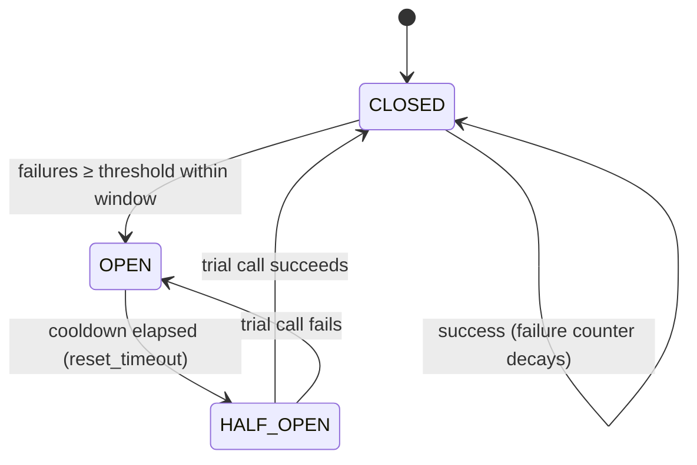

# CIRCUIT_BREAKER_LAYER — Hystrix-style breakers around every external call

**Layer:** PURIQ v12 → `resilience_observability/`
**Author:** Yachay (SZL reliability agent), under CTO authority
**Date:** 2026-06-01
**Doctrine:** v12 (= v11 + PURIQ). v11 LOCKED numbers preserved (749/14/163, 13-axis
`yuyay_v3`, replay-hash `bacf5443…631fc5`). SLSA L1 (honest); Khipu sig DSSE PLACEHOLDER.
**Scope:** ADDITIVE. Breakers wrap calls; they never alter the 13-axis gate math.

> Every call that leaves an SZL process — Hugging Face Hub, GitHub, LLM providers,
> satellite/ground-link APIs, NVIDIA NIMs — is wrapped in a **circuit breaker** with a
> **per-call timeout**, a **bounded retry budget**, and a **named fallback** that maps to
> a path in `DEGRADATION_PATHS.md`. When a breaker opens, the fallback runs and a Khipu
> degradation receipt is emitted. No external call is unguarded. No bandaid.

---

## 0 — State machine (Hystrix semantics)



| State | Meaning | Behaviour |
|---|---|---|
| **CLOSED** | healthy | calls pass through; failures counted in a rolling window |
| **OPEN** | tripped | calls **short-circuit immediately to the fallback**; no external call attempted; emits `breaker_open` Khipu receipt on transition |
| **HALF-OPEN** | probing | after `reset_timeout`, **one** trial call is allowed; success → CLOSED, failure → OPEN |

**Per-breaker config (the contract every breaker must declare):**

| Field | Meaning | Example (LLM router) |
|---|---|---|
| `name` | breaker id (matches dashboard + degradation receipt) | `llm_router` |
| `timeout_s` | per-call wall-clock timeout | `20` |
| `failure_threshold` | failures in window to trip | `5` |
| `window_s` | rolling failure window | `30` |
| `reset_timeout_s` | cooldown before HALF-OPEN | `15` |
| `retry_budget` | max retries per logical call (exp backoff + jitter) | `2` |
| `fallback` | named degradation path | `D2 → T0/T1/honest-error` |

---

## 1 — Breaker registry (every external call has one)

| Breaker | Wraps | Timeout | Retry | Trips when | Fallback (→ DEGRADATION_PATHS) |
|---|---|---|---|---|---|
| `hf_hub_push` | `HfApi.create_commit` / `upload_file` | 60s | 8 (exp, cap 300s) | 5 fails / 60s | **D3** queue + backoff + alarm |
| `hf_space_health` | `GET /api/<space>/healthz`, `get_space_runtime` | 10s | 1 | 2 fails / 30s | **D1** static fallback + cached snapshot |
| `github_api` | repo read/commit, PR, secret-scan | 30s | 3 | 5 fails / 60s | read: cached metadata; write: queue + alarm |
| `llm_provider.<p>` | per-provider inference (one breaker **per provider**) | 20s | 2 | 5 fails / 30s | remove provider from `𝒜`; cascade to next |
| `llm_router` | the aggregate router decision | 25s | 0 (providers retry) | all provider breakers OPEN | **D2** T0 cache → T1 small → honest error |
| `vector_db` | per-organ vector index query/upsert | 5s | 1 | 5 fails / 30s | **D4** keyword/BM25 + badge |
| `nvidia_nim.<m>` | NIM/Triton inference endpoint | 20s | 2 | 5 fails / 30s | route to alt NIM, else `llm_router` fallback |
| `sat_link` | Starlink/ground-link backhaul API | 8s | 1 | 3 fails / 20s | **D7** mesh-LTE → store-and-forward |
| `gps_source` | GNSS fix ingest (edge) | 1s | 0 | innovation/RAIM fail | **D6** INS-only + halt + RTL |
| `khipu_ingest` | cross-Space receipt ingest (Wire F) | 5s | 3 | 5 fails / 30s | buffer to local chain; reconcile on reconnect |
| `ws_stream` | rosie/twin WebSocket | n/a (liveness) | reconnect w/ backoff | disconnect | **D5** buffer + Khipu replay |

**Per-provider isolation.** Each LLM provider and each NIM gets its *own* breaker so one
flaky provider cannot trip the whole router. The router's `𝒜` (bounded action space) is
recomputed each call by **excluding providers whose breaker is OPEN** — this is exactly
the PONDER design point: rate-limited/failing candidates are removed from `𝒜` *before*
the organ's `argmax`, enforcing `exp(−β·HUKLLA(a))` at generation time.

---

## 2 — Python patch (`szl_breaker.py`) — pybreaker + tenacity

Honest design: **pybreaker** provides the state machine (CLOSED/OPEN/HALF-OPEN);
**tenacity** provides the bounded retry with exponential backoff + jitter; we add the
timeout, the named fallback, and the **Khipu degradation receipt** on every OPEN
transition and every fallback execution. This file is *additive* — dropped into each
Python Space (a11oy, amaru, sentra, vessels, rosie, killinchu) next to `szl_wire.py`.

```python
# SPDX-License-Identifier: Apache-2.0
# © 2026 SZL Holdings · Doctrine v12 (additive over v11 LOCKED). Yachay.
"""
szl_breaker — Hystrix-style circuit breakers for every external SZL call.

pybreaker = state machine (CLOSED/OPEN/HALF-OPEN).
tenacity  = bounded retry w/ exponential backoff + full jitter.
We add:   per-call timeout, named fallback, and a Khipu degradation receipt
          on every OPEN transition and every fallback execution.

HONEST: receipt signature is DSSE PLACEHOLDER (Sigstore CI not wired, v11 §9).
        Khipu DAG ingest reuses szl_wire.ingest_receipt (in-memory ring + S3 mirror).
"""
from __future__ import annotations
import functools, time
from concurrent.futures import ThreadPoolExecutor, TimeoutError as FutureTimeout
from datetime import datetime, timezone
from typing import Any, Callable

import pybreaker
from tenacity import (retry, stop_after_attempt, wait_exponential_jitter,
                      retry_if_exception_type)

try:
    from szl_wire import ingest_receipt, SIGNATURE_PLACEHOLDER  # reuse the live DAG
except Exception:  # edge / standalone import
    SIGNATURE_PLACEHOLDER = "PLACEHOLDER — Sigstore CI not wired (Doctrine v12)"
    def ingest_receipt(receipt: dict) -> dict:  # local fallback writer
        return {"receipt": receipt, "note": "local-only ingest (no szl_wire)"}

_POOL = ThreadPoolExecutor(max_workers=16)


def _emit_degradation(breaker_name: str, flagship: str, failure_mode: str,
                      fallback_tier: str, state: str, traceparent: str | None) -> None:
    """Append a szl.degradation.receipt/v1 to the canonical Khipu DAG (RUWAY-only path)."""
    ingest_receipt({
        "schema": "szl.degradation.receipt/v1",
        "event_id": f"deg-{datetime.now(timezone.utc).isoformat()}-{flagship}-{breaker_name}",
        "flagship": flagship,
        "failure_mode": failure_mode,
        "circuit": breaker_name,
        "breaker_state": state,
        "fallback_tier_served": fallback_tier,
        "detected_at": datetime.now(timezone.utc).isoformat(),
        "user_visible": True,
        "traceparent": traceparent,
        "doctrine": "v12",
        "dsse": {"sig": SIGNATURE_PLACEHOLDER, "keyid": "PENDING"},
    })


class KhipuListener(pybreaker.CircuitBreakerListener):
    """Emit a Khipu receipt on every breaker state transition (honest audit trail)."""
    def __init__(self, name: str, flagship: str, failure_mode: str, fallback_tier: str):
        self.name, self.flagship = name, flagship
        self.failure_mode, self.fallback_tier = failure_mode, fallback_tier
    def state_change(self, cb, old, new):
        _emit_degradation(self.name, self.flagship, self.failure_mode,
                          self.fallback_tier, str(new.name).upper(), None)


def make_breaker(name: str, flagship: str, failure_mode: str, fallback_tier: str,
                 fail_max: int = 5, reset_timeout_s: int = 15) -> pybreaker.CircuitBreaker:
    return pybreaker.CircuitBreaker(
        fail_max=fail_max,
        reset_timeout=reset_timeout_s,
        listeners=[KhipuListener(name, flagship, failure_mode, fallback_tier)],
        name=name,
    )


def guarded_call(breaker: pybreaker.CircuitBreaker, *, flagship: str, failure_mode: str,
                 fallback_tier: str, timeout_s: float, retry_budget: int,
                 fallback: Callable[[], Any], traceparent: str | None = None):
    """
    Decorator: wraps an external call with breaker + timeout + bounded retry + fallback.
    On OPEN (short-circuit) or exhausted retries, runs `fallback` and emits a Khipu receipt.
    """
    def deco(fn: Callable[..., Any]) -> Callable[..., Any]:
        @retry(stop=stop_after_attempt(max(1, retry_budget + 1)),
               wait=wait_exponential_jitter(initial=1, max=300),
               retry=retry_if_exception_type(Exception), reraise=True)
        def _attempt(*a, **k):
            fut = _POOL.submit(fn, *a, **k)
            try:
                return fut.result(timeout=timeout_s)   # per-call hard timeout
            except FutureTimeout:
                raise TimeoutError(f"{breaker.name} exceeded {timeout_s}s")

        @functools.wraps(fn)
        def wrapper(*a, **k):
            try:
                return breaker.call(_attempt, *a, **k)   # breaker tracks success/fail
            except pybreaker.CircuitBreakerError:        # OPEN → short-circuit
                _emit_degradation(breaker.name, flagship, failure_mode,
                                  fallback_tier, "OPEN", traceparent)
                return fallback()
            except Exception:                            # retries exhausted
                _emit_degradation(breaker.name, flagship, failure_mode,
                                  fallback_tier, "FALLBACK", traceparent)
                return fallback()
        return wrapper
    return deco


# ── Example: LLM router provider call (one breaker per provider) ───────────────
deepseek_breaker = make_breaker("llm_provider.deepseek", "a11oy",
                                "llm_provider_unavailable", "remove_from_action_space",
                                fail_max=5, reset_timeout_s=15)

def _t0_then_t1_then_honest_error():
    """D2 fallback: T0 semantic cache → T1 small GREEN model → honest structured error."""
    hit = t0_cache_lookup()                 # defined in router
    if hit is not None:
        return {"completion": hit, "degraded": True, "tier": "T0_cache"}
    small = t1_small_model_if_available()   # smallest GREEN model whose breaker is CLOSED
    if small is not None:
        return {"completion": small, "degraded": True, "tier": "T1_small"}
    return {"error": "all_llm_providers_rate_limited", "retry_after_s": 30,
            "degraded": True, "honest": "No model could answer within budget."}

@guarded_call(deepseek_breaker, flagship="a11oy",
              failure_mode="llm_provider_unavailable",
              fallback_tier="T0/T1/honest-error", timeout_s=20, retry_budget=2,
              fallback=_t0_then_t1_then_honest_error)
def call_deepseek(prompt: str) -> dict:
    ...  # real provider call here


# ── Example: HfApi push (D3 — queue + exp backoff + alarm) ─────────────────────
hf_push_breaker = make_breaker("hf_hub_push", "ship", "hfapi_push_failed",
                               "queue_and_retry", fail_max=5, reset_timeout_s=30)

@guarded_call(hf_push_breaker, flagship="ship", failure_mode="hfapi_push_failed",
              fallback_tier="D3_queue", timeout_s=60, retry_budget=8,
              fallback=lambda: enqueue_to_ship_queue())   # durable local queue + alarm
def hf_create_commit(api, **kwargs):
    return api.create_commit(**kwargs)   # NEVER GitHub Actions; HfApi token only
```

**Notes (honest):**
- **`HfApi` only** for HF changes — the `hf_push_breaker` wraps `create_commit`/`upload_file`
  with the token from `.secret/hf_token`. **Never** `secrets.HF_TOKEN` in GitHub Actions.
- The timeout uses a thread + `future.result(timeout=...)` because not every SDK exposes a
  native timeout; this is the honest portable way to bound a blocking call.
- Retries use `wait_exponential_jitter` (full jitter) to avoid thundering-herd on recovery.

---

## 3 — TypeScript patch (`szlBreaker.ts`) — cockatiel

The a11oy Node serve (`:8081`) and any TS surface use **cockatiel** (actively maintained,
typed; preferred over the deprecated `@nodecg/circuitbreaker`, which is noted only as the
brief's alternate). cockatiel composes a `Policy` of `circuitBreaker` + `retry` +
`timeout` + `fallback` — the same four guarantees as the Python side.

```typescript
// SPDX-License-Identifier: Apache-2.0
// © 2026 SZL Holdings · Doctrine v12 (additive over v11 LOCKED). Yachay.
//
// szlBreaker.ts — Hystrix-style breakers for TS surfaces (a11oy Node serve, etc.)
// cockatiel: circuitBreaker (CLOSED/OPEN/HALF-OPEN) + retry (exp backoff+jitter)
//            + timeout (per-call) + fallback. Khipu receipt on every transition.
// Alternate noted by brief: @nodecg/circuitbreaker (older; we use cockatiel).

import {
  circuitBreaker, ConsecutiveBreaker, retry, timeout, fallback,
  wrap, handleAll, ExponentialBackoff, TimeoutStrategy, Policy,
} from "cockatiel";

const SIGNATURE_PLACEHOLDER = "PLACEHOLDER — Sigstore CI not wired (Doctrine v12)";

// Reuse the live in-process Khipu DAG ingest (Wire F) if present.
async function emitDegradation(p: {
  breaker: string; flagship: string; failureMode: string;
  fallbackTier: string; state: string; traceparent?: string;
}): Promise<void> {
  const receipt = {
    schema: "szl.degradation.receipt/v1",
    event_id: `deg-${new Date().toISOString()}-${p.flagship}-${p.breaker}`,
    flagship: p.flagship, failure_mode: p.failureMode, circuit: p.breaker,
    breaker_state: p.state, fallback_tier_served: p.fallbackTier,
    detected_at: new Date().toISOString(), user_visible: true,
    traceparent: p.traceparent ?? null, doctrine: "v12",
    dsse: { sig: SIGNATURE_PLACEHOLDER, keyid: "PENDING" },
  };
  try { await ingestReceipt(receipt); }      // szl_wire equivalent on the Node side
  catch { /* local-only; never throw from the audit path */ }
}

export interface BreakerOpts {
  name: string; flagship: string; failureMode: string; fallbackTier: string;
  timeoutMs: number; retryBudget: number; failureThreshold: number;
  resetTimeoutMs: number; traceparent?: string;
}

/** Compose timeout → retry → circuitBreaker → fallback into one Policy. */
export function makePolicy<T>(opts: BreakerOpts, fallbackFn: () => Promise<T>): Policy {
  const cb = circuitBreaker(handleAll, {
    halfOpenAfter: opts.resetTimeoutMs,
    breaker: new ConsecutiveBreaker(opts.failureThreshold),
  });
  cb.onStateChange((state) =>
    emitDegradation({ breaker: opts.name, flagship: opts.flagship,
      failureMode: opts.failureMode, fallbackTier: opts.fallbackTier,
      state: String(state), traceparent: opts.traceparent }));

  const to = timeout(opts.timeoutMs, TimeoutStrategy.Aggressive);
  const rt = retry(handleAll, {
    maxAttempts: opts.retryBudget,
    backoff: new ExponentialBackoff({ initialDelay: 1000, maxDelay: 300_000 }),
  });
  const fb = fallback(handleAll, async () => {
    await emitDegradation({ breaker: opts.name, flagship: opts.flagship,
      failureMode: opts.failureMode, fallbackTier: opts.fallbackTier,
      state: "FALLBACK", traceparent: opts.traceparent });
    return fallbackFn();
  });
  // Order matters: fallback wraps breaker wraps retry wraps timeout.
  return wrap(fb, cb, rt, to);
}

// ── Example: LLM router fallback (D2) on the Node side ────────────────────────
const llmPolicy = makePolicy(
  { name: "llm_router", flagship: "a11oy", failureMode: "llm_all_providers_rate_limited",
    fallbackTier: "T0/T1/honest-error", timeoutMs: 25_000, retryBudget: 0,
    failureThreshold: 5, resetTimeoutMs: 15_000 },
  async () => {
    const hit = await t0CacheLookup();
    if (hit) return { completion: hit, degraded: true, tier: "T0_cache" };
    const small = await t1SmallModelIfAvailable();
    if (small) return { completion: small, degraded: true, tier: "T1_small" };
    return { error: "all_llm_providers_rate_limited", retry_after_s: 30,
             degraded: true, honest: "No model could answer within budget." };
  },
);

export async function routeLLM(prompt: string) {
  return llmPolicy.execute(() => callProviderRouter(prompt)); // real call
}
```

---

## 4 — Where each breaker lives (per-flagship wiring)

| Flagship | Runtime | Breakers installed |
|---|---|---|
| **a11oy** | Node `:8081` + Python | `llm_router`, `llm_provider.*`, `nvidia_nim.*`, `vector_db`, `github_api`, `hf_space_health` |
| **amaru** | Python (FastAPI) | `llm_router` (via a11oy), `vector_db`, `khipu_ingest`, `ws_stream` |
| **sentra** | Python (FastAPI) | `llm_router` (via a11oy), `vector_db`, `khipu_ingest` |
| **vessels** | Python sidecar + nginx | `khipu_ingest`, `vector_db`, `hf_space_health` |
| **rosie** | Python (FastAPI) | `llm_router` (via a11oy), `ws_stream`, `khipu_ingest`, `vector_db` |
| **killinchu** | Edge Python (vendored) | `gps_source`, `sat_link`, `llm_router` (via a11oy when connected), `khipu_ingest` (local→reconcile) |
| **ship pipeline** | local | `hf_hub_push`, `github_api` |

**Health surface.** Each breaker's state is exported to Prometheus
(`szl_breaker_state{breaker,flagship}` = 0 CLOSED / 1 HALF_OPEN / 2 OPEN) and rendered on
the observability dashboard (see `OBSERVABILITY_DASHBOARD.md`). The `/api/<space>/healthz`
JSON gains a `breakers` block listing each breaker's current state — honest, live.

---

## 5 — Honesty notes (Zero-Bandaid)

- Breakers wrap calls; they **do not** touch the 13-axis Yuyay gate, the Λ aggregator, or
  any LOCKED number. ADDITIVE only.
- A degraded organ factor stays in `[0,1]` — a breaker fallback can only lower utility.
- Khipu receipts on breaker transitions reuse the **existing in-memory DAG + S3 mirror**;
  signatures remain **DSSE PLACEHOLDER** until Sigstore CI lands (v11 §9). We do not claim
  signed non-repudiation we have not wired.
- `pybreaker`/`tenacity`/`cockatiel` are real, maintained OSS libraries; no fictional deps.

— Yachay (SZL reliability agent), under CTO authority — Doctrine v12, additive over v11 LOCKED.
