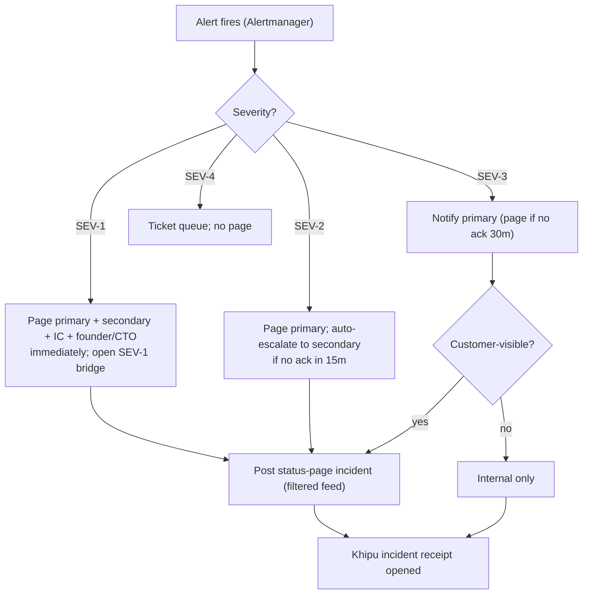

# INCIDENT_RESPONSE_RUNBOOK — On-Call, Severity, Paging, Postmortem

**Layer:** PURIQ v12 → `resilience_observability/`
**Author:** Yachay (SZL reliability agent), under CTO authority
**Date:** 2026-06-01
**Doctrine:** v12 (= v11 + PURIQ). v11 LOCKED numbers preserved. SLSA L1 (honest); Khipu
sig DSSE PLACEHOLDER.

> When something breaks, this is the single document on-call opens. Severity levels with
> response-time targets, paging logic, incident-commander roles, a **blameless**
> postmortem template, and a **Khipu-receipted** incident record so every incident is
> auditable. Honest blamelessness — fix the system, not the human.

---

## 1 — Severity levels + response targets

| Sev | Definition | Examples | Ack target | Mitigation target | Comms |
|---|---|---|---|---|---|
| **SEV-1** | Empire-critical: audit spine integrity lost, safety-critical drone failure, customer-data exposure | Khipu integrity fail (D8); confirmed token leak with customer-data scope (D9); killinchu safety system not halting | **5 min** | 30 min | status page + direct customer notice; founder/CTO paged |
| **SEV-2** | Major customer-facing outage or all-LLM-down | a11oy or killinchu down; all LLM providers down (D2 active, but customer feels it); regional outage | **15 min** | 1 h | status page incident; on-call + secondary |
| **SEV-3** | Degraded / single dependency tripped | one breaker OPEN; one non-critical flagship down; chaos regression (CE HELD→VIOLATED); HfApi push dead-letter (D3) | **30 min** | 4 h | internal; status page only if customer-visible |
| **SEV-4** | Minor / no customer impact | single transient error spike that self-healed; cosmetic dashboard issue; sorry-count drift note | next business day | best effort | ticket only |

**Auto-classification.** Alertmanager labels every alert with a `severity` (see
`OBSERVABILITY_DASHBOARD.md §5`). Khipu integrity fail and GPS-safety alerts are
hard-coded SEV-1/SEV-2 — they cannot be downgraded by automation; only the incident
commander can reclassify, and the reclassification is itself receipted.

---

## 2 — Paging logic



- **Escalation timers:** SEV-1 pages everyone at once. SEV-2 escalates primary→secondary
  after 15 min unacked. SEV-3 escalates after 30 min. SEV-4 never pages.
- **De-dup:** Alertmanager groups by `(flagship, failure_mode)` so a storm of related
  alerts is one incident, not fifty pages.
- **Quiet hours:** the weekly chaos window (Sun 02:00–03:20, `CHAOS_ENGINEERING_PLAN.md`)
  is annotated so chaos-induced alerts are tagged `chaos:true` and routed to the chaos
  runner, not on-call — unless they reveal a *real* regression (HELD→VIOLATED), which does
  page.

---

## 3 — Incident commander (IC) roles

| Role | Who | Responsibility |
|---|---|---|
| **Incident Commander (IC)** | rotating senior on-call | owns the incident; makes the call; the single decision-maker. Does NOT fix hands-on — coordinates. |
| **Ops lead** | the engineer mitigating | drives the technical fix; reports status to IC. |
| **Comms lead** | on-call comms (or IC if small) | owns the status page + customer notices via the filtered feed (`STATUS_PAGE_FEED.md`). |
| **Scribe** | any responder | timestamps every action in the incident record (feeds the postmortem + Khipu receipt). |
| **Founder / CTO** | escalation | second signer on SEV-1 state-changing actions; sets doctrine. |

For SEV-3/4 one person may hold multiple roles. For SEV-1/2 the IC must be distinct from
the Ops lead so coordination and fixing don't collide.

---

## 4 — Incident lifecycle

1. **Detect** — alert fires or human reports.
2. **Triage** — assign severity (auto + IC confirm); open the incident record + Khipu
   `incident_opened` receipt.
3. **Mitigate** — Ops lead works the documented degradation path first
   (`DEGRADATION_PATHS.md`) — graceful degradation buys time. Stop the bleeding before
   root-causing.
4. **Communicate** — Comms lead posts to the status page via the filtered feed; updates at
   a cadence (SEV-1 every 30 min, SEV-2 hourly).
5. **Resolve** — service restored to SLO; alert clears; status page → operational; Khipu
   `incident_resolved` receipt.
6. **Postmortem** — blameless, within 5 business days for SEV-1/2; receipted.

---

## 5 — Khipu-receipted incident record

Every incident emits receipts at open and resolve (and on any severity change), appended
to the canonical Khipu DAG — so the incident is part of the same auditable provenance
spine as governed actions.

```jsonc
// szl.incident.receipt/v1
{
  "schema": "szl.incident.receipt/v1",
  "incident_id": "INC-2026-0601-01",
  "severity": "SEV-2",
  "state": "opened",                 // opened | sev_changed | resolved
  "title": "All LLM providers rate-limited",
  "flagship": "a11oy",
  "failure_mode": "llm_all_providers_rate_limited",
  "detected_at": "2026-06-01T18:10:00Z",
  "ic": "oncall-senior-3",
  "linked_degradation_receipts": ["deg-2026-06-01T18:10:04Z-a11oy-router-rl"],
  "customer_impacting": true,
  "status_page_incident": "INC-2026-0601-01",
  "doctrine": "v12",
  "dsse": { "sig": "PLACEHOLDER — Sigstore CI not wired", "keyid": "PENDING" }
}
```

The incident receipt **links** to the degradation receipts that fired (D2 in this
example), so an auditor can trace alert → degradation path taken → incident → resolution
in one chain. Signatures DSSE PLACEHOLDER; integrity is the hash chain.

---

## 6 — Blameless postmortem template

> Blameless means: we assume everyone acted reasonably with the information they had. We
> fix the **system and the signals**, never blame a person. A postmortem that names a
> culprit is rejected and rewritten.

```markdown
# Postmortem — INC-<id> — <short title>
**Severity:** SEV-<n>   **Date:** <UTC>   **Duration:** <detect→resolve>   **IC:** <role>
**Khipu receipts:** <incident_opened sha> … <incident_resolved sha>

## 1. Summary (3 sentences)
What broke, who/what was affected, how it was resolved.

## 2. Customer impact
Which public components (STATUS_PAGE_FEED) were degraded/down, for how long, est. users.

## 3. Timeline (UTC, from the scribe + Khipu receipts)
- HH:MM detect — <alert / report>
- HH:MM triage — severity assigned, IC assigned
- HH:MM mitigate — <degradation path engaged>
- HH:MM resolve — <service restored>

## 4. Root cause (the system, not the person)
The technical cause. Use the "5 whys" on the *system*: why did the guard not catch it?
why did the signal not page sooner? why was the blast radius this large?

## 5. What went well
The degradation path that held; the breaker that tripped correctly; the chaos test that
had pre-validated this fallback (or, honestly, that we lacked one).

## 6. What we will change (action items, each with an owner + due date)
- [ ] <fix the system / add a guard> — owner — due
- [ ] <add/upgrade an alert so we page sooner> — owner — due
- [ ] <add a chaos experiment to prevent regression> — owner — due (link to CHAOS_ENGINEERING_PLAN)

## 7. Detection & error-budget impact
How much error budget burned (RESILIENCE_BUDGET); did burn-rate alarms fire correctly?

## 8. Honesty note
Anything we could not fully determine; any place we degraded rather than fully served;
any LOCKED-number/integrity concern (there should be none — confirm).
```

**Action items are tracked to closure**; an open SEV-1/2 action item past due is itself a
SEV-4. Every postmortem proposes at least one **chaos experiment** so the failure cannot
silently regress (closes the loop with `CHAOS_ENGINEERING_PLAN.md`).

---

## 7 — Honesty notes (Zero-Bandaid)

- Incidents are receipted into the same Khipu spine as governed actions — no incident is
  off-the-books.
- Postmortems are **blameless by rule**; a culprit-naming postmortem is rejected.
- Customer comms go through the **filtered feed** — honest impact, no internal leakage.
- SEV-1 for Khipu integrity and drone safety **cannot be auto-downgraded** — the audit
  spine and human safety are sacred.

---

*Cited internal sources:* `OBSERVABILITY_DASHBOARD.md` (alerts → severity),
`DEGRADATION_PATHS.md` (mitigation paths), `STATUS_PAGE_FEED.md` (customer comms),
`RESILIENCE_BUDGET.md` (error-budget impact), `CHAOS_ENGINEERING_PLAN.md` (regression
prevention), `wires_def_ship/szl_wire.py` (Khipu DAG ingest).

— Yachay (SZL reliability agent), under CTO authority — Doctrine v12, additive over v11 LOCKED.
