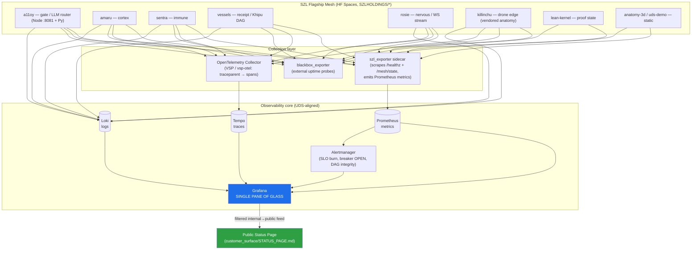

# OBSERVABILITY_DASHBOARD — Single Pane of Glass

**Layer:** PURIQ v12 → `resilience_observability/`
**Author:** Yachay (SZL reliability agent), under CTO authority
**Date:** 2026-06-01
**Doctrine:** v12 (= v11 + PURIQ). v11 LOCKED numbers preserved (749/14/163, 13-axis
`yuyay_v3`, replay-hash `bacf5443…631fc5`). SLSA L1 (honest); Khipu sig DSSE PLACEHOLDER.
**Stack:** Grafana + Prometheus + Loki + Tempo (matches the UDS Core observability stack).

> One Grafana instance, one URL, one pane of glass over the entire flagship mesh:
> per-flagship uptime, per-endpoint latency, error rates, LLM-provider health, Khipu DAG
> depth + integrity, Yuyay score distribution, and HUKLLA tripwire firings. Metrics →
> Prometheus, logs → Loki, traces → Tempo (correlated by the **W3C `traceparent`** that
> Wire D already propagates on every request).

---

## 0 — Why this stack (UDS Core alignment)

UDS Core ships a metrics/logs/traces observability stack; we adopt the same shape so the
flagship telemetry and the UDS-bundle telemetry land in one place:

- **Prometheus** — metrics (uptime, latency histograms, error rates, breaker state, DAG
  depth, Yuyay/HUKLLA gauges).
- **Loki** — structured logs (one JSON line per request, carrying `traceparent`).
- **Tempo** — distributed traces (spans keyed by the Wire-D `trace_id`).
- **Grafana** — the single pane; dashboards + alert rules + the public-status feed source.

This is **additive**: the Spaces today expose honest in-process state at
`/api/<space>/healthz` and `/api/<space>/v1/mesh/state`. The collector *scrapes* those and
re-exposes them as Prometheus metrics; nothing in the Spaces' governance math changes.

---

## 1 — Topology (Mermaid)



**Trace correlation.** Because Wire D stamps a real W3C `traceparent` on every request and
echoes it on the response (`wires_def_ship/szl_wire.py`), Tempo spans, Loki log lines, and
Prometheus exemplars all carry the **same `trace_id`** — click a latency spike in Grafana
→ jump to the exact trace → jump to the exact log line. This is the load-bearing
"single pane" property.

---

## 2 — The panels (single pane of glass)

### Row 1 — Fleet health (per-flagship uptime)
- **Uptime tiles** per flagship (a11oy, amaru, sentra, vessels, rosie, killinchu,
  lean-kernel, anatomy-3d, uds-demo) — green/amber/red from `szl_up{flagship}`.
- 30-day uptime % vs. the SLO target (see `RESILIENCE_BUDGET.md`): a11oy 99.9%,
  amaru/sentra 99.5%, killinchu 99.9%, rosie 99.5%.
- **HF stage** read from `get_space_runtime` (RUNNING / APP_STARTING / BUILDING /
  RUNTIME_ERROR) as an annotation overlay.

### Row 2 — Per-endpoint latency
- Latency heatmap + p50/p90/p99 per endpoint from `szl_request_duration_seconds` histogram,
  labelled `{flagship,endpoint,method}`. Key endpoints: `/v1/router`, `/v1/rag`,
  `/v1/brain/multi-jack`, `/v1/lean-verify`, `/v1/receipts/ingest`, `/healthz`.
- Exemplars link each bucket to a Tempo trace.

### Row 3 — Error rates + circuit breakers
- Error rate per flagship/endpoint from `szl_requests_total{status=~"5..|4.."}`.
- **Breaker state matrix**: `szl_breaker_state{breaker,flagship}` (0 CLOSED / 1 HALF_OPEN
  / 2 OPEN) rendered as a colored grid — instantly see which external dependency is tripped
  (HF, GitHub, an LLM provider, a NIM, vector DB, sat-link).
- **Degradation events** timeline from the `szl.degradation.receipt/v1` stream (failure
  mode + fallback tier served).

### Row 4 — LLM provider health
- Per-provider availability and rate-limit state from `szl_llm_provider_up{provider}` and
  `szl_llm_provider_ratelimited{provider}` (one series per provider breaker).
- Router tier distribution: how many requests served at full vs. T1-small vs. T0-cache vs.
  honest-error (`szl_router_tier_total{tier}`). This is the live D2 degradation gauge.
- `license_class` split (GREEN/AMBER/RED) per `szl_inference_total{license_class}` —
  verifies the sovereign-GREEN-only invariant in production.

### Row 5 — Khipu DAG depth + integrity
- **DAG depth** `szl_khipu_dag_depth{chain}` (canonical + per-edge-chain).
- **Integrity** `szl_khipu_integrity_ok` (1 = all recomputed digests match; 0 = mismatch →
  SEV-1, see `DEGRADATION_PATHS.md` D8). A continuous verifier walks the tail.
- Receipt ingest rate `szl_khipu_ingest_total{wire="F"}` and reconcile backlog (edge
  drones) `szl_khipu_reconcile_backlog{flagship="killinchu"}`.

### Row 6 — Yuyay score distribution
- Histogram of `szl_yuyay_score` (the 13-axis `yuyay_v3` conjunctive score for evaluated
  actions). Floors annotated: 2 sacred ≥ 0.95, 7 structural ≥ 0.90, 4 introspection.
- Pass/halt rate `szl_yuyay_decision_total{result="pass|halt"}` — shows the gate working.

### Row 7 — HUKLLA tripwire firings
- Per-tripwire firing count `szl_hukulla_tripwire_total{tripwire="T01".."T10"}`.
- **T10 (STOP/undo absorbing halt)** highlighted — any T10 firing is an annotation + a
  page candidate (a hard halt happened).
- HUKLLA load (compound-risk via Egyptian recursive doubling) trend.

### Row 8 — Lean-kernel proof state (honesty panel)
- From `lean-kernel /api/lean/theorems`: total declarations, proven, sorry, axiom counts.
  This surfaces the honest proof status next to the runtime — drift between the LOCKED
  749/14/163 and the live kernel build is immediately visible.

---

## 3 — Metric catalog (Prometheus naming)

| Metric | Type | Labels | Source |
|---|---|---|---|
| `szl_up` | gauge | `flagship` | blackbox probe / healthz |
| `szl_request_duration_seconds` | histogram | `flagship,endpoint,method` | exporter middleware |
| `szl_requests_total` | counter | `flagship,endpoint,status` | exporter middleware |
| `szl_breaker_state` | gauge | `breaker,flagship` | szl_breaker (0/1/2) |
| `szl_llm_provider_up` | gauge | `provider` | router |
| `szl_llm_provider_ratelimited` | gauge | `provider` | router |
| `szl_router_tier_total` | counter | `tier` | router (D2) |
| `szl_inference_total` | counter | `provider,license_class` | router |
| `szl_khipu_dag_depth` | gauge | `chain` | vessels / a11oy DAG |
| `szl_khipu_integrity_ok` | gauge | `chain` | DAG verifier |
| `szl_khipu_ingest_total` | counter | `wire` | Wire F ingest |
| `szl_khipu_reconcile_backlog` | gauge | `flagship` | killinchu edge |
| `szl_yuyay_score` | histogram | `flagship` | gate |
| `szl_yuyay_decision_total` | counter | `result` | gate |
| `szl_hukulla_tripwire_total` | counter | `tripwire` | HUKLLA |
| `szl_degradation_total` | counter | `failure_mode,fallback_tier` | degradation receipts |

---

## 4 — Exporter sidecar (`szl_exporter.py`, honest)

```python
# SPDX-License-Identifier: Apache-2.0  · Doctrine v12 (additive). Yachay.
"""
szl_exporter — scrapes each Space's honest in-process state and re-exposes it as
Prometheus metrics. Reads /api/<space>/healthz, /v1/mesh/state, /v1/brain/sockets.
HONEST: it reports what the Spaces actually expose. Where a Space has no metric yet
(e.g. a static Space has no latency histogram), the series is simply absent, not faked.
"""
from prometheus_client import Gauge, Counter, Histogram, start_http_server
import httpx, time

SPACES = {
    "a11oy":      "https://szlholdings-a11oy.hf.space",
    "amaru":      "https://szlholdings-amaru.hf.space",
    "sentra":     "https://szlholdings-sentra.hf.space",
    "vessels":    "https://szlholdings-vessels.hf.space",
    "rosie":      "https://szlholdings-rosie.hf.space",
    "killinchu":  "https://szlholdings-killinchu.hf.space",
    "lean-kernel":"https://szlholdings-lean-kernel.hf.space",
}

up = Gauge("szl_up", "flagship up", ["flagship"])
dag_depth = Gauge("szl_khipu_dag_depth", "Khipu DAG depth", ["chain"])
integ = Gauge("szl_khipu_integrity_ok", "Khipu integrity", ["chain"])

def scrape_once():
    for name, base in SPACES.items():
        try:
            h = httpx.get(f"{base}/api/{name}/healthz", timeout=10)
            up.labels(name).set(1 if h.status_code == 200 else 0)
        except Exception:
            up.labels(name).set(0)            # honest: probe failed → down
    # DAG depth + integrity from vessels ledger read-view
    try:
        led = httpx.get(f"{SPACES['vessels']}/api/vessels/v1/receipts/ledger", timeout=10).json()
        dag_depth.labels("canonical").set(len(led.get("nodes", [])))
        integ.labels("canonical").set(1)      # verifier sets 0 on digest mismatch
    except Exception:
        integ.labels("canonical").set(0)

if __name__ == "__main__":
    start_http_server(9100)                   # Prometheus scrapes :9100/metrics
    while True:
        scrape_once(); time.sleep(15)
```

**Honesty.** The exporter reports only what the Spaces truly expose. The in-process event
buses and Khipu DAG are **in-memory ring buffers** today (per `szl_wire.py`); the dashboard
labels DAG depth as the live ring depth, and the **S3 mirror** (see
`BACKUP_AND_RECOVERY.md`) is the durable record. We do not claim a distributed metrics
fabric we have not wired — the collector is a single sidecar scraping honest endpoints.

---

## 5 — Alert rules (feed Alertmanager → status page)

| Alert | Expr (sketch) | Severity | Action |
|---|---|---|---|
| Flagship down | `szl_up == 0 for 2m` | SEV-2 (SEV-1 if a11oy/killinchu) | page; status-page incident |
| SLO burn (fast) | error-budget burn > 14.4× (1h) | SEV-2 | page; see RESILIENCE_BUDGET |
| SLO burn (slow) | burn > 3× (6h) | SEV-3 | ticket |
| Breaker OPEN | `szl_breaker_state == 2 for 1m` | SEV-3 | investigate dependency |
| All LLM providers down | `sum(szl_llm_provider_up)==0` | SEV-2 | D2 fallback active; page |
| Khipu integrity fail | `szl_khipu_integrity_ok == 0` | **SEV-1** | freeze writes; D8 repair |
| T10 halt fired | `increase(szl_hukulla_tripwire_total{tripwire="T10"}[5m])>0` | SEV-3 | review halted action |
| GPS spoof (edge) | `increase(szl_degradation_total{failure_mode="gps_spoof_detected"}[5m])>0` | SEV-2 | INS/RTL confirmed; review |

Alertmanager routes to the on-call (see `INCIDENT_RESPONSE_RUNBOOK.md`) and emits the
filtered public signal to the status page (see `STATUS_PAGE_FEED.md`). Every alert that
fires also produces a Khipu receipt so the alarm itself is auditable.

---

*Cited internal sources:* `wires_def_ship/szl_wire.py` (traceparent + Khipu DAG + mesh
state), `hf_spaces_inventory.json` (flagship list + HF stages), `wire_finish/e2e_results_final.txt`
(live endpoints), `530_ENV_PLAN_AND_UDS_DOCS.md` (UDS stack), `RESILIENCE_BUDGET.md` (SLOs).

— Yachay (SZL reliability agent), under CTO authority — Doctrine v12, additive over v11 LOCKED.
