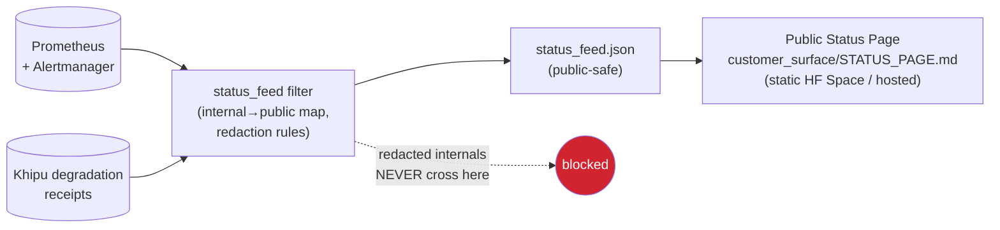

# STATUS_PAGE_FEED — Internal Health → Public Status (filtered)

**Layer:** PURIQ v12 → `resilience_observability/`
**Author:** Yachay (SZL reliability agent), under CTO authority
**Date:** 2026-06-01
**Doctrine:** v12 (= v11 + PURIQ). v11 LOCKED numbers preserved. SLSA L1 (honest); Khipu
sig DSSE PLACEHOLDER.
**Drives:** the public status page (intended target `customer_surface/STATUS_PAGE.md`,
created by the customer-surface agent). This doc defines the **feed** behind it.

> The public status page tells customers the truth about whether the empire is up — and
> *only* that. The feed translates rich internal health (Prometheus/Loki/Tempo, breaker
> states, Khipu integrity, tripwire firings) into a small, honest, public-safe signal.
> It never leaks internal topology, secrets, model providers, tripwire mechanics, or the
> Khipu DAG. Honest uptime, no internals.

---

## 0 — Filter principle: surface impact, hide mechanism

The feed maps **internal signals → public components → a coarse status**. The rule:
publish *customer-visible impact*, never the *internal cause or mechanism*.

| Internal signal (private) | Public translation |
|---|---|
| `szl_breaker_state{breaker="llm_provider.deepseek"}==2` | (nothing per-provider) → contributes to "AI features: degraded performance" only if it actually degrades the customer path |
| `szl_router_tier_total{tier="T0_cache"}` rising | "AI responses: degraded performance" |
| `szl_khipu_integrity_ok==0` | "Audit/receipts: degraded" (NOT "Khipu DAG corruption at node N") |
| `szl_hukulla_tripwire_total{tripwire="T10"}` fired | **not published** (internal governance event, no customer impact) |
| `szl_up{flagship="amaru"}==0` | "Memory/cortex service: outage" |
| GPS spoof on a drone (D6) | "Drone ops: degraded (safety hold active)" — no spoof specifics |
| Token leak (D9) | only a customer notice **if** customer data plausibly affected; mechanism never shown |

**Never published:** provider names, model names, internal hostnames/IPs, tripwire IDs and
mechanics, Khipu node indices/digests, secret fingerprints, exact infra topology, error
budget math internals. These would help an adversary (see `THREAT_MODEL.md`, Information
Disclosure) and serve no customer.

---

## 1 — Public components (the customer-facing map)

The status page shows a short list of **customer-meaningful components**, each derived
from one-or-more internal flagships/signals:

| Public component | Backed by (internal) | Status levels |
|---|---|---|
| **Governance & Brand (a11oy)** | a11oy uptime + router health | Operational / Degraded / Partial outage / Major outage |
| **Memory / Cortex (amaru)** | amaru uptime | same |
| **Immune / Policy (sentra)** | sentra uptime | same |
| **Maritime & Receipts (vessels)** | vessels uptime + Khipu ingest path | same |
| **Companion (rosie)** | rosie uptime + WS stream | same |
| **Drone Ops (killinchu)** | killinchu uptime + edge safety state | same |
| **AI Responses** | router tier distribution (full/T1/T0/error) | Operational / Degraded / Unavailable |
| **Audit / Receipts** | Khipu integrity + ingest rate | Operational / Degraded |
| **Proof Kernel (lean-kernel)** | lean-kernel uptime | Operational / Degraded |

Status levels mapping (honest, coarse):
- **Operational** — SLO met, no active degradation.
- **Degraded performance** — a documented degradation path is active (e.g. AI at T0/T1),
  service still answering.
- **Partial outage** — some endpoints down, others up.
- **Major outage** — component down.

---

## 2 — Feed pipeline



The filter is a small pure function: in = internal metrics + alerts + degradation
receipts; out = the public `status_feed.json`. It is allow-list based — only the fields in
the public schema below can ever be emitted; anything else is dropped by construction
(fail-closed: if the filter doesn't recognize a signal, it does NOT publish it).

---

## 3 — Public feed schema (`status_feed.json`)

```jsonc
{
  "schema": "szl.status_feed/v1",
  "generated_at": "2026-06-01T18:30:00Z",
  "overall": "operational",          // operational | degraded | partial_outage | major_outage
  "components": [
    { "name": "Governance & Brand", "status": "operational",  "uptime_30d": 99.94 },
    { "name": "AI Responses",       "status": "degraded",      "note": "Responses may be slower than usual." },
    { "name": "Memory / Cortex",    "status": "operational",  "uptime_30d": 99.51 },
    { "name": "Audit / Receipts",   "status": "operational",  "uptime_30d": 99.97 },
    { "name": "Drone Ops",          "status": "operational",  "uptime_30d": 99.92 }
  ],
  "active_incidents": [
    { "id": "INC-2026-0601-01", "title": "Elevated AI response latency",
      "impact": "degraded", "started_at": "2026-06-01T18:10:00Z",
      "latest_update": "We are serving cached/smaller-model responses while upstream capacity recovers." }
  ],
  "scheduled_maintenance": []
}
```

**What is in the schema (allowed):** component name, coarse status, 30-day uptime %, plain
customer-language incident title/impact/update. **What can never appear:** any field not in
this schema. No `breaker`, no `provider`, no `tripwire`, no `khipu_node`, no hostname.

---

## 4 — Incident copy rules (plain, honest, non-leaky)

- **Plain language.** "AI responses may be slower than usual" — not "all `llm_provider.*`
  breakers OPEN, router on T0 cache."
- **Honest about impact, vague about mechanism.** Say *what the customer experiences* and
  *that we are on it*; do not narrate the internal failure.
- **Match reality.** If the dashboard shows degraded, the page shows degraded — the feed is
  driven by the *same* Prometheus signals, so the public page can never silently claim
  "all good" while internally on fire. (This is the anti-cover-up property.)
- **Timely.** Incidents post when an SLO-impacting alert fires (see
  `INCIDENT_RESPONSE_RUNBOOK.md` paging logic), and resolve when the alert clears.

---

## 5 — Filter implementation (`status_feed.py`, fail-closed)

```python
# SPDX-License-Identifier: Apache-2.0 · Doctrine v12 (additive). Yachay.
"""
status_feed — internal health → public status_feed.json (fail-closed allow-list).
Reads Prometheus + active Alertmanager alerts + degradation receipts; emits ONLY the
szl.status_feed/v1 schema. Anything not explicitly mapped is dropped (never leaked).
"""
from datetime import datetime, timezone

# allow-list: internal flagship -> public component
PUBLIC_COMPONENT = {
    "a11oy": "Governance & Brand", "amaru": "Memory / Cortex",
    "sentra": "Immune / Policy",   "vessels": "Maritime & Receipts",
    "rosie": "Companion",          "killinchu": "Drone Ops",
    "lean-kernel": "Proof Kernel",
}
# Keys that MUST NEVER appear in the public feed (defense-in-depth; allow-list already
# drops them). Match on KEY NAMES (not a whole-blob substring) so legitimate copy like
# "Receipts"/"Companion" is never falsely flagged.
_NEVER_PUBLISH_KEYS = frozenset({"provider","model","tripwire","khipu_node","digest",
                                 "hostname","ip","secret","token","breaker","circuit"})

def _coarse_status(up: bool, degraded: bool, partial: bool) -> str:
    if not up: return "major_outage"
    if partial: return "partial_outage"
    if degraded: return "degraded"
    return "operational"

def build_feed(metrics: dict, alerts: list[dict]) -> dict:
    components = []
    for fl, comp in PUBLIC_COMPONENT.items():
        up = metrics.get(f"szl_up::{fl}", 0) == 1
        degraded = any(a for a in alerts if a.get("flagship") == fl and a.get("impact") == "degraded")
        components.append({
            "name": comp,
            "status": _coarse_status(up, degraded, partial=False),
            "uptime_30d": round(metrics.get(f"szl_uptime_30d::{fl}", 0.0), 2),
        })
    # AI Responses component derived from router tiers (impact only, no provider)
    router_degraded = metrics.get("szl_router_tier::T0_cache", 0) + \
                      metrics.get("szl_router_tier::T1_small", 0) > 0
    components.append({"name": "AI Responses",
                       "status": "degraded" if router_degraded else "operational",
                       "note": "Responses may be slower than usual." if router_degraded else None})
    overall = "operational"
    if any(c["status"] == "major_outage" for c in components): overall = "major_outage"
    elif any(c["status"] == "partial_outage" for c in components): overall = "partial_outage"
    elif any(c["status"] == "degraded" for c in components): overall = "degraded"

    feed = {"schema": "szl.status_feed/v1",
            "generated_at": datetime.now(timezone.utc).isoformat(),
            "overall": overall, "components": components,
            "active_incidents": _public_incidents(alerts),
            "scheduled_maintenance": []}
    _assert_no_leak(feed)            # fail-closed: refuse to emit if any banned key present
    return feed

def _public_incidents(alerts):
    out = []
    for a in alerts:
        if not a.get("customer_impacting"):  # only customer-impacting alerts go public
            continue
        out.append({"id": a["incident_id"], "title": a["public_title"],   # pre-sanitized copy
                    "impact": a["impact"], "started_at": a["started_at"],
                    "latest_update": a["public_update"]})
    return out

def _assert_no_leak(node):
    """Recursively refuse to publish if any banned KEY appears anywhere (fail-closed)."""
    if isinstance(node, dict):
        for k, v in node.items():
            if str(k).lower() in _NEVER_PUBLISH_KEYS:
                raise RuntimeError(f"status_feed leak guard tripped on key '{k}' — refusing to publish")
            _assert_no_leak(v)
    elif isinstance(node, (list, tuple)):
        for item in node: _assert_no_leak(item)
```

**Fail-closed.** `_assert_no_leak` refuses to publish a feed containing any banned token —
so even a future bug that tried to surface a provider/tripwire/digest would *block the
publish*, not leak it. Defense-in-depth on top of the allow-list.

---

## 6 — Honesty notes (Zero-Bandaid)

- The public page is driven by the **same** Prometheus signals as the internal dashboard —
  it cannot claim green while internally red (no cover-up).
- It publishes **only** the `szl.status_feed/v1` schema; everything else is dropped by an
  allow-list + a fail-closed leak guard.
- Degradation is shown as *degradation* (honest), not hidden as "operational."
- No provider, model, tripwire, Khipu, secret, or topology detail ever reaches the public.

---

*Cited internal sources:* `OBSERVABILITY_DASHBOARD.md` (signals + alerts),
`DEGRADATION_PATHS.md` (degradation receipts feeding incidents),
`INCIDENT_RESPONSE_RUNBOOK.md` (paging → incident posting), `THREAT_MODEL.md`
(Information Disclosure mitigations). Public page target: `customer_surface/STATUS_PAGE.md`.

— Yachay (SZL reliability agent), under CTO authority — Doctrine v12, additive over v11 LOCKED.
