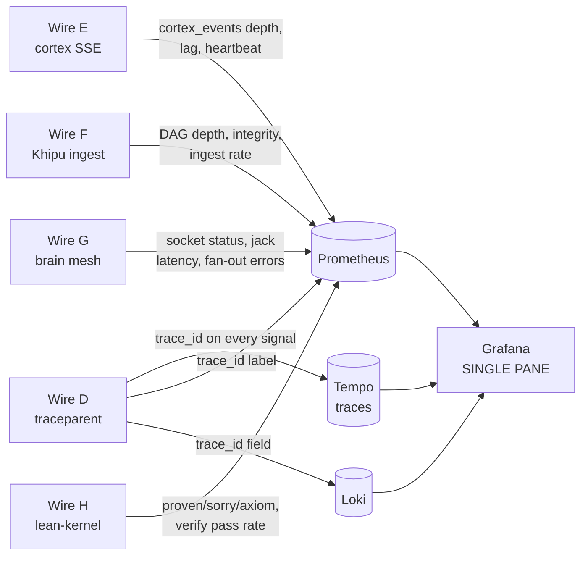

# WIRES_D_TO_H_INTEGRATION — Feeding the Observability Dashboard

**Layer:** PURIQ v12 → `resilience_observability/`
**Author:** Yachay (SZL reliability agent), under CTO authority
**Date:** 2026-06-01
**Doctrine:** v12 (= v11 + PURIQ). v11 LOCKED numbers preserved (749/14/163, 13-axis
`yuyay_v3`, replay-hash `bacf5443…631fc5`). SLSA L1 (honest); Khipu sig DSSE PLACEHOLDER.
**Coordination:** with the in-flight **Wires D–H agent** (`wires_def_ship/`, `wire_finish/`).

> Wires D–H already carry the mesh's live signals. This document defines how each wire
> **feeds the observability single pane of glass** (`OBSERVABILITY_DASHBOARD.md`) and locks
> the **schema sync** so the resilience layer and the Wires agent agree on field names,
> units, and the `traceparent` correlation key. No new wires invented — we instrument the
> existing five. ADDITIVE only.

---

## 0 — The five wires (as built, from the live e2e)

Verified live in `wire_finish/e2e_results_final.txt`:

| Wire | Edge / function | Live surface | Status (honest) |
|---|---|---|---|
| **D** | **W3C `traceparent` propagation** | middleware on every request; `/api/<space>/healthz` → `traceparent_propagating:true` | LIVE in-process; cross-Space distributed-trace broker NOT wired |
| **E** | a11oy↔amaru cortex sync | SSE `/api/amaru/v1/cortex-subscribe`; publish `/api/a11oy/v1/cortex-publish` | LIVE (in-memory ring bus) |
| **F** | a11oy↔vessels Khipu receipts | `POST /api/vessels/v1/receipts/ingest`; `GET …/ledger` | LIVE (in-memory Merkle DAG) |
| **G** | brain-jack mesh | `/api/<space>/v1/brain/sockets`, `/v1/brain/multi-jack` | LIVE (fan-out across a11oy/amaru/sentra/vessels/rosie) |
| **H** | lean-kernel proof endpoints + verify proxy | `/api/lean/{healthz,theorems,vectors,verify}`; a11oy/rosie `/v1/lean-verify` | LIVE |

The **`traceparent`** stamped by Wire D is the universal correlation key: every metric,
log, trace, and Khipu receipt below carries it, so the dashboard can stitch a single
request across all five wires and all flagships.

---

## 1 — How each wire feeds the dashboard



| Wire | Dashboard panel it feeds | Metrics emitted |
|---|---|---|
| **D** | trace correlation across **all** panels; per-endpoint latency exemplars | `traceparent`/`trace_id` as exemplar label on `szl_request_duration_seconds` |
| **E** | "cortex sync health" (Row 4 adjunct) | `szl_cortex_events_buffered`, `szl_cortex_sse_clients`, `szl_cortex_lag_seconds` |
| **F** | "Khipu DAG depth + integrity" (Row 5) | `szl_khipu_dag_depth`, `szl_khipu_integrity_ok`, `szl_khipu_ingest_total{wire="F"}` |
| **G** | "brain mesh" (breaker/topology adjunct) | `szl_brain_socket_status{src,target}`, `szl_brain_jack_duration_seconds`, `szl_brain_multijack_errors_total` |
| **H** | "Lean-kernel proof state" honesty panel (Row 8) | `szl_lean_declarations`, `szl_lean_proven`, `szl_lean_sorry`, `szl_lean_axiom`, `szl_lean_verify_pass_total` |

---

## 2 — Schema sync (the contract with the Wires agent)

The resilience exporter reads the wires' **existing** JSON shapes (no changes to the
Wires agent's output required); this section pins those shapes so both sides stay aligned.

### Wire D — traceparent (W3C Trace Context, from `szl_wire.py`)
```jsonc
// format: 00-<32hex trace_id>-<16hex span_id>-01   (parse_traceparent)
{ "valid": true, "version": "00",
  "trace_id": "<32hex>", "span_id": "<16hex>", "flags": "01", "raw": "00-…-…-01" }
```
**Sync rule:** the `trace_id` (32hex) is the dashboard correlation key. Exporter labels
all per-request metrics with `trace_id`; Tempo/Loki index on it. Unit of `span` is a
single request hop; cross-Space distributed tracing is NOT wired (honest), so Tempo
shows in-process spans linked by shared `trace_id`, not a broker-stitched waterfall.

### Wire E — cortex event (from `publish_brand_decision`)
```jsonc
{ "wire": "E", "type": "brand_decision", "source": "a11oy", "sink": "amaru",
  "decision": { … }, "traceparent": "00-…-…-01", "ts_utc": "ISO-8601" }
```
**Sync rule:** exporter derives `szl_cortex_events_buffered` = ring-buffer depth,
`szl_cortex_lag_seconds` = now − newest `ts_utc`. Honest: in-memory bus, resets on restart.

### Wire F — Khipu node + gate-decision receipt (from `ingest_receipt` / `emit_gate_decision_receipt`)
```jsonc
// Khipu DAG node
{ "index": 0, "wire": "F", "source": "a11oy", "sink": "vessels",
  "receipt": { "schema": "szl.gate_decision.receipt/v1", "action_id": "…",
               "gate": "…", "lambda": 0.83, "gates_fired": [...], "passed": true,
               "doctrine": "v12", "ts_utc": "…", "signature": "PLACEHOLDER…" },
  "parents": ["<digest>"], "digest": "<sha256(receipt‖parents)>",
  "dsse": { "payloadType": "application/vnd.szl.receipt+json",
            "signatures": [{ "sig": "PLACEHOLDER…", "keyid": "PENDING" }] },
  "ts_utc": "ISO-8601" }
```
**Sync rule:** `szl_khipu_dag_depth` = `len(nodes)`; integrity verifier recomputes
`sha256(receipt ‖ parents)` and sets `szl_khipu_integrity_ok`. **Doctrine field updated
v10→v12** in new receipts (the resilience layer's degradation/chaos/restore receipts use
`doctrine:"v12"`); historical v10 nodes are preserved unchanged (ADDITIVE).
**The degradation/chaos/restore receipt schemas in this resilience layer are NEW siblings**
of `szl.gate_decision.receipt/v1` and ingest through the same Wire-F path — confirmed
compatible because `ingest_receipt` accepts any receipt dict.

### Wire G — brain socket (from `/v1/brain/sockets`)
```jsonc
{ "space": "a11oy", "organ": "gate",
  "sockets": [ { "target_space": "amaru", "target_organ": "cortex",
                 "target_url": "https://szlholdings-amaru.hf.space",
                 "last_jack_at": "ISO-8601|null", "status": "self|open|…",
                 "wire": "G", "doctrine": "v11" } ] }
```
**Sync rule:** `szl_brain_socket_status{src,target}` from `status`; `last_jack_at` →
freshness gauge. A socket stuck `open` (never jacked) for too long is a connectivity
warning surfaced in the mesh panel.

### Wire H — lean-kernel theorems (from `/api/lean/theorems`)
```jsonc
{ "summary": { "total_declarations": 759, "theorems_and_lemmas": 455,
               "proven": 383, "sorry": 79, "axiom": 18 }, "items": [ … ] }
```
**Sync rule — IMPORTANT honesty reconciliation:** the **live lean-kernel build** reports
`759 / 18 axioms / 79 sorry` for the kernel's *current* tree, while **Doctrine v11/v12
LOCKED** numbers are `749 declarations / 14 unique axioms / 163 tracked sorries` at tag
`lutar-v18.0.0` / `c7c0ba17`. These are **different snapshots**, not a contradiction:
- The LOCKED numbers are the doctrine's canonical reference at the tagged commit.
- The kernel endpoint reports whatever tree it currently has built (`repo_sha` differs:
  `679d3d80…`).
The dashboard shows **both**, labelled: a "LOCKED (doctrine)" reference line `749/14/163`
and a "live kernel build" line. **The resilience layer changes neither** — it surfaces the
drift honestly so an operator can see when the live build diverges from the LOCKED tag.
This drift surfacing is exactly the kind of honest signal the empire wants; it does NOT
edit any LOCKED number.

---

## 3 — Coordination notes for the Wires D–H agent

1. **No output changes requested.** The resilience exporter reads your existing endpoints
   read-only. If you add fields, keep the keys above stable; append new keys freely.
2. **Please keep `traceparent` on every wire payload** (D/E/F already do; G/H currently
   carry `doctrine`+`wire` — adding `traceparent` to G socket events and H verify responses
   would let the dashboard correlate brain-jacks and lean-verifies into the same trace).
   This is a *request, not a blocker* — the dashboard degrades to per-endpoint correlation
   if absent.
3. **Receipt `doctrine` field:** new receipts from the resilience layer use `v12`; your
   gate-decision receipts may stay `v10/v11` — the DAG mixes versions honestly and the
   integrity check is version-agnostic (it hashes payload‖parents).
4. **Wire D cross-Space broker** is still NOT wired (honest). When/if a real distributed
   tracer (OTel→Tempo with cross-Space context propagation, the `vsp-otel` work) lands,
   the dashboard's Tempo waterfall upgrades from "in-process spans sharing a trace_id" to
   "true cross-Space waterfall" with no schema change — `traceparent` is already the key.
5. **Shared metric namespace:** all resilience metrics are prefixed `szl_`. If you emit
   your own Prometheus metrics, prefix `szl_` too and avoid the names in
   `OBSERVABILITY_DASHBOARD.md §3` to prevent collisions.

---

## 4 — Honesty notes (Zero-Bandaid)

- Wires E/F buses are **in-memory ring buffers** (no Kafka/NATS in a static HF Space) —
  the dashboard labels them as such; durability is the S3 mirror (`BACKUP_AND_RECOVERY.md`).
- Wire D is **in-process** traceparent; cross-Space distributed tracing is NOT wired.
- Wire H surfaces **both** the LOCKED reference (749/14/163) and the live kernel build —
  no LOCKED number is altered.
- Receipt signatures remain **DSSE PLACEHOLDER**; integrity is hash-chain, not signature.

---

*Cited internal sources:* `wire_finish/e2e_results_final.txt` (live wire surfaces),
`wires_def_ship/szl_wire.py` (D/E/F schemas), `wires_def_ship/push_all.py` (wire ship),
`OBSERVABILITY_DASHBOARD.md` (panels + metric names), `puriq/doctrine/PURIQ_DOCTRINE_v12.md`
(LOCKED numbers).

— Yachay (SZL reliability agent), under CTO authority — Doctrine v12, additive over v11 LOCKED.
