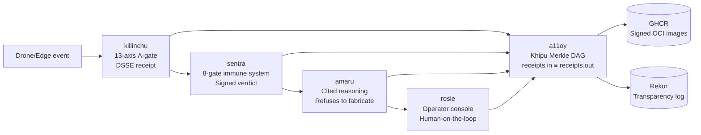

# SZL Holdings — We sell proof.

> AI is moving into decisions that carry real consequences. We make every AI action **cryptographically verifiable** — a signed, tamper-evident receipt any auditor or regulator can check on their own hardware, with public tooling, after the fact. **We sell the one thing the AI market still can't buy off the shelf: proof.**

---

## Five live products. One-click demos. No login.

| Product | What it does | Try it now |
|---|---|---|
| **a11oy** | Signed-receipt substrate — every AI decision leaves a cryptographic Khipu receipt; `receipts.in ≡ receipts.out` audit-fiber continuity | [](https://huggingface.co/spaces/SZLHOLDINGS/a11oy) |
| **sentra** | Deny-by-default policy immune system — 8 gates; every verdict signed and chained | [](https://huggingface.co/spaces/SZLHOLDINGS/sentra) |
| **amaru** | Reasoning that refuses to fabricate — every answer cites a real source or declines | [](https://huggingface.co/spaces/SZLHOLDINGS/amaru) |
| **rosie** | Operator console — human-on-the-loop confirmation; surfaces verdicts across the mesh | [](https://huggingface.co/spaces/SZLHOLDINGS/rosie) |
| **killinchu** | Counter-UAS edge organ — 13-axis Λ-gate; every interdiction signed with a DSSE receipt | [](https://huggingface.co/spaces/SZLHOLDINGS/killinchu) |

**All five return HTTP 200. All five emit DSSE Khipu receipts. All five ship as signed OCI images.**

---

## 3D Heroes — the governance substrate, visualized

Six live Three.js/WebGL explorations of the proof architecture. Static. No login.

| Space | What you see |
|---|---|
| [anatomy-3d](https://betterwithage-anatomy-3d.static.hf.space) | 3D anatomy of the governed-AI organs — Λ-gate, Khipu DAG, Ouroboros loop |
| [rosie-3d](https://betterwithage-rosie-3d.static.hf.space) | 3D operator console — live mesh of cross-session receipt routing |
| [mesh-cathedral](https://betterwithage-mesh-cathedral.static.hf.space) | Ouroboros loop geometry — 5-organ bounded-recursion visualization |
| [khipu-constellation](https://betterwithage-khipu-constellation.static.hf.space) | 3D Merkle-DAG receipt visualizer — Khipu knot-graph in space |
| [doctrine-cathedral](https://betterwithage-doctrine-cathedral.static.hf.space) | 3D doctrine visualization — 749 declarations rendered as cathedral geometry |
| [llm-router-live](https://betterwithage-llm-router-live.static.hf.space) | Live model-routing topology — real-time LLM dispatch mesh |

---

## The proof layer — verify it yourself

[](https://github.com/szl-holdings/a11oy/attestations)
[](https://docs.sigstore.dev/cosign/signing/overview/)
[](https://search.sigstore.dev/)
[](https://github.com/szl-holdings/uds-mesh)
[](https://github.com/szl-holdings/lutar-lean)
[-f59e0b?style=flat-square)](https://github.com/szl-holdings/lutar-lean/blob/main/BOUNTY.md)
[](https://huggingface.co/SZLHOLDINGS)
[](https://github.com/szl-holdings/.github/blob/main/LICENSE)

### Verify the signed bundle (one command)

```bash
# Verify the entire szl-mesh:v0.4.0 UDS bundle — keyless cosign, public Sigstore
cosign verify oci://ghcr.io/szl-holdings/szl-mesh:v0.4.0 \
  --certificate-identity-regexp="^https://github.com/szl-holdings/" \
  --certificate-oidc-issuer="https://token.actions.githubusercontent.com"
```

### Verify SLSA Build L2 provenance (all 5 flagships)

```bash
# Any of the five flagships — all have GitHub-hosted runner attestations
gh attestation verify oci://ghcr.io/szl-holdings/a11oy@sha256:1cfd28e03e6f1fb4b0827f2281f5016ebde8122d8c9ecb00d73145c77dd02cd7 \
  --repo szl-holdings/a11oy
# Expected: ✓ Verification succeeded — SLSA Provenance v1, github-hosted runner

# Rekor transparency-log entries (public Sigstore instance):
# a11oy:   https://search.sigstore.dev/?logIndex=1723769508
# sentra:  https://search.sigstore.dev/?logIndex=1723794608
# amaru:   https://search.sigstore.dev/?logIndex=1723784350
# rosie:   https://search.sigstore.dev/?logIndex=1722745939
```

### Deploy the full mesh (airgap, one command)

```bash
uds deploy oci://ghcr.io/szl-holdings/szl-mesh:v0.4.0 --confirm
# or from local tarball:
uds-cli bundle deploy szl-mesh-v0.4.0.tar.zst --confirm
```

**[Full verify-it-yourself guide →](https://github.com/szl-holdings/developers/blob/main/VERIFY.md)**

---

## Status badges — honest

| Claim | Status | Verify |
|---|---|---|
| 5 live HF demos | ✅ All HTTP 200 | curl any `/healthz` |
| SLSA Build L2 | ✅ Verified — a11oy/sentra/amaru/rosie (Public Sigstore); killinchu (GitHub Sigstore, private repo) | `gh attestation verify` above |
| cosign keyless signed | ✅ All 5 organs, Public Good Rekor | `cosign verify` above |
| UDS bundle published | ✅ `szl-mesh:v0.4.0` on GHCR | `uds deploy oci://ghcr.io/szl-holdings/szl-mesh:v0.4.0` |
| Lean kernel | ✅ 749 decl / 14 axioms / 163 sorries @ `c7c0ba17` | [`lutar-lean@main`](https://github.com/szl-holdings/lutar-lean) |
| Λ-uniqueness | ⚠️ **Conjecture 1** — F23 open bounty (not a closed theorem) | [`BOUNTY.md`](https://github.com/szl-holdings/lutar-lean/blob/main/BOUNTY.md) |
| SLSA L3 | ❌ Not claimed (requires isolated signing workflow) | — |
| FedRAMP / CMMC / Iron Bank | ❌ Not claimed | — |

---

## What "proof" means here

**The problem:** AI is being deployed into consequential decisions — defense, compliance, critical infrastructure — with no standard way to show *what the AI decided, why, and whether it stayed in bounds*.

**Our answer:** Every SZL action emits a **DSSE-enveloped Khipu receipt** — an ECDSA P-256 signed, SHA-256 hash-linked Merkle DAG node. The chain satisfies `receipts.in ≡ receipts.out`: what came in is what got signed; nothing is lost between the decision and the proof.

**Competitive position:** Palantir, New Relic, Anduril — none ship a signed-receipt substrate for individual AI decisions. We match their AIP policy layer (sentra), their observability surface (rosie), and their edge deployment (killinchu). We exceed them on one dimension they don't offer: **every decision is a verifiable artifact, not a log entry**.

**The Warhacker / Cannonico fit:** Defense Unicorns published a problem: *"an autonomous drone loses contact — is it still inside authorized parameters, or has it gone off script? There's no independent system today that can monitor AI behavior in real time, catch the moment a line gets crossed, and back it up with a permanent, tamper-evident record."* — [Warhacker 2026](https://defenseunicorns.com/warhacker/). **That is exactly what SZL ships.** `killinchu → sentra → amaru → a11oy` is the Cannonico answer, deployable in one signed UDS command.

---

## Technical depth

*For engineers, auditors, and technical reviewers. Investors can stop above.*

### Architecture — the mesh



### Supply-chain posture

- **SLSA Build L2 verified** — all 5 flagship images have `actions/attest-build-provenance@v2.4.0` wired in `ghcr-build-push.yml`; `runner_environment: github-hosted`; DSSE-signed SLSA Provenance v1 predicate stored in GitHub Attestations API + pushed to registry
- **cosign keyless signed** — every image signed via Fulcio OIDC short-lived cert bound to the GitHub Actions workflow identity; entries in public Sigstore Rekor transparency log (indexes above)
- **UDS bundle `szl-mesh:v0.4.0`** — real baked images (SBOM-only regression fixed); keyless cosign-signed; deployable via `uds deploy oci://...` into any UDS Core cluster
- **DCO required** on every commit; OpenSSF Scorecard monitored; Trivy + Grype + Gitleaks in CI

### Formal math substrate

- **Lean 4 + Mathlib v4.13.0** — [`lutar-lean`](https://github.com/szl-holdings/lutar-lean): 749 declarations / 14 unique axioms / 163 tracked sorries @ `c7c0ba17`
- **Λ (verdict aggregator):** `Λ(x) = Σᵢ wᵢ φᵢ(x)` — 13-axis `yuyay_v3`; `Σwᵢ = 1`, `wᵢ ≥ 0`
- **Λ-uniqueness: Conjecture 1** — conditional uniqueness machine-checked; unconditional case remains open (`CAUCHY_ND` sorry open); [F23 open bounty](https://github.com/szl-holdings/lutar-lean/blob/main/BOUNTY.md)
- **DOI-pinned thesis:** [`10.5281/zenodo.20434276`](https://doi.org/10.5281/zenodo.20434276) (v18.0 master); concept DOI [`10.5281/zenodo.19944926`](https://doi.org/10.5281/zenodo.19944926)

### Compliance honest-claims

- Apache-2.0 source / CC-BY-4.0 papers
- Section 889: exactly 5 vendors (Huawei, ZTE, Hytera, Hikvision, Dahua)
- ORCID: [0009-0001-0110-4173](https://orcid.org/0009-0001-0110-4173)
- **Not claimed:** FedRAMP, Iron Bank, CMMC, SLSA L3

### Citation

```bibtex
@software{szl_holdings_2026,
  author    = {Lutar, Stephen P.},
  title     = {SZL Holdings: a formally-grounded governance substrate for agentic AI},
  year      = {2026},
  publisher = {Zenodo},
  version   = {Doctrine v11 LOCKED},
  doi       = {10.5281/zenodo.20434276},
  url       = {https://github.com/szl-holdings},
  note      = {749 declarations / 14 axioms / 163 sorries, kernel c7c0ba17}
}
```

---

<sub>Doctrine v11 LOCKED · 749/14/163 · kernel `c7c0ba17` · Λ = Conjecture 1 (F23 open bounty, not a theorem) · SLSA L2 verified (a11oy/sentra/amaru/rosie public; killinchu GitHub Sigstore) · Apache-2.0 code / CC-BY-4.0 papers · DOI [10.5281/zenodo.20434276](https://doi.org/10.5281/zenodo.20434276) · [ORCID 0009-0001-0110-4173](https://orcid.org/0009-0001-0110-4173)</sub>

Signed-off-by: stephenlutar2-hash <stephenlutar2@gmail.com>
