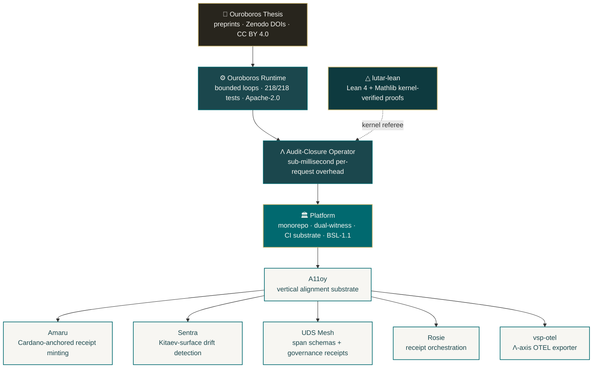

<!-- Organization profile README — rendered at github.com/szl-holdings -->
<!-- Series-A grade. Doctrine v6. Governance-mathematical language only. -->

# SZL Holdings

### Formal AI Governance — Λ-axis scoring · audit fibers · provable receipts

**Bounded recursion as a system primitive. Proof-chain receipts on every decision. Sub-millisecond audit closure.**

 

---

## What we build

SZL Holdings develops the **Ouroboros Thesis** — a mathematical framework for governed AI execution. Every claim is formally verified in Lean 4 against Mathlib; every artifact ships with a kernel-checked proof or an honest axiom-with-citation. The runtime emits a **proof-chain receipt** for every decision — bounded loop trace, policy gates traversed, evidence cited, convergence verified — recorded against an audit-closure operator (Λ) with sub-millisecond per-request overhead.

Every enterprise AI deployment fails the same diligence question: **"prove what your model decided, why, and that it was within policy."** The receipt is the deliverable. The loop is the product.

---

## Open source substrate

| Pillar | Repo | License | What it is |
|---|---|---|---|
| 📄 **Research** | [`ouroboros-thesis`](https://github.com/szl-holdings/ouroboros-thesis) | CC BY 4.0 | Ouroboros Thesis (v14–v17.9+). Λ-axis scoring, audit fibers, provable receipts. Zenodo DOI-pinned. |
| ⚙️ **Runtime** | [`ouroboros`](https://github.com/szl-holdings/ouroboros) | Apache-2.0 | Bounded-loop runtime. Formulas, agentic loops, bekenstein bounds, dual-witness emitters. 218/218 tests. |
| △ **Proofs** | [`lutar-lean`](https://github.com/szl-holdings/lutar-lean) | Apache-2.0 | Lean 4 + Mathlib — Λ-gate theorems, audit-fiber invariants, knot-calculus / Feynman-grafts. Kernel-verified. |
| 🔗 **Monorepo** | [`platform`](https://github.com/szl-holdings/platform) | BSL 1.1 | SZL Holdings monorepo — Ouroboros runtime, Lutar formulas, dual-witness adapters, agent-tooling, CI substrate. |
| 🧩 **Alignment** | [`a11oy`](https://github.com/szl-holdings/a11oy) | Other | Vertical alignment substrate — policy / measurement / knowledge / qec-integrity packages for governed AI execution. |
| 📡 **Spans** | [`uds-mesh`](https://github.com/szl-holdings/uds-mesh) | Apache-2.0 | Unified Data System — cross-component span schemas + governance receipts for OTEL-style observability. |
| 📬 **Receipts** | [`rosie`](https://github.com/szl-holdings/rosie) | Apache-2.0 | Receipt orchestration — CSS-ingress + canonical receipt byte-string emission. |
| ⛓️ **Provenance** | [`amaru`](https://github.com/szl-holdings/amaru) | Other | Cardano-anchored governance receipt minting + Shor-encoded provenance. |
| 🛡️ **Telemetry** | [`sentra`](https://github.com/szl-holdings/sentra) | Other | Sensor/telemetry adapter for SZL audit fibers — Kitaev-surface drift detection. |
| 📊 **OTEL** | [`vsp-otel`](https://github.com/szl-holdings/vsp-otel) | Apache-2.0 | OpenTelemetry exporter for SZL audit fibers + Λ-axis spans. |
| 🔮 **Forecast** | [`agi-forecast`](https://github.com/szl-holdings/agi-forecast) | Apache-2.0 | Forecasting models + scenario library for AI governance trajectories. |
| 📖 **Cookbook** | [`szl-cookbook`](https://github.com/szl-holdings/szl-cookbook) | Apache-2.0 | Recipes for building governed AI systems on the SZL substrate. |
| 🎨 **Brand** | [`szl-brand`](https://github.com/szl-holdings/szl-brand) | CC BY 4.0 | Brand assets, logos, social-preview templates, and visual doctrine for SZL Holdings. |

---

## Architecture

---

## Doctrine v6

Every artifact obeys SZL Doctrine v6: governance-mathematical language only, attribution-clean grafts, no marketing prose, no banned-word classes. Canonical scanner: `platform/tools/doctrine-v6-scan.js`.

---

## DOI history

| Version | Title | DOI |
|---|---|---|
| **v17** (current) | Wheelerian audit closure + Shannon doctrine code + QEC-evolved Agent Body | [10.5281/zenodo.20431181](https://doi.org/10.5281/zenodo.20431181) |
| **v16** | Feynman path-integral audit closure + Gates doctrine codes | [10.5281/zenodo.20424996](https://doi.org/10.5281/zenodo.20424996) |
| **v15** | Knot Calculus for Governed Decision Receipts | [10.5281/zenodo.20424995](https://doi.org/10.5281/zenodo.20424995) |
| **v14** | Verifiable Multi-Agent Anatomy — Lutar Calculus | [10.5281/zenodo.20424992](https://doi.org/10.5281/zenodo.20424992) |
| Concept | — | [10.5281/zenodo.19944926](https://doi.org/10.5281/zenodo.19944926) |

---

## Verified platform metrics

| Metric | Value |
|---|---|
| Ouroboros runtime tests | **218 / 218 passing** |
| Lean formal theorems | **24** (kernel-checked) |
| Honest axioms with citation | **11** |
| Thesis versions published (DOI-pinned) | **17** |
| Λ overhead | ≤ 0.59 ms median per request |

---

## Agent Body

The SZL Agent Body is the canonical anatomy of an audit-closure AI agent:
- **Heart** — yuyay_v3, 13-axis conjunctive AND gate
- **Brain** — 5 cortical regions + Quantum Mind substrate
- **Blood** — YAWAR append-only receipt bus
- **Immune** — SENTRA inline + HUKLLA 10 tripwires

---

## How to engage

- **Builders / integrators** → start with the [runtime](https://github.com/szl-holdings/ouroboros) and the [Lean proofs](https://github.com/szl-holdings/lutar-lean)
- **Researchers** → read the [thesis preprints](https://github.com/szl-holdings/ouroboros-thesis), cite via Zenodo DOI (`10.5281/zenodo.19944926`)
- **Security / procurement** → [Trust Portal](https://github.com/szl-holdings/szl-trust) · [Security Policy](https://github.com/szl-holdings/.github/security/policy)
- **Enterprise** → [stephen@szlholdings.com](mailto:stephen@szlholdings.com)

---

**SZL Holdings, LLC** · Founded by [Lutar, Stephen P.](https://orcid.org/0009-0001-0110-4173) · Apache-2.0 unless noted · Doctrine v6

