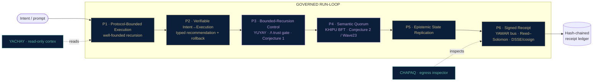

<!--
  SZL Holdings — organization profile README (szl-holdings/.github -> profile/README.md)
  GENIUS REVAMP v2. Honesty doctrine LOCKED. Edited FROM _live_org_profile_README.md + PROVEN_STATE_CANONICAL.md + warhacker_approved_problems.md.
  Canonical numbers (source of truth: lutar-lean@main, kernel c7c0ba17):
    749 declarations / 14 unique axioms / 163 tracked proof placeholders
    Locked-proven (kernel) = EXACTLY 5 formulas {F1, F11, F12, F18, F19}
    ~185 machine-checked Lean theorems total (Waves 11-22); CUT-1 closed on its stated hypotheses
    Lambda-uniqueness = Conjecture 1 (unconditional uniqueness machine-checked FALSE; conditional uniqueness proven, axiom-free)
    SLSA posture = L1 honest · L2 build-attested (container provenance, Sigstore keyless) where attest-build-provenance runs+verifies (a11oy, killinchu); L3 / FedRAMP / Iron Bank / CMMC / ATO = roadmap.
  Two-product end-state: a11oy (command platform) + killinchu (drones & vessels). Honest internal roles only. No banned codenames.
  Banner expected at: profile/assets/banner-org.png
-->

<div align="center">


# SZL Holdings

### Governed autonomy with a checkable receipt for every decision.

**SZL builds governed-AI decision infrastructure** — every autonomous action carries a machine-checked, tamper-evident warrant: *under what authority it acted, on what trust evidence, and proof the record was not quietly rewritten.* Two live products run on one signed substrate.

[](https://github.com/szl-holdings/lutar-lean)
[-B79BD6?style=flat-square)](https://github.com/szl-holdings/lutar-lean/blob/main/BOUNTY.md)
[-B79BD6?style=flat-square)](https://github.com/szl-holdings/khipu-consensus)
[](https://search.sigstore.dev/)
[](https://slsa.dev/spec/v1.0/levels)
[](https://github.com/szl-holdings)

</div>

> **TL;DR** — SZL turns AI governance into a *substrate*: a Proof Chain where every decision is policy-checked, evidence-bound, scored by a single trust aggregator **Λ**, and sealed into a DSSE receipt over a SHA-256 hash chain that anyone can verify offline. The trust math is pinned in **Lean 4** — **exactly 5 formulas are kernel-locked**, ~**185** theorems are machine-checked, and the one uniqueness claim we cannot prove unconditionally we call **Conjecture 1**. We surface only what the kernel checks. The differentiator vs. every observability and AI-security incumbent: **a machine-checked proof backbone they don't have.**

---

## The company story

Modern AI gives you answers. It does not give you **accountability**.

SZL Holdings was founded by **Stephen P. Lutar Jr.** to close that gap with a missing layer — not a smarter model, but a *machine for producing evidence*. When an AI system makes a consequential call, SZL records it as a signed, hash-chained receipt: *what was decided, against which policy, on what evidence, and whether it stayed inside the authorized envelope.* Hand that receipt to a skeptical auditor and they replay it offline, trusting no one. Tamper with a single byte and verification fails.

We built this as a **substrate**, not a point product, because governance is horizontal. The same Proof Chain that audits an enterprise workflow also audits an autonomous drone's engagement decision. That is why two very different products — an enterprise command platform and a drones-&-vessels field tool — run on one signed core.

And we refused to fake the math. The trust score's foundations are written as theorems in Lean 4 and checked by the kernel. We publish exactly how far each result goes, including where it stops — five locked-proven formulas, ~185 machine-checked theorems, and one honest **Conjecture**. In a market full of "formally verified" marketing, a reproducible proof backbone is the moat.

---

## Two products, one substrate

| Product | What it does | Open it |
|---|---|---|
| **a11oy — Command Platform** | One pane of glass for governed AI: ask-&-act with deny-by-default safety gates, trust scoring with confidence intervals, a live decision feed, readiness & compliance, forecasting, signed receipts, formal-proof status, a live CVE / KEV / MITRE threat library, and model routing. | [a11oy.net →](https://a11oy.net) · [Space →](https://huggingface.co/spaces/SZLHOLDINGS/a11oy) |
| **killinchu — Drones & Vessels** | Autonomous-systems field tool for air and sea: live track board, multi-sensor fusion, maritime picture (sanctions screening + dark-vessel detection), engagement rules, autonomy governance, and **verify-it-yourself** signed engagement receipts. | [Open killinchu →](https://szlholdings-killinchu.hf.space/elite) |

**a11oy is the orchestrator.** Its **Reasoning**, **Policy**, and **Operator** capabilities are built in as one receipt-bound fabric, and it governs the field tool with the same trust scoring, consensus, and signed receipts. The field tool's edge governance runs on a **Field Node** that keeps emitting signed receipts even when the link is degraded.

> **Not affiliated with Defense Unicorns.** SZL mark: **USPTO Serial 99831122**. UDS is a deployment target referenced for interoperability only — not an endorsement. We never claim a production ATO.

---

## The thesis — a proof layer for consequential AI

```text
   decision ──▶  POLICY  ──▶  EVIDENCE  ──▶  Λ score  ──▶  DSSE receipt  ──▶  hash-chained ledger
                (gates)     (bound)       (trust)        (signed)          (replayable · tamper-evident)
                                                                                 │
                                             verify offline, trusting no one ◀───┘
```

Trust is scored by a single aggregator, **Λ**, a weighted geometric mean over four axes — provenance, containment, coherence, convergence — and we are explicit about exactly how far that math is proven (see below). Read the full thesis → [szl-papers](https://github.com/szl-holdings/szl-papers) · DOI lineage on [Zenodo](https://doi.org/10.5281/zenodo.19944926).

<details>
<summary><strong>For engineers — the governed run-loop (P1–P6), in detail</strong></summary>



*The trust gate (P3) and the consensus step (P4) render in **conjecture violet** by design: Λ unconditional uniqueness is **Conjecture 1** (conditional **Theorem U** proven, axiom-free) and Khipu BFT safety is **Conjecture 2** (Wave23 conditional only). Codenames map to honest roles — YACHAY = read-only reasoning cortex, YUYAY = Λ trust gate, YAWAR = receipt bus, CHAPAQ = egress inspector, KHIPU = consensus.*

</details>

---

## The math, explained — without a PhD

The honesty contract, in three labels:

- **LOCKED-PROVEN** — sorry-free, kernel-checked, Lean-core axioms only. **Exactly 5.** Never inflated.
- **MACHINE-CHECKED (experimental)** — kernel-checked by CI in the experimental waves; real, but never folded into the locked 5.
- **CONJECTURE** — *not* a theorem. Stated honestly; sometimes with its negation proven.

### The 5 locked-proven formulas

| ID | What it proves (plain language) | Why it matters |
|---|---|---|
| **F1** — Replay determinism | Replaying the same recorded log from the same start yields a **bit-identical** trace. | This is what makes a receipt *replayable*: an auditor re-runs it and must get exactly your result. |
| **F11** — Reciprocity conservation | Folding an append-only give/take ledger conserves its balance invariant. | Fair, auditable exchange between agents; the ledger can't silently drift. |
| **F12** — Coupling boundedness (additive fragment) | Discretised coupling stays bounded under additive superposition. *Caveat: additive scaffolding only, **not** full nonlinear Kuramoto.* | Keeps multi-agent coupling from diverging; caveat ships in the Lean docstring. |
| **F18** — Reed–Solomon recovery | `RS(10,6)`: data is recoverable **iff ≥ 6 of 10 shards survive.** | Resilience math for the receipt/payload encoding — survive up to 4 lost shards. |
| **F19** — Entropy budget (additive fragment) | Over a region partition, per-region entropy ≤ total. *Caveat: monotone scaffolding only, **not** the full Bekenstein bound.* | A conservative budgeting primitive; caveat ships in the docstring. |

### Λ — uniqueness, told honestly

| Claim | Status |
|---|---|
| Λ unique under axioms **A1–A5**, *unconditionally* | **Conjecture 1 — machine-checked FALSE.** `Round13.maxAgg_ne_Lambda` shows `max`/`min` satisfy A1–A5 yet ≠ Λ. Stays Conjecture 1. |
| Λ unique **given slice-multiplicativity (separability)** | **MACHINE-CHECKED, axiom-free.** `lambda_unique_of_separable`, `#print axioms` ⊆ {propext, Classical.choice, Quot.sound} — no new axiom. |

> One line: Λ's unconditional uniqueness **remains Conjecture 1** (unconditional is provably false for A1–A5); we proved the strongest **axiom-free conditional** uniqueness (slice-multiplicativity ⇒ Λ). Open bounty: [BOUNTY.md](https://github.com/szl-holdings/lutar-lean/blob/main/BOUNTY.md).

Across Waves 11–22 there are **~185 machine-checked theorems** (no `sorry`, no new axiom), including the full **binary Pinsker inequality** and **CUT-1** (the Aczel quasi-arithmetic representation theorem), now **fully closed on its stated hypotheses**. These stay separate from the locked 5.

---

## SZL at Warhacker 2026 — the 5 Defense Unicorns problems

Warhacker is **16–19 June 2026, San Diego**: build, package, and deploy software for warfighter problems. Our substrate — signed receipts + the Λ-gate + UDS air-gap deploy + vertical readiness packs — is *horizontal*, so it has a credible answer to all five. **In total honesty: only Cannonico is a true bullseye today (real, live). The other four are credible-with-a-readiness-pack — substrate-ready, not solved.**

| # | DU Problem | How SZL's substrate answers it | Status |
|---|---|---|---|
| **1** | **Cannonico** — independent real-time AI-behavior monitor for autonomous drones; catch the moment a line is crossed; back it with a permanent, tamper-evident record. | This is the SZL thesis stated as a DoD problem. **killinchu** Field Node + the **Λ-gate** (the "authorized parameters" boundary) + signed DSSE receipts chained in the ledger. When Λ drops below floor, the verdict flips and a tamper-evident receipt is emitted — live today on the killinchu surface. | ★ **BULLSEYE — real, live** |
| **2** | **Tychee** — proven, reusable deployment stacks for fragmented satellite ground software across air-gapped networks. | The signed **UDS bundle** + Zarf reusable air-gap deploy + the vertical readiness-pack framework (stand up a GSW vertical fast). | Credible — readiness pack |
| **3** | **HANGAR2APPS** — unify scattered military deployment-health screening data into real-time readiness dashboards. | **Operator** console (dashboards) + **Reasoning** ingest over scattered schemas + the receipt substrate (auditable workflow) as a screening-schema vertical. | Credible — readiness pack |
| **4** | **Cyber RTS** — lightweight visualization that ingests any trajectory/orbit data into operational context without bespoke integration. | **Operator** viz + **Reasoning** schema ingest + a trajectory readiness adapter. Overlaps killinchu's existing track/trajectory ingest and multi-prioritization. | Credible — readiness pack |
| **5** | **Raven** — purpose-built infra to deploy and authorize software where the mission happens. | The whole **UDS air-gap deploy** story + UDS Core alignment: a "just works in San Diego" signed bundle is exactly the deploy-and-authorize answer. | Credible — readiness pack |

**The pitch:** we're not a point solution — we're the **governance + deploy substrate** under any of these. We lead with Cannonico because it *is* our thesis, and we are explicit about what is real versus what we can stand up fast.

---

## Verify it yourself — trust nothing

```bash
curl -s https://szlholdings-killinchu.hf.space/cosign.pub -o cosign.pub
curl -s https://szlholdings-killinchu.hf.space/api/killinchu/v1/receipt/export > receipt.json
# verify the DSSE signature offline   ->  "Verified OK"
# tamper a single byte and re-verify   ->  "Verification failure"
```

A third party can confirm a decision happened, exactly as recorded, with zero trust in SZL.

> **Fleet command demonstration:** the governance loop is real (policy → Λ → signed receipt), and the effector link is **simulated** — we label this honestly as a command *demonstration*, not a live weapons release.

---

## What we claim — and what we don't

| We claim | We do **not** claim |
|---|---|
| **5 formulas locked-proven in Lean** (machine-checked, sorry-free): `F1, F11, F12, F18, F19`. | The remaining formulas as "proven." Newer waves are **experimental / CI-green**, labeled as such. |
| **~185 machine-checked theorems** (Waves 11–22); **CUT-1 closed on its stated hypotheses**. | These as part of the locked 5 — they never inflate the count. |
| **Λ-uniqueness is Conjecture 1** — conditional uniqueness proven axiom-free (slice-multiplicativity). | Λ as an unconditional theorem. Unconditional uniqueness is machine-checked **false**, and we say so. |
| **SLSA L1 honest · L2 build-attested** (container provenance, Sigstore keyless) where `attest-build-provenance` runs + verifies (a11oy, killinchu). | **L3, FedRAMP, Iron Bank, CMMC, or a production ATO** — these are **roadmap**, never claimed today. |
| Receipts genuinely signed where a signing key is present; **honestly marked unsigned** otherwise. | Fabricated signatures or fabricated metrics — ever. |
| Maritime AIS uses a clearly-labeled **sample / replay** dataset. | A live production AIS feed. |
| **best GOVERNED LLM** (a11oy Code) within its governed envelope. | "best LLM" or any frontier-weights claim. |

**Canonical:** kernel `c7c0ba17` · **749** declarations / **14** unique axioms / **163** tracked proof placeholders (honest markers, **not** a quality claim) · `lake build` clean.

---

## Deploy the whole mesh — one signed bundle

```bash
uds deploy oci://ghcr.io/szl-holdings/szl-mesh:0.4.0 --confirm
```

Cosign-signed bundle; each service image carries a build attestation. SLSA: **L1 honest · L2 build-attested (container provenance, Sigstore keyless) · L3 roadmap.**

---

## Where to start

| If you want to… | Go to |
|---|---|
| **See the product** | [a11oy.net](https://a11oy.net) · [a11oy Space](https://huggingface.co/spaces/SZLHOLDINGS/a11oy) · [killinchu](https://szlholdings-killinchu.hf.space/elite) |
| **Read the math** | [lutar-lean](https://github.com/szl-holdings/lutar-lean) (Lean 4 kernel) · [szl-papers](https://github.com/szl-holdings/szl-papers) |
| **Build on it** | [developers](https://github.com/szl-holdings/developers) · [szl-cookbook](https://github.com/szl-holdings/szl-cookbook) |
| **Deploy it** | [uds-bundles](https://github.com/szl-holdings/uds-bundles) · [szl-mesh](https://github.com/szl-holdings/szl-mesh) |
| **Verify the chain** | [szl-trust](https://github.com/szl-holdings/szl-trust) · [khipu-consensus](https://github.com/szl-holdings/khipu-consensus) |

---

## Collaborate

We're looking for design partners, auditors, and contributors who care about *provable* governance. Open the bounty, run the kernel, break our receipts. **[stephen@szlholdings.com](mailto:stephen@szlholdings.com)**

---

<div align="center">

Built by **Stephen P. Lutar Jr.** · Honest by design · [a11oy.net](https://a11oy.net) · [🤗 SZLHOLDINGS](https://huggingface.co/SZLHOLDINGS) · [github.com/szl-holdings](https://github.com/szl-holdings)

<sub>Not affiliated with Defense Unicorns · SZL mark USPTO Serial 99831122 · no production ATO claimed · SLSA L1 honest · L2 build-attested · L3 roadmap · Λ = Conjecture 1 · Khipu = Conjecture 2 · trust never 100%</sub>

</div>
