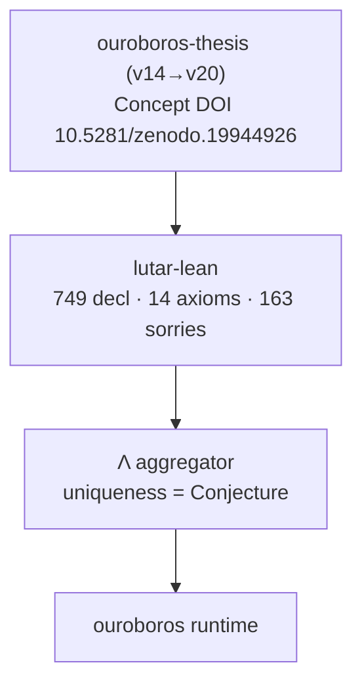
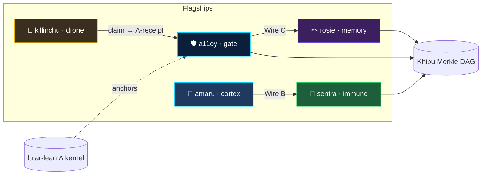

<!-- Organization profile README — rendered at github.com/szl-holdings -->
<!-- Doctrine v11. Updated 2026-06-01: Series-A polish, killinchu flagship, 3D showcase, full badges. -->

# SZL Holdings — Formally-Verified Governance Substrate for Agentic AI

SZL Holdings builds a **formally-verified governance substrate for agentic AI**. The Λ aggregator is anchored in Lean 4 against **749 declarations / 14 unique axioms / 163 tracked sorries** on [`lutar-lean@main`](https://github.com/szl-holdings/lutar-lean). Every gate decision emits a DSSE-enveloped receipt onto a hash-linked **Khipu Merkle DAG**, packaged as a UDS-deployable bundle and aligned with EU AI Act Article 12 and NIST AI RMF.

[🤗 Hugging Face](https://huggingface.co/SZLHOLDINGS) · [Live mesh demo](https://huggingface.co/spaces/SZLHOLDINGS/uds-demo) · [3D anatomy (live)](https://szlholdings-anatomy-3d.static.hf.space/) · [Org page](https://github.com/szl-holdings)

---

## Flagship surfaces

Five flagships, each with a live 🤗 Space, a GitHub repo, and a CI status badge.

### 🛡️ a11oy — Brand Orchestration Layer
Policy + receipt substrate. Every action signed, every decision gated through the Λ-aggregator, every receipt verifiable. Anchor gates evaluate each request before it reaches a tool.

🤗 [SZLHOLDINGS/a11oy](https://huggingface.co/spaces/SZLHOLDINGS/a11oy) · [github.com/szl-holdings/a11oy](https://github.com/szl-holdings/a11oy)

### 🧠 amaru — Cortex / Conduit
Cortex memory + reasoner. Every inference cites its source; every memory carries its receipt. Live FastAPI with a DSSE-wrapped tick endpoint over the conduit.

🤗 [SZLHOLDINGS/amaru](https://huggingface.co/spaces/SZLHOLDINGS/amaru) · [github.com/szl-holdings/amaru](https://github.com/szl-holdings/amaru)

### 🦠 sentra — Immune
Policy immune system. Deny by default, allow with proof; eight gates evaluate every action. Egress inspector + tripwires, Wire B live to a11oy.

🤗 [SZLHOLDINGS/sentra](https://huggingface.co/spaces/SZLHOLDINGS/sentra) · [github.com/szl-holdings/sentra](https://github.com/szl-holdings/sentra)

### 🦅 killinchu — Drone Intelligence *(NEW — air sibling of vessels)*
Andean counter-UAS rule engine. Real decoders for FAA Remote ID, ADS-B Mode-S, MAVLink, and STANAG 4609. Decoded telemetry is scored as a *claim* against geofence + policy, emitting an honest Λ-receipt. The maritime sibling [`vessels`](https://github.com/szl-holdings/vessels) remains live during the transition.

[github.com/szl-holdings/killinchu](https://github.com/szl-holdings/killinchu) · 🤗 Space queued (HF deploy pending) · *vessels:* 🤗 [SZLHOLDINGS/vessels](https://huggingface.co/spaces/SZLHOLDINGS/vessels)

### 🪢 rosie — Cross-Session Memory
Cross-session memory + operator console. Human-facing UI for verdicts and the live receipt stream; persistent memory carries provenance across sessions. Wire C live to a11oy.

🤗 [SZLHOLDINGS/rosie](https://huggingface.co/spaces/SZLHOLDINGS/rosie) · [github.com/szl-holdings/rosie](https://github.com/szl-holdings/rosie)

---

## 3D Visualization — the substrate, alive

The full substrate renders as an interactive 3D anatomy: 12 organs around the Λ-spine (13 axes), wires B–H between flagships, live Λ score, and per-organ formula registry with honest Lean status (`GREEN` / `PARTIAL`) and per-organ Zenodo DOIs.

**[▶ Explore Live — anatomy-3d](https://szlholdings-anatomy-3d.static.hf.space/)**

The 3D anatomy reports the same canonical numbers as `lutar-lean@main` and labels Λ uniqueness as a **Conjecture**. A rosie cross-session-memory 3D view is in development (`rosie-3d`); the live, deployed viewer today is **anatomy-3d**.

---

## Math substrate

The governance substrate rests on a Lean 4 + Mathlib proof kernel.

- **[`lutar-lean`](https://github.com/szl-holdings/lutar-lean)** — Lean 4 proofs of the Λ aggregator. Honest counts on `main`: **749 declarations · 14 unique axioms (15 raw, 1 duplicate) · 163 tracked sorries (112 baseline + 51 Putnam)**, regenerated by [`lean_numbers.py`](https://github.com/szl-holdings/.github/blob/main/.github/scripts/lean_numbers.py).
- **Concept DOI** [10.5281/zenodo.19944926](https://doi.org/10.5281/zenodo.19944926) — always resolves to the latest thesis version. The thesis chain runs **v14 → v20** (delta-graft sessions, ORCID-attributed, concept-DOI chain intact).
- **[`ouroboros-thesis`](https://github.com/szl-holdings/ouroboros-thesis)** — the written thesis, DOI-pinned per version.

---

## Honest disclosure — Doctrine v11

This block is load-bearing. Every claim cites Lean/Zenodo backing.

- **Formal proof posture:** 749 declarations, 14 unique axioms (15 raw, 1 duplicate), **163** tracked sorries (112 baseline + 51 Putnam) on `lutar-lean@main`. Source of truth: [`lean_numbers.json`](https://github.com/szl-holdings/.github/blob/main/.github/data/lean_numbers.json).
- **Λ uniqueness is a Conjecture, not a Theorem** — it depends on an open `CAUCHY_ND` sorry and a missing symmetry axiom. We do **not** claim "zero sorry" or "fully verified".
- **13-axis canonical trust schema** (yuyay_v3) — not 9-axis.
- **Axiom semantics:** `A2 IsHomogeneous` and `A4 IsBounded` carry disclosed semantic drift from earlier versions (see lutar-lean axiom disclosure).
- **SLSA L1 (honest)** — previously mis-claimed L3; corrected in platform PR #235.
- **Receipts:** DSSE envelopes ship from the amaru tick endpoint; signature fields are labelled `PLACEHOLDER` until Sigstore CI signing is wired.

---

## Anatomy

---

## Active repositories

| Repo | Role |
|---|---|
| [`a11oy`](https://github.com/szl-holdings/a11oy) | Brand orchestration — policy + receipt substrate (TypeScript, MCP server) |
| [`amaru`](https://github.com/szl-holdings/amaru) | Cortex / conduit — memory + reasoner (FastAPI) |
| [`sentra`](https://github.com/szl-holdings/sentra) | Immune / policy — egress inspector + tripwires (Wire B live) |
| [`killinchu`](https://github.com/szl-holdings/killinchu) | Drone intelligence — counter-UAS rule engine (air sibling of vessels) |
| [`vessels`](https://github.com/szl-holdings/vessels) | Maritime detection — UDS packaging, Pepr admission (pivoting → killinchu for air) |
| [`rosie`](https://github.com/szl-holdings/rosie) | Cross-session memory + operator console (Wire C live) |
| [`lutar-lean`](https://github.com/szl-holdings/lutar-lean) | Lean 4 + Mathlib proofs of the Λ aggregator |
| [`ouroboros`](https://github.com/szl-holdings/ouroboros) | Bounded-recursion runtime |
| [`ouroboros-thesis`](https://github.com/szl-holdings/ouroboros-thesis) | DOI-pinned written thesis |
| [`platform`](https://github.com/szl-holdings/platform) | Composing monorepo for the substrate runtime |
| [`uds-mesh`](https://github.com/szl-holdings/uds-mesh) | UDS span schemas + governance receipts |
| [`vsp-otel`](https://github.com/szl-holdings/vsp-otel) | OpenTelemetry exporter for Λ-axis spans |
| [`du-upstream-contributions`](https://github.com/szl-holdings/du-upstream-contributions) | Upstream patches to Defense Unicorns UDS |
| [`szl-trust`](https://github.com/szl-holdings/szl-trust) · [`szl-cookbook`](https://github.com/szl-holdings/szl-cookbook) · [`szl-brand`](https://github.com/szl-holdings/szl-brand) | Trust specs · recipes · visual doctrine |

---

## Building in public

- **LinkedIn:** [@stephen-l-279315240](https://www.linkedin.com/in/stephen-l-279315240/)
- **ORCID:** [0009-0001-0110-4173](https://orcid.org/0009-0001-0110-4173)
- **Hugging Face:** [SZLHOLDINGS](https://huggingface.co/SZLHOLDINGS)

---

## Operating doctrine

- **Doctrine v11** — language hygiene + honesty enforced by CI grep; canonical numbers regenerated, never hand-typed.
- **Watunakuy** — testing discipline (Four Strikes · Five Boots · Five Passes).
- **Zero-Bandaid Law** — every output must survive a Series-A diligence read.
- **Mythos → Hatun-Willay.**

Full spec: [DOCTRINE_V11.md](https://github.com/szl-holdings/.github/blob/main/DOCTRINE_V11.md)

---

## Founder guides

Step-by-step Word guides to stand the ecosystem up from zero:

- **Environment Setup Guide** — hardware to buy, tools to install (with links), accounts, secret keys, 10-step first-time setup: [docs/SZL_ENVIRONMENT_SETUP_GUIDE.docx](https://github.com/szl-holdings/.github/blob/main/docs/SZL_ENVIRONMENT_SETUP_GUIDE.docx)
- **UDS Run Guide** — sign bundles, build Zarf, k3d deploy, verify, Warhacker demo script, founder action queue: [docs/SZL_UDS_RUN_GUIDE.docx](https://github.com/szl-holdings/.github/blob/main/docs/SZL_UDS_RUN_GUIDE.docx)
- Mirrored on Hugging Face: [SZLHOLDINGS/doctrine-v10-v11](https://huggingface.co/datasets/SZLHOLDINGS/doctrine-v10-v11) under `founder-guides/`

---

## Contact

- Founder: Stephen P. Lutar Jr. · [stephen@szlholdings.com](mailto:stephen@szlholdings.com) · ORCID [0009-0001-0110-4173](https://orcid.org/0009-0001-0110-4173)
- Security: [`security@szlholdings.com`](mailto:security@szlholdings.com) · [security policy](https://github.com/szl-holdings/.github/security/policy)
- Citation: [CITATION.cff](https://github.com/szl-holdings/.github/blob/main/CITATION.cff) · Concept DOI [10.5281/zenodo.19944926](https://doi.org/10.5281/zenodo.19944926)

---

© 2026 SZL Holdings · Apache-2.0 · Doctrine v11 · Updated 2026-06-01 — Series-A polish, killinchu flagship, 3D showcase
