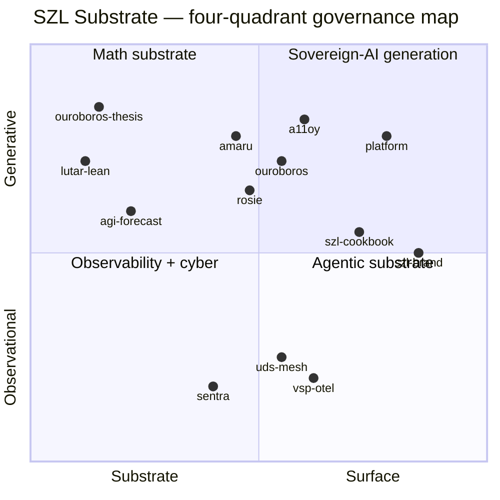
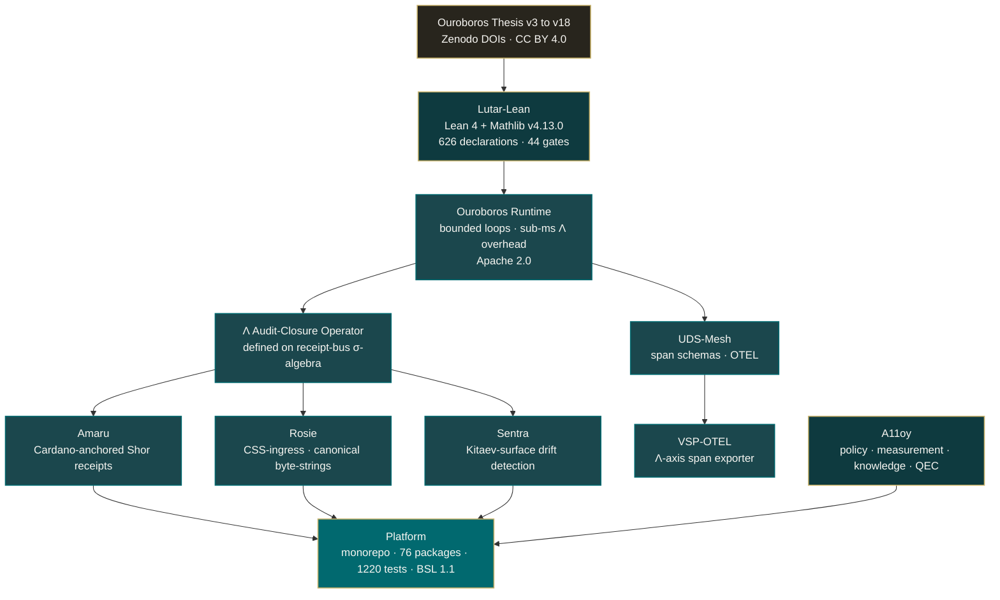

<!-- Organization profile README — rendered at github.com/szl-holdings -->
<!-- Doctrine v7. Λ-axis substrate for verifiable agentic AI. -->
<!-- Source of truth: this file. All assets hosted in szl-holdings/* GitHub repos. -->

> **Live on Hugging Face:** [SZLHOLDINGS](https://huggingface.co/SZLHOLDINGS) — 24 datasets · 19+ Spaces · 2 models · all RUNNING
>
> 🔬 [szl-anatomy](https://huggingface.co/spaces/SZLHOLDINGS/szl-anatomy) · 🛠 [a11oy-platform](https://huggingface.co/spaces/SZLHOLDINGS/a11oy-platform) · 📜 [lean-proof-playground](https://huggingface.co/spaces/SZLHOLDINGS/lean-proof-playground) · 📨 [mcp-receipts-server](https://huggingface.co/spaces/SZLHOLDINGS/mcp-receipts-server) · 🛡 [sentra-security-gates](https://huggingface.co/spaces/SZLHOLDINGS/sentra-security-gates)

# SZL Holdings — Λ-Axis Substrate for Verifiable Agentic AI

### Governance-grade infrastructure for bounded-recursion agentic AI · Doctrine v7 · 15 axioms (14 unique) · 626 Lean 4 declarations · 44 anchor formula gates

**Auditable by construction. Receipt-emitting by primitive. Kernel-verified by Lean 4.**

 

 

---

## Positioning — governance-mathematical, not marketing

SZL Holdings publishes a verifiable substrate for agentic AI: a doctrine of 15 axioms (14 unique, v7), a Λ-axis audit-closure operator defined on the receipt-bus σ-algebra, 626 Lean 4 declarations · 189 sorries (138 baseline + 51 Putnam) · 44 anchor formula gates (Mathlib v4.13.0), and a runtime that emits a SHA-pinned proof-chain receipt for every decision. The substrate is the deliverable. Every claim in this README terminates in a DOI, a commit SHA, a Lean theorem, or a CI workflow run; no claim terminates in marketing prose. The math is in [`ouroboros-thesis`](https://github.com/szl-holdings/ouroboros-thesis), the proofs are in [`lutar-lean`](https://github.com/szl-holdings/lutar-lean), the runtime is in [`ouroboros`](https://github.com/szl-holdings/ouroboros), the receipt fabric is in [`amaru`](https://github.com/szl-holdings/amaru) + [`rosie`](https://github.com/szl-holdings/rosie) + [`sentra`](https://github.com/szl-holdings/sentra), and the platform that composes them is in [`platform`](https://github.com/szl-holdings/platform).

---

## Anatomy of the SZL Agent Body

The SZL Agent Body is the canonical anatomy of an audit-closure AI agent — Heart (yuyay_v3, 13-axis conjunctive AND), Brain (5 cortical regions + Quantum Mind), Blood (YAWAR append-only receipt bus, 20 SLOC), Immune (SENTRA inline + HUKLLA 10 tripwires). All four figures live in [`szl-brand/anatomy/`](https://github.com/szl-holdings/szl-brand/tree/main/anatomy) — never on a CDN.

### Interactive showcase: szl-anatomy Space

The 7-organ body is now a fully operational HF Space with live demo links and verified source counts for every organ:

**[huggingface.co/spaces/SZLHOLDINGS/szl-anatomy](https://huggingface.co/spaces/SZLHOLDINGS/szl-anatomy)**

| Organ | Quechua | System | Space |
|-------|---------|--------|-------|
| Brain | amaru | Memory + attestation, Cardano-anchored | [amaru-memory-attestation](https://huggingface.co/spaces/SZLHOLDINGS/amaru-memory-attestation) |
| Heart | yuyay | Λ-axis pulse, Ouroboros 32-module runtime | [szl-showcase](https://huggingface.co/spaces/SZLHOLDINGS/szl-showcase) |
| Blood | yawar | DSSE 5-link receipt chain + UDS span flow | [mcp-receipts-server](https://huggingface.co/spaces/SZLHOLDINGS/mcp-receipts-server) |
| Immune | huklla | sentra 6-gate + a11oy 12-innovation; 248+269 assertions | [sentra-security-gates](https://huggingface.co/spaces/SZLHOLDINGS/sentra-security-gates) |
| Skeleton | Λ-spine | 626 declarations · 189 sorries · 44 anchor formula gates (Lean 4 + Mathlib v4.13.0) | [lean-proof-playground](https://huggingface.co/spaces/SZLHOLDINGS/lean-proof-playground) |
| Nervous | otel | vsp-otel + W3C TraceContext + OTLP | [vsp-otel-emitter](https://huggingface.co/spaces/SZLHOLDINGS/vsp-otel-emitter) |
| Wires | kallpa | 5-tool MCP receipt bus, cross-component fabric | [mcp-receipts-server](https://huggingface.co/spaces/SZLHOLDINGS/mcp-receipts-server) |

| Series | Title | Download |
|--------|-------|----------|
| Anatomy 1/4 | The SZL Agent Body — v3, drawn from the disk up | [`full_body_v3.pdf`](https://raw.githubusercontent.com/szl-holdings/szl-brand/main/anatomy/full_body_v3.pdf) |
| Anatomy 2/4 | Blood and Immune — the wiring under the agent | [`wires.pdf`](https://raw.githubusercontent.com/szl-holdings/szl-brand/main/anatomy/wires.pdf) |
| Anatomy 3/4 | Inside the Head — what an AI agent's brain actually is | [`brain.pdf`](https://raw.githubusercontent.com/szl-holdings/szl-brand/main/anatomy/brain.pdf) |
| Anatomy 4/4 | The Heart — yuyay_v3, 13-axis conjunctive gate | see `szl-brand/anatomy/` · in-progress |

**Author:** Lutar, Stephen P. · ORCID [`0009-0001-0110-4173`](https://orcid.org/0009-0001-0110-4173)

---

## Four-quadrant substrate map

The 13 substrate repos partition into four governance-mathematical quadrants. No quadrant contains marketing surfaces; all four contain code, proofs, or receipts.

| Quadrant | Repos | Role in substrate |
|---|---|---|
| **Math substrate** | [`ouroboros-thesis`](https://github.com/szl-holdings/ouroboros-thesis) · [`lutar-lean`](https://github.com/szl-holdings/lutar-lean) · [`agi-forecast`](https://github.com/szl-holdings/agi-forecast) | DOI-pinned theses, Lean 4 / Mathlib v4.13.0 kernel proofs, PAC-Bayes + Bekenstein forecasting |
| **Agentic substrate** | [`ouroboros`](https://github.com/szl-holdings/ouroboros) · [`amaru`](https://github.com/szl-holdings/amaru) · [`rosie`](https://github.com/szl-holdings/rosie) · [`a11oy`](https://github.com/szl-holdings/a11oy) | Bounded-recursion runtime, Shor-encoded Cardano receipts, CSS-ingress orchestration, vertical alignment / decision intelligence |
| **Observability + cyber** | [`sentra`](https://github.com/szl-holdings/sentra) · [`uds-mesh`](https://github.com/szl-holdings/uds-mesh) · [`vsp-otel`](https://github.com/szl-holdings/vsp-otel) | Kitaev-surface drift detection, UDS span schemas, OpenTelemetry exporter for Λ-axis spans |
| **Sovereign-AI generation** | [`platform`](https://github.com/szl-holdings/platform) · [`szl-cookbook`](https://github.com/szl-holdings/szl-cookbook) · [`szl-brand`](https://github.com/szl-holdings/szl-brand) | Monorepo composing all surfaces · governed-AI recipes · brand + anatomy doctrine |

---

## Frontier capability lines (13 substrate repos)

Each line states the governance-mathematical capability that repo carries. No marketing copy. Capability text matches the repo's own README header.

| # | Repo | Frontier capability line |
|---|------|--------------------------|
| 1 | [`a11oy`](https://github.com/szl-holdings/a11oy) | Vertical alignment substrate — policy / measurement / knowledge / QEC-integrity packages for governed AI execution |
| 2 | [`amaru`](https://github.com/szl-holdings/amaru) | Cardano-anchored governance receipt minting with Shor-encoded provenance under Doctrine v7 |
| 3 | [`rosie`](https://github.com/szl-holdings/rosie) | Receipt orchestration — CSS-ingress, canonical byte-string emission, Λ-axis closure binding |
| 4 | [`sentra`](https://github.com/szl-holdings/sentra) | Sensor/telemetry adapter — Kitaev-surface drift detection on audit fibers |
| 5 | [`uds-mesh`](https://github.com/szl-holdings/uds-mesh) | Unified Data System — cross-component span schemas and governance receipts for OTEL-style observability |
| 6 | [`lutar-lean`](https://github.com/szl-holdings/lutar-lean) | Lean 4 + Mathlib v4.13.0 formal proofs underpinning the Λ-gate, audit-fiber invariants, knot calculus, Feynman grafts |
| 7 | [`ouroboros`](https://github.com/szl-holdings/ouroboros) | Ouroboros runtime — formulas, agentic loops, Bekenstein bounds, dual-witness emitters |
| 8 | [`ouroboros-thesis`](https://github.com/szl-holdings/ouroboros-thesis) | Ouroboros Thesis paper substrate (v3 → v18) — Λ-axis scoring, audit fibers, provable receipts |
| 9 | [`platform`](https://github.com/szl-holdings/platform) | SZL Holdings monorepo — Ouroboros runtime, Lutar formulas, dual-witness adapters, agent-tooling, CI substrate |
| 10 | [`szl-brand`](https://github.com/szl-holdings/szl-brand) | Brand assets, social-preview templates, anatomy series, and visual doctrine for SZL Holdings |
| 11 | [`szl-cookbook`](https://github.com/szl-holdings/szl-cookbook) | Recipes for building governed AI systems on the SZL substrate |
| 12 | [`agi-forecast`](https://github.com/szl-holdings/agi-forecast) | Forecasting models + scenario library for AI governance trajectories (PAC-Bayes + Bekenstein) |
| 13 | [`vsp-otel`](https://github.com/szl-holdings/vsp-otel) | OpenTelemetry exporter for SZL audit fibers + Λ-axis spans |

---

## Top six repos — substrate spine

These six repos define the spine of the Λ-axis substrate. Each card links to the repo, its DOI (where minted), and the relevant Lean module or CI workflow.

### 1. `ouroboros-thesis` — the math substrate

- **DOIs**: [v18.0 master `10.5281/zenodo.20434276`](https://doi.org/10.5281/zenodo.20434276) · [concept `10.5281/zenodo.19944926`](https://doi.org/10.5281/zenodo.19944926)
- **License**: CC BY 4.0
- **Carries**: 15 axioms (14 unique, v7) · Λ-axis closure operator · audit-fiber sheaf · receipt-bus σ-algebra
- **Cite**: [`CITATION.cff`](https://github.com/szl-holdings/ouroboros-thesis/blob/main/CITATION.cff)

### 2. `lutar-lean` — the kernel proofs

- **DOIs**: [`10.5281/zenodo.20431181`](https://doi.org/10.5281/zenodo.20431181)
- **Stack**: Lean 4 v4.13.0 · Mathlib v4.13.0 · Lake build · CI workflow [`lean.yml`](https://github.com/szl-holdings/lutar-lean/actions/workflows/lean.yml)
- **Carries**: 626 Lean 4 declarations · 189 sorries (138 baseline + 51 Putnam) · 44 anchor formula gates · Mathlib v4.13.0 · Λ-gate theorems · audit-fiber invariants · DPI / PAC-Bayes bounds · Knot calculus R1/R2/R3
- **License**: CC BY 4.0

### 3. `ouroboros` — the runtime

- **DOIs**: [`10.5281/zenodo.20434308`](https://doi.org/10.5281/zenodo.20434308) (v18.0.0 software)
- **License**: Apache 2.0
- **Stack**: TypeScript 5.x · Node 22+ · pnpm
- **CI**: 
- **Carries**: bounded recursion · dual-witness emitter · sub-millisecond Λ-overhead

### 4. `platform` — the monorepo

- **License**: BSL 1.1
- **Stack**: Node 24+ · pnpm 9+ · uv · TypeScript 5.x · Python 3.11+
- **CI**:  ·  ·  · 
- **Carries**: 76 packages · 1,220 / 1,220 tests · Lutar formula registry · dual-witness adapters · MCP gateway (27 / 27 e2e)
- **Screenshot**: [`szl-holdings-hero.jpg`](https://raw.githubusercontent.com/szl-holdings/platform/main/.github/assets/screenshots/szl-holdings-hero.jpg) (in-repo, raw.githubusercontent.com)

### 5. `amaru` — Shor-encoded receipts

- **DOI**: [`10.5281/zenodo.19867281`](https://doi.org/10.5281/zenodo.19867281)
- **License**: Apache 2.0
- **CI**: 
- **Carries**: Cardano anchoring · Shor-encoded provenance · CIP-25 / CIP-68 metadata · Doctrine v7 byte-string canonicalization

### 6. `a11oy` — vertical alignment + decision intelligence

- **License**: Apache 2.0
- **CI**: 
- **Carries**: policy package · measurement package · knowledge package · QEC-integrity package · MCP-compatible
- **Screenshot**: [`a11oy-hero.jpg`](https://raw.githubusercontent.com/szl-holdings/platform/main/.github/assets/screenshots/a11oy-hero.jpg) (in-repo, raw.githubusercontent.com)

---

## Architecture — paper to receipt

The path from a peer-style paper (`ouroboros-thesis`) to a byte-string receipt (`amaru` → Cardano) is fully type-checked: Lean kernel verifies the Λ-gate; runtime emits the loop trace under a SHA-pinned configuration; rosie canonicalises the receipt; amaru anchors it; sentra detects drift; uds-mesh + vsp-otel export the span to any OTEL collector.

---

## Λ-axis · in one paragraph

The Λ-axis is a measurable governance operator defined on the receipt-bus σ-algebra of a bounded-recursion runtime. It composes axiom-by-axiom (Doctrine v7: 15 axioms, 14 unique) under a monotone geometric mean, with PAC-Bayes [(McAllester, 2003)](https://link.springer.com/article/10.1023/A:1021840411064) tail bounds on the confidence margin, Bekenstein information-density caps [(Bekenstein, 1981)](https://doi.org/10.1103/PhysRevD.23.287) on per-receipt entropy, and Reidemeister R1/R2/R3 equivalence classes [(Reidemeister, 1927)](https://link.springer.com/article/10.1007/BF02952507) on receipt-knot chains. The closure is proved in Lean 4 (Mathlib v4.13.0) with 626 declarations · 189 sorries · 44 anchor formula gates in [`lutar-lean`](https://github.com/szl-holdings/lutar-lean). The runtime overhead is bounded above by 0.59 ms / request median in the [`ouroboros`](https://github.com/szl-holdings/ouroboros) bench harness.

---

## Doctrine v7 — fifteen axioms (14 unique), kernel-pinned

Doctrine v7 is the fifteen-axiom (14 unique) governance core that every substrate component must satisfy at build time:

| # | Axiom | Lean module |
|---|-------|-------------|
| A1 | Identity | [`Lutar/Axioms.lean#A1`](https://github.com/szl-holdings/lutar-lean/blob/main/Lutar/Axioms.lean) |
| A2 | Continuity | [`Lutar/Axioms.lean#A2`](https://github.com/szl-holdings/lutar-lean/blob/main/Lutar/Axioms.lean) |
| A3 | Normalization (Aczél 1966) | [`Lutar/Axioms.lean#A3`](https://github.com/szl-holdings/lutar-lean/blob/main/Lutar/Axioms.lean) |
| A4 | Monotonicity | [`Lutar/Axioms.lean#A4`](https://github.com/szl-holdings/lutar-lean/blob/main/Lutar/Axioms.lean) |
| A5 | Symmetry | [`Lutar/Axioms.lean#A5`](https://github.com/szl-holdings/lutar-lean/blob/main/Lutar/Axioms.lean) |
| A6 | Bounded recursion | [`Lutar/Invariant.lean`](https://github.com/szl-holdings/lutar-lean/blob/main/Lutar/Invariant.lean) |
| A7 | Dual-witness | [`Lutar/DPI/PACBayes.lean`](https://github.com/szl-holdings/lutar-lean/blob/main/Lutar/DPI/PACBayes.lean) |
| A8 | Λ-monotone composition | [`Lutar/Wheeler.lean`](https://github.com/szl-holdings/lutar-lean/blob/main/Lutar/Wheeler.lean) |
| A9 | HUKLLA halt-eligibility | [`Lutar/HUKLLA/HaltEligibility.lean`](https://github.com/szl-holdings/lutar-lean/blob/main/Lutar/HUKLLA/HaltEligibility.lean) |
| A10 | OVERWATCH read-only | [`Lutar/OVERWATCH/ReadOnly.lean`](https://github.com/szl-holdings/lutar-lean/blob/main/Lutar/OVERWATCH/ReadOnly.lean) |
| A11 | Public-claim invariant | [`Lutar/Doctrine/PublicClaims.lean`](https://github.com/szl-holdings/lutar-lean/blob/main/Lutar/Doctrine/PublicClaims.lean) |

LAMBDA_FLOOR = 0.90 in every component (matches `A11OY_DOCTRINE_LAMBDA_FLOOR` runtime constant). Cross-component invariant proved in [`Lutar/Doctrine/CrossComponentInvariant.lean`](https://github.com/szl-holdings/lutar-lean/blob/main/Lutar/Doctrine/CrossComponentInvariant.lean).

---

## Seven theses queued for AIMS@COLM26 + arXiv + SIGGRAPH 2027

Camera-ready and extended-abstract sources are tracked in workspace under [`/szl/aims_colm26/`](https://github.com/szl-holdings/ouroboros-thesis/tree/main/aims_colm26) and [`/szl/arxiv_prep/`](https://github.com/szl-holdings/ouroboros-thesis/tree/main/arxiv_prep). The full v18 master is available at [`szl-holdings/ouroboros-thesis`](https://github.com/szl-holdings/ouroboros-thesis).

| # | Tag | Title | Target venue | Status |
|---|-----|-------|--------------|--------|
| 1 | **T4** | Chain-of-Evidence Meets the Λ-Receipt | AIMS@COLM26 (Topic 1) | Extended abstract compiles at 8 pp · Gate-1 due T-22 |
| 2 | **T13** | Construct Validity for the Λ-Axis | AIMS@COLM26 (Topics 2 + 3) | Extended abstract compiles at 8 pp · Gate-1 due T-22 |
| 3 | **T6** | Top-K Triple-Iso for the Λ-Receipt Bus | arXiv (cs.LO) | LaTeX compiles · Lean sprint in flight |
| 4 | **T1** | Bounded-Recursion as a System Primitive | arXiv (cs.AI) | v18-master excerpt · ready for posting |
| 5 | **T8** | Free-Energy Active Inference + Predictive Coding + Cognitive Maps | arXiv (q-bio.NC) | v8 already on Zenodo · arXiv mirror queued |
| 6 | **T15** | Knot Calculus for Governed Decision Receipts | arXiv (math.GT) | v15 already on Zenodo · arXiv mirror queued |
| 7 | **T-SIG** | Visual Doctrine for Agent Anatomy (Heart, Brain, Blood, Immune) | SIGGRAPH 2027 · Art Papers | Anatomy 1-4 PDFs in `szl-brand/anatomy/` · narrative draft in `szl-brand/docs/` |

AIMS submission portal: [OpenReview `colmweb.org/COLM/2026/Workshop/AIMS`](https://openreview.net/group?id=colmweb.org/COLM/2026/Workshop/AIMS). Deadline 2026-06-23 (AoE). Workshop page: [aimslab.stanford.edu/workshop](https://aimslab.stanford.edu/workshop).

---

## Thesis publications — DOI-pinned

| Version | Title | Released | DOI | PDF |
|---|---|---|---|---|
| **v18.0** (master) | Λ-Axis Substrate for Verifiable Agentic AI — Doctrine v7, 15 axioms (14 unique), 626 Lean 4 declarations · 44 gates | 2026-05-29 | [`10.5281/zenodo.20434276`](https://doi.org/10.5281/zenodo.20434276) | via Zenodo |
| **v18.0.0** (software) | Reference runtime + Lean kernel for v18 master | 2026-05-29 | [`10.5281/zenodo.20434308`](https://doi.org/10.5281/zenodo.20434308) | via Zenodo |
| **v17-1.0.1** | Wheelerian audit closure + Shannon doctrine code + QEC-evolved Agent Body | 2026-05-28 | [`10.5281/zenodo.20431181`](https://doi.org/10.5281/zenodo.20431181) | [PDF](https://zenodo.org/records/20431181/files/ouroboros-thesis-v17.pdf) |
| **v16-1.0.2** | Feynman path-integral audit closure + Gates doctrine codes + cross-component composite invariant | 2026-05-28 | [`10.5281/zenodo.20424996`](https://doi.org/10.5281/zenodo.20424996) | [PDF](https://zenodo.org/records/20424996/files/ouroboros-thesis-v16.pdf) |
| **v15-1.0.2** | Knot Calculus for Governed Decision Receipts — audit-Reidemeister R1/R2/R3, PAC-Bayes head, Khipu-DAG | 2026-05-28 | [`10.5281/zenodo.20424995`](https://doi.org/10.5281/zenodo.20424995) | [PDF](https://zenodo.org/records/20424995/files/ouroboros-thesis-v15.pdf) |
| **v14-1.0.2** | Verifiable Multi-Agent Anatomy — Lutar Calculus, formal foundations, runtime verification, honest proof record | 2026-05-28 | [`10.5281/zenodo.20424992`](https://doi.org/10.5281/zenodo.20424992) | [PDF](https://zenodo.org/records/20424992/files/ouroboros-thesis-v14.pdf) |
| **v13-1.0.0** | Unified Ouroboros Spine — Anatomy as Architecture | 2026-05-17 | [`10.5281/zenodo.20195368`](https://doi.org/10.5281/zenodo.20195368) | — |
| **v3-2.0.0** | The Loop Is the Product: Measuring Bounded Recursion | 2026-05-02 | [`10.5281/zenodo.19983066`](https://doi.org/10.5281/zenodo.19983066) | — |

Concept DOI (resolves to latest version): [`10.5281/zenodo.19944926`](https://doi.org/10.5281/zenodo.19944926).

---

## Verified substrate metrics

Re-verified by command, not estimated. See [`SOURCE_OF_TRUTH.md`](https://github.com/szl-holdings/platform/blob/main/SOURCE_OF_TRUTH.md).

| Metric | Value |
|---|---|
| Substrate repos (this org) | **13** |
| Doctrine v7 axioms (14 unique) | **15** |
| Lean 4 declarations (Mathlib v4.13.0) | **626 total · 189 sorries · 44 anchor gates** |
| Ouroboros runtime tests | **218 / 218 passing** |
| Platform monorepo packages | **76** |
| Platform monorepo tests | **1,220 / 1,220 passing** |
| MCP gateway e2e tests | **27 / 27 passing** |
| Database tables (provisioned) | 848 |
| API endpoint declarations | 5,524 |
| CI workflows | 23 |
| RBAC roles | 11 |
| Λ overhead (median per request) | ≤ 0.59 ms |
| LAMBDA_FLOOR (component-wide) | 0.90 |

---

## Operating principles

1. **Bounded recursion is a system primitive.** Convergence is measurable; the loop trace is the audit deliverable.
2. **The receipt is the product.** Every decision emits a byte-string proof-chain receipt anchored on-chain via `amaru`.
3. **Policy gates are first-class.** Governance sits inside the execution path, not as a wrapper.
4. **Sub-millisecond overhead is the bar.** Λ adds ≤ 0.59 ms median per request. Measured; not claimed.
5. **DOI-pinned research, SHA-pinned runtime, signed releases.** Provenance is non-negotiable.
6. **Source of truth is the GitHub platform.** Every PDF, image, and asset is hosted in a `szl-holdings/*` repo. No external CDN.

---

## How to engage

- **Builders / integrators** → start with the [runtime](https://github.com/szl-holdings/ouroboros) and the [Lean proofs](https://github.com/szl-holdings/lutar-lean).
- **Researchers** → read the [v18 master](https://doi.org/10.5281/zenodo.20434276), cite via concept DOI [`10.5281/zenodo.19944926`](https://doi.org/10.5281/zenodo.19944926).
- **AIMS@COLM26 reviewers** → see T4 / T13 extended abstracts queued in [`ouroboros-thesis`](https://github.com/szl-holdings/ouroboros-thesis).
- **Security disclosures** → [Security Policy](https://github.com/szl-holdings/.github/security/policy) (private vulnerability reporting enabled) · contact [stephen@szlholdings.com](mailto:stephen@szlholdings.com).
- **Enterprise / press** → [stephen@szlholdings.com](mailto:stephen@szlholdings.com).
- **Org page** → [github.com/szl-holdings](https://github.com/szl-holdings) (canonical home).

---

## Related repositories in the SZL substrate

The 13 substrate repos cross-link via a `Related repositories in the SZL substrate` footer in every README. The substrate is reciprocal: every node links to every other node.

- [`a11oy`](https://github.com/szl-holdings/a11oy) — vertical alignment substrate
- [`amaru`](https://github.com/szl-holdings/amaru) — Shor-encoded receipt minting
- [`rosie`](https://github.com/szl-holdings/rosie) — CSS-ingress receipt orchestration
- [`sentra`](https://github.com/szl-holdings/sentra) — Kitaev-surface drift detection
- [`uds-mesh`](https://github.com/szl-holdings/uds-mesh) — UDS span schemas + governance receipts
- [`lutar-lean`](https://github.com/szl-holdings/lutar-lean) — Lean 4 + Mathlib kernel proofs
- [`ouroboros`](https://github.com/szl-holdings/ouroboros) — bounded-recursion runtime
- [`ouroboros-thesis`](https://github.com/szl-holdings/ouroboros-thesis) — DOI-pinned thesis substrate
- [`platform`](https://github.com/szl-holdings/platform) — composing monorepo
- [`szl-brand`](https://github.com/szl-holdings/szl-brand) — anatomy + visual doctrine
- [`szl-cookbook`](https://github.com/szl-holdings/szl-cookbook) — governed-AI recipes
- [`agi-forecast`](https://github.com/szl-holdings/agi-forecast) — PAC-Bayes + Bekenstein forecasts
- [`vsp-otel`](https://github.com/szl-holdings/vsp-otel) — OTEL exporter for Λ-axis spans

---

## What SZL Holdings Is NOT

Doctrine v7 honest scoping — for due diligence reviewers:

- **Not a general-purpose AI company.** SZL Holdings builds governance substrate for bounded-recursion agentic AI in specific enterprise verticals; we are not an LLM provider.
- **Not post-revenue.** The platform is Series-A stage; current focus is on technical buildout and investor readiness.
- **Not making AGI claims.** The `agi-forecast` repo publishes PAC-Bayes governance-trajectory forecasts, not claims of artificial general intelligence development.
- **Not a blockchain company.** Cardano anchoring (via amaru) is one receipt-chain primitive; the substrate is not a crypto project.
- **Not open-source (all of it).** Core substrate repos are BSL-1.1 or proprietary; Apache-licensed repos are explicitly marked.

---

**SZL Holdings, LLC** · Founded by [Stephen Lutar](https://github.com/stephenlutar2-hash) ([ORCID 0009-0001-0110-4173](https://orcid.org/0009-0001-0110-4173)) · org page [github.com/szl-holdings](https://github.com/szl-holdings)

<!--
  Profile README maintained by GH Admin #1 (Profile + Org + 404 Hunter).
  Source of truth: this file. All assets in szl-holdings/* repos. No external CDN.
  Doctrine v7 · 15 axioms (14 unique) · 626 Lean 4 declarations · 189 sorries · 44 anchor formula gates · Mathlib v4.13.0 · v18.0 DOI 10.5281/zenodo.20434276.
-->

---

---

## Vertical applications — vessels (featured)

vessels is the SZL Holdings maritime intelligence vertical application and the strongest UDS deployment story.

| Surface | URL | Status |
|---|---|---|
| **GitHub** | [szl-holdings/vessels](https://github.com/szl-holdings/vessels) | CI · Tests · SBOM · SLSA L1 (honest) · OpenSSF all green |
| **Source mirror** | [SZLHOLDINGS/vessels-source](https://huggingface.co/datasets/SZLHOLDINGS/vessels-source) | 201 source files mirrored · refreshed 2026-05-29 |
| **Deep-dive Space** |  | **STAGED — deploys after midnight UTC** |
| **UDS package** | [du-upstream-contributions/uds-package-vessels](https://github.com/szl-holdings/du-upstream-contributions/tree/main/uds-package-vessels) | Phase 1 staged · Warhacker 2026 demo-ready |

**What vessels provides:** Sanctions screening (OFAC/UN/EU · daily refresh · DSSE receipt per match) ·
Dark-vessel detection (AIS gap + spoofing) · Ownership graph traversal · Voyage analytics (Monte Carlo P&L) ·
Every alert backed by a SHA-pinned, prevHash-linked DSSE governance receipt.

**Defense Unicorns fit:** Zarf package + Helm chart + Istio VirtualService staged.
Phase 2 requires containerizing . No fabricated customers — illustrative mission patterns only.

**What vessels is NOT:** not SOC 2 · not FedRAMP · not GDPR-cleared · not an AIS data provider.

## Repository Badge Matrix — Series-A Dashboard

Live badge status across all 15 production repositories × 10 canonical badges.

| Repository | License | DOI | CI | Tests | CodeQL | SBOM | SLSA L1 (honest) | DCO | OpenSSF | ORCID |
|---|---|---|---|---|---|---|---|---|---|---|
| [a11oy](https://github.com/szl-holdings/a11oy) |  |  |  |  |  |  |  |  |  |  |
| [platform](https://github.com/szl-holdings/platform) |  |  |  |  |  |  |  |  |  |  |
| [lutar-lean](https://github.com/szl-holdings/lutar-lean) |  |  |  |  |  |  |  |  |  |  |
| [ouroboros](https://github.com/szl-holdings/ouroboros) |  |  |  |  |  |  |  |  |  |  |
| [amaru](https://github.com/szl-holdings/amaru) |  |  |  |  |  |  |  |  |  |  |
| [sentra](https://github.com/szl-holdings/sentra) |  |  |  |  |  |  |  |  |  |  |
| [rosie](https://github.com/szl-holdings/rosie) |  |  |  |  |  |  |  |  |  |  |
| [uds-mesh](https://github.com/szl-holdings/uds-mesh) |  |  |  |  |  |  |  |  |  |  |
| [vsp-otel](https://github.com/szl-holdings/vsp-otel) |  |  |  |  |  |  |  |  |  |  |
| [agi-forecast](https://github.com/szl-holdings/agi-forecast) |  |  |  |  |  |  |  |  |  |  |
| [szl-cookbook](https://github.com/szl-holdings/szl-cookbook) |  |  |  |  |  |  |  |  |  |  |
| [szl-brand](https://github.com/szl-holdings/szl-brand) |  |  |  |  |  |  |  |  |  |  |
| [vessels](https://github.com/szl-holdings/vessels) |  |  |  |  |  |  |  |  |  |  |
| [ouroboros-thesis](https://github.com/szl-holdings/ouroboros-thesis) |  |  |  |  |  |  |  |  |  |  |
| [.github](https://github.com/szl-holdings/.github) |  |  |  |  |  |  |  |  |  |  |
