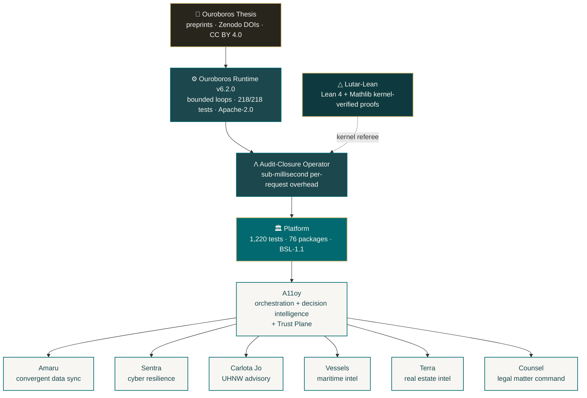

<!-- Organization profile README — rendered at github.com/szl-holdings -->
<!-- Series-A grade. Bounded recursion. Auditable AI by construction. -->

# SZL Holdings

### Governed AI infrastructure for high-consequence enterprise operations

**Bounded recursion as a system primitive. Proof-chain receipts on every decision. Sub-millisecond audit closure.**

 

---

## Anatomy of the SZL Agent Body

The SZL Agent Body is the canonical anatomy of an audit-closure AI agent — Heart (yuyay_v3, 13-axis conjunctive AND), Brain (5 cortical regions + Quantum Mind), Blood (YAWAR append-only receipt bus, 20 SLOC), Immune (SENTRA inline + HUKLLA 10 tripwires).

| Series | Title | PDF |
|--------|-------|-----|
| Anatomy 1/4 | The SZL Agent Body — v3, drawn from the disk up | [full_body.pdf](https://raw.githubusercontent.com/szl-holdings/szl-brand/main/anatomy/full_body.pdf) |
| Anatomy 2/4 | Blood and Immune — the wiring under the agent | [wires.pdf](https://raw.githubusercontent.com/szl-holdings/szl-brand/main/anatomy/wires.pdf) |
| Anatomy 3/4 | Inside the Head — what an AI agent's brain actually is | [brain.pdf](https://raw.githubusercontent.com/szl-holdings/szl-brand/main/anatomy/brain.pdf) |
| Anatomy 4/4 | The Heart — yuyay_v3, the gate every cycle clears | [heart.pdf](https://raw.githubusercontent.com/szl-holdings/szl-brand/main/anatomy/heart.pdf) |

Originals with richer diagrams: [brain_original.pdf](https://raw.githubusercontent.com/szl-holdings/szl-brand/main/anatomy/brain_original.pdf) · [wires_original.pdf](https://raw.githubusercontent.com/szl-holdings/szl-brand/main/anatomy/wires_original.pdf) · [full_body_original.pdf](https://raw.githubusercontent.com/szl-holdings/szl-brand/main/anatomy/full_body_original.pdf)

**Author:** Lutar, Stephen P. · ORCID [0009-0001-0110-4173](https://orcid.org/0009-0001-0110-4173)

---

## The thesis

Every enterprise AI deployment fails the same diligence question: **"prove what your model decided, why, and that it was within policy."** Most can't. We can. Our runtime emits a **proof-chain receipt** for every decision — bounded loop trace, policy gates traversed, evidence cited, convergence verified — recorded against an audit-closure operator (Λ) with sub-millisecond per-request overhead. The receipt is the deliverable. The loop is the product.

The math is published as a peer-style thesis family (v3, v9, v10 — Zenodo DOI-pinned). The runtime is shipped as a library. The fabric is shipped as a platform exposing the **Covenant Proof Standard (CPS)** as a first-class API. Eight product surfaces sit on top, governed by a single Decision Intelligence + Trust Plane (A11oy) that owns the proof-chain, the Outcome Graph, and the policy ladder.

## Architecture

## Open source pillars

| Pillar | Repo | License | What it is |
|---|---|---|---|
| 📄 **Research** | [`ouroboros-thesis`](https://github.com/szl-holdings/ouroboros-thesis) | CC BY 4.0 | The thesis. Bounded recursive computation as a system primitive. Zenodo DOIs. |
| ⚙️ **Runtime** | [`ouroboros`](https://github.com/szl-holdings/ouroboros) | Apache-2.0 | Reference TypeScript implementation. **218/218 tests** passing (verified 2026-05-12). Audit-closure operator Λ. |
| △ **Proofs** | [`lutar-lean`](https://github.com/szl-holdings/lutar-lean) | Apache-2.0 | Lean 4 + Mathlib machine-checked proofs of the Λ uniqueness theorem and the Egyptian-exactness lemma. The kernel is the referee. |
| 🛡️ **Trust portal** | [`szl-trust`](https://github.com/szl-holdings/szl-trust) | CC BY 4.0 | Public Trust Portal. Covenant Proof Standard (CPS) reference run with 12 receipts (`mocked:false`), deterministic replay. |
| 📖 **Cookbook** | [`szl-cookbook`](https://github.com/szl-holdings/szl-cookbook) | Apache-2.0 | 9 engineering skills (Anthropic SKILL.md pattern) covering pre-flight thinking, refactoring, review, debugging. |
| 🎨 **Brand** | [`szl-brand`](https://github.com/szl-holdings/szl-brand) | CC BY 4.0 | 14 social preview images, brand guidance, deterministic banner builder. |

## Product surfaces

Seven customer-facing surfaces, orchestrated by the A11oy decision-intelligence + Trust Plane. Each surface has its own README with mechanism-level cross-references.

| Surface | Repo | Domain |
|---|---|---|
| **A11oy** | [`a11oy`](https://github.com/szl-holdings/a11oy) | Orchestration + Decision Intelligence + Trust Plane. Hosts **Argo** (champion policies, mirror eval, counterfactuals, reward-hacking guardrails), **PSYCHE** (emergent-sentience observatory), **Trust Center / Exchange / Public Trust Portal**, **Agent Zero Trust** runtime gate, and a Claude-Sonnet-4.6-backed advisory chat at `/a11oy/chat`. |
| **Sentra** | [`sentra`](https://github.com/szl-holdings/sentra) | Cyber resilience. Posture drift, incident response, policy-gated remediation. Ships a **governed adversary loop** emitting a six-step proof chain through A11oy. |
| **Amaru** | [`amaru`](https://github.com/szl-holdings/amaru) | Convergent multi-source data sync. Append-only delta logs, hash-verified ingest, three-witness reconciliation (Frustum). |
| **Carlota Jo** | [`carlota-jo`](https://github.com/szl-holdings/carlota-jo) | UHNW advisory operations. Concierge workflow with proof-chain delivery. |
| **Vessels** | [`vessels`](https://github.com/szl-holdings/vessels) | Maritime fleet intel. Sanctions screening, dark-vessel detection, ownership graphs. |
| **Terra** | [`terra`](https://github.com/szl-holdings/terra) | Real estate intel. Deal pipeline scoring, AI-assisted underwriting. NYC + NYS data live. |
| **Counsel** | [`counsel`](https://github.com/szl-holdings/counsel) | Legal matter command. Document review, obligation mapping, proof-chain delivery. |

## Covenant Proof Standard (CPS)

The platform exposes proof-chained, policy-gated workflows as a first-class HTTP API:

| Endpoint | Behavior |
|---|---|
| `GET /api/cps/payloads` | List registered payloads |
| `GET /api/cps/payloads/:id` | Resolve a payload definition |
| `POST /api/cps/runs` | Execute a payload run |
| `GET /api/cps/runs/:id` | Inspect a run, its proof receipts, and approval state |
| `POST /api/cps/runs/:id/approve` | Approve a gated step at the caller's tier |
| `POST /api/cps/runs/:id/rollback` | Roll a completed run back to a prior verified state |
| `POST /api/cps/payloads/:id/maturity` | Promote/demote a payload's maturity mode |

Three flagship payloads ship with the standard — covering the cross-domain shape investors and procurement officers care about most: incident → governed action → audit close.

## Lutar-as-a-Service

`POST /api/ouroboros/lutar/v10` runs the v10 audit-closure operator Λ₁₀ against the live shipping repo on every test cycle. The typed result backs the `lutar_v10` Codex node. This is the operational binding from paper to production — the audit closure is *executable*, not just *publishable*.

## How to engage

- **Builders / integrators** → start with the [runtime](https://github.com/szl-holdings/ouroboros) and the [Lean proofs](https://github.com/szl-holdings/lutar-lean).
- **Researchers** → read the [thesis preprints](https://github.com/szl-holdings/ouroboros-thesis), cite via Zenodo DOI (concept `10.5281/zenodo.19944926`).
- **Security / procurement** → see the [Trust Portal](https://github.com/szl-holdings/szl-trust) and our [Security Policy](https://github.com/szl-holdings/.github/security/policy).
- **Enterprise customers** → [stephen@szlholdings.com](mailto:stephen@szlholdings.com)
- **Press / partnerships** → [stephen@szlholdings.com](mailto:stephen@szlholdings.com)

## Operating principles

1. **Bounded recursion is a system primitive.** Convergence is measurable; the loop trace is the audit deliverable.
2. **The receipt is the product.** Every decision emits a proof-chain receipt that downstream audit and procurement can consume.
3. **Policy gates are first-class.** Governance is not a wrapper. It is in the execution path.
4. **Sub-millisecond overhead is the bar.** Λ adds ≤ 0.59 ms median per request across our routes. Measured, not claimed.
5. **DOI-pinned research, SHA-pinned runtime, signed releases.** Provenance is non-negotiable.

## Verified platform metrics

| Metric | Value |
|---|---|
| Customer-facing surfaces (live) | **8** + A11oy orchestration layer |
| Database tables (live, provisioned) | 848 |
| API endpoint declarations | 5,524 |
| Monorepo packages | 126 |
| DB schema files | 170 |
| CI workflows | 23 |
| RBAC roles | 11 |
| Ouroboros runtime tests | **218 / 218 passing** (verified 2026-05-12 against szl-holdings/ouroboros `f31d749`) |
| Platform monorepo packages | **76** |
| Platform monorepo tests | **1,220 / 1,220 passing** (verified 2026-05-12 via full-sweep-2b) |
| MCP gateway e2e tests | **27 / 27 passing** |
| Lean kernel `sorry` count | tracked per CI run on [lutar-lean](https://github.com/szl-holdings/lutar-lean) |
| Formal axes in Lutar invariant family | 9 |
| Codex v11 nodes / typed edges | 76 / 95 across 11 domains |
| Λ overhead | ≤ 0.59 ms median per request |

*Re-verified by command, not estimated. See [`SOURCE_OF_TRUTH.md`](https://github.com/szl-holdings/platform/blob/main/SOURCE_OF_TRUTH.md).*

## Thesis publications (DOI-pinned)

| Version | Title | Released | DOI |
|---|---|---|---|
| **v11-1.0.0** (current) | APPLIED Λ — Measured per-request latency overhead of Λ₁₀ in a governed AI runtime | 2026-05-09 | [`10.5281/zenodo.20119582`](https://doi.org/10.5281/zenodo.20119582) |
| **v10-1.0.0** | EXHAUSTIVE-AUDIT — The Audit Closure Operator Λ₁₀ | 2026-05-07 | [`10.5281/zenodo.20053163`](https://doi.org/10.5281/zenodo.20053163) |
| **v9-1.0.0** | UNIFIED-OPERATIONAL — The Lutar Invariant Family v1 → v7 → Ω with Bianchi closure | 2026-05-07 | [`10.5281/zenodo.20053148`](https://doi.org/10.5281/zenodo.20053148) |
| **v8-1.0.0** | Free-Energy Active Inference + Predictive Coding + Cognitive Maps | 2026-05-05 | [`10.5281/zenodo.20020849`](https://doi.org/10.5281/zenodo.20020849) |
| **v3-2.0.0** | The Loop Is the Product: Measuring Bounded Recursion as a System Primitive for Auditable AI | 2026-05-02 | [`10.5281/zenodo.19983066`](https://doi.org/10.5281/zenodo.19983066) |
| **v12-1.0.0** | The Λ-Ouroboros Substrate — Four Machine-Verified Mechanisms | 2026-05-14 | DOI pending Zenodo mint — concept [`10.5281/zenodo.19944926`](https://doi.org/10.5281/zenodo.19944926) |
| **v13-exhaustive-1.0.0** | Anatomy as Architecture — The SZL Agent Body as a governed AI runtime | 2026-05-18 | DOI pending Zenodo mint |

---

**SZL Holdings, LLC** · Founded by [Lutar, Stephen P.](https://orcid.org/0009-0001-0110-4173) · [szlholdings.com](https://szlholdings.com)

