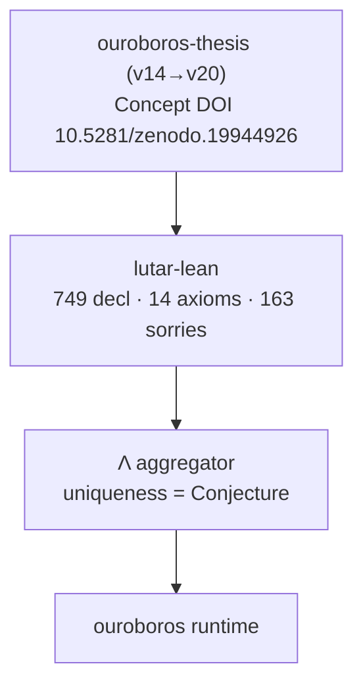
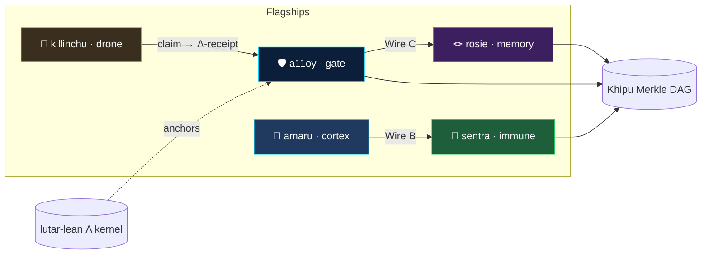

<!-- Organization profile README — rendered at github.com/szl-holdings -->
<!-- Doctrine v11. Updated 2026-06-02: OPS WAVE B — verticals, docs links, Series-A, c7c0ba17. Series-A polish, killinchu flagship, 3D showcase, full badges. -->

<div align="center">

<!-- ===== INCA AVATAR HERO (additive · Amaru animated mark · Yachay · 2026-06-01) =====
     Animated Inca avatar placed at the top of the hero. Existing static logo
     (szl-holdings-logo.svg) and every section below are preserved verbatim. -->


# SZL Holdings — Formally-Verified Governance Substrate for Agentic AI

SZL Holdings builds a **formally-verified governance substrate for agentic AI**. The Λ aggregator is anchored in Lean 4 against **749 declarations / 14 unique axioms / 163 tracked sorries** on [`lutar-lean@main`](https://github.com/szl-holdings/lutar-lean). Every gate decision emits a DSSE-enveloped receipt onto a hash-linked **Khipu Merkle DAG**, packaged as a UDS-deployable bundle and aligned with EU AI Act Article 12 and NIST AI RMF.

[](https://doi.org/10.5281/zenodo.19944926)
[](https://www.apache.org/licenses/LICENSE-2.0)
[](https://github.com/szl-holdings/.github/blob/main/DOCTRINE_V11.md)
[](https://slsa.dev/spec/v1.0/levels)
[](https://orcid.org/0009-0001-0110-4173)

[🤗 Hugging Face](https://huggingface.co/SZLHOLDINGS) · [Live mesh demo](https://huggingface.co/spaces/SZLHOLDINGS/uds-demo) · [3D anatomy (live)](https://szlholdings-anatomy-3d.static.hf.space/) · [Org page](https://github.com/szl-holdings)

</div>

<!-- ===== GENIUS HERO (additive overhaul · Yachay · 2026-06-01) ===== -->
<div align="center">

<a href="https://szl-holdings.github.io/.github/"></a>

<a href="https://szl-holdings.github.io/.github/"><b>▶ Open the live SZL Constellation (3D)</b></a> — every star is a governance surface; every edge is a Khipu receipt link.


</div>

<!-- ===== /GENIUS HERO ===== -->

---

## Flagship surfaces

Five flagships, each with a live 🤗 Space, a GitHub repo, and a CI status badge.

### 🛡️ a11oy — Brand Orchestration Layer
**Λ-gate governance platform · Lean-proven · DSSE-signed.** Policy + receipt substrate. Every action signed, every decision gated through the Λ-aggregator, every receipt verifiable. Anchor gates evaluate each request before it reaches a tool.
[](https://github.com/szl-holdings/a11oy/actions/workflows/ci.yml)
🤗 [SZLHOLDINGS/a11oy](https://huggingface.co/spaces/SZLHOLDINGS/a11oy) · [github.com/szl-holdings/a11oy](https://github.com/szl-holdings/a11oy)

### 🧠 amaru — Cortex / Conduit
Cortex memory + reasoner. Every inference cites its source; every memory carries its receipt. Live FastAPI with a DSSE-wrapped tick endpoint over the conduit.
[](https://github.com/szl-holdings/amaru/actions/workflows/ci.yml)
🤗 [SZLHOLDINGS/amaru](https://huggingface.co/spaces/SZLHOLDINGS/amaru) · [github.com/szl-holdings/amaru](https://github.com/szl-holdings/amaru)

### 🦠 sentra — Immune
Policy immune system. Deny by default, allow with proof; eight gates evaluate every action. Egress inspector + tripwires, Wire B live to a11oy.
[](https://github.com/szl-holdings/sentra/actions/workflows/ci.yml)
🤗 [SZLHOLDINGS/sentra](https://huggingface.co/spaces/SZLHOLDINGS/sentra) · [github.com/szl-holdings/sentra](https://github.com/szl-holdings/sentra)

### 🦅 killinchu — Drone Intelligence *(NEW — air sibling of vessels)*
Andean counter-UAS rule engine. Real decoders for FAA Remote ID, ADS-B Mode-S, MAVLink, and STANAG 4609. Decoded telemetry is scored as a *claim* against geofence + policy, emitting an honest Λ-receipt. The maritime sibling [`vessels`](https://github.com/szl-holdings/vessels) remains live during the transition.
[](https://github.com/szl-holdings/killinchu/actions/workflows/ci.yml)
🤗 [SZLHOLDINGS/killinchu](https://huggingface.co/spaces/SZLHOLDINGS/killinchu) · [github.com/szl-holdings/killinchu](https://github.com/szl-holdings/killinchu) · *maritime sibling:* 🤗 [SZLHOLDINGS/vessels](https://huggingface.co/spaces/SZLHOLDINGS/vessels)

> **Provenanced defense intelligence · 53-drone mesh · cosign-signed missions · geofence-enforced.** As of Doctrine v11 (2026-06-01) killinchu is also an **a11oy understudy** — it carries every a11oy moat + the 11 understudy capabilities (7-tier LLM router, agentic RAG, 18-tool MCP, PURIQ 12 organs, 23 formulas, Khipu DAG, AYNI, WAYRA) under `/api/killinchu/v2/*`, failover-ready with `ready_to_substitute: true`.

### 🪢 rosie — Cross-Session Memory · a11oy Understudy
**Your provenanced AI aide. Every action signed. Every memory yours.** Cross-session memory + operator console. Human-facing UI for verdicts and the live receipt stream; persistent memory carries provenance across sessions. Wire C live to a11oy.

> As of Doctrine v11 (2026-06-01) rosie is a **failover-ready a11oy understudy** — she carries every a11oy moat + the 11 understudy capabilities (full 7-tier open-LLM router, full agentic RAG with live corpus, 18-tool MCP, PURIQ 12 organs, 23 formulas, Khipu DAG, AYNI, WAYRA) under `/api/rosie/v2/*`, `ready_to_substitute: true`. See [`platform/docs/moat-equivalence.md`](https://github.com/szl-holdings/platform/blob/main/docs/moat-equivalence.md).
[](https://github.com/szl-holdings/rosie/actions/workflows/ci.yml)
🤗 [SZLHOLDINGS/rosie](https://huggingface.co/spaces/SZLHOLDINGS/rosie) · [github.com/szl-holdings/rosie](https://github.com/szl-holdings/rosie)

---

## 3D Visualization — the substrate, alive

The full substrate renders as an interactive 3D anatomy: 12 organs around the Λ-spine (13 axes), wires B–H between flagships, live Λ score, and per-organ formula registry with honest Lean status (`GREEN` / `PARTIAL`) and per-organ Zenodo DOIs.

<div align="center">

<a href="https://szlholdings-anatomy-3d.static.hf.space/"></a>
<a href="https://szlholdings-anatomy-3d.static.hf.space/"></a>

**[▶ Explore Live — anatomy-3d](https://szlholdings-anatomy-3d.static.hf.space/)** · **[▶ rosie-3d](https://szlholdings-rosie-3d.static.hf.space/)**

</div>

The 3D anatomy reports the same canonical numbers as `lutar-lean@main` and labels Λ uniqueness as a **Conjecture**. Two live 3D viewers are deployed: **[anatomy-3d](https://szlholdings-anatomy-3d.static.hf.space/)** (the 12-organ substrate) and **[rosie-3d](https://szlholdings-rosie-3d.static.hf.space/)** (cross-session-memory view).

---

## Math substrate

The governance substrate rests on a Lean 4 + Mathlib proof kernel.

- **[`lutar-lean`](https://github.com/szl-holdings/lutar-lean)** — Lean 4 proofs of the Λ aggregator. Honest counts on `main`: **749 declarations · 14 unique axioms (15 raw, 1 duplicate) · 163 tracked sorries (112 baseline + 51 Putnam)**, regenerated by [`lean_numbers.py`](https://github.com/szl-holdings/.github/blob/main/.github/scripts/lean_numbers.py).
- **Concept DOI** [10.5281/zenodo.19944926](https://doi.org/10.5281/zenodo.19944926) — always resolves to the latest thesis version. The thesis chain runs **v14 → v20** (delta-graft sessions, ORCID-attributed, concept-DOI chain intact).
- **[`ouroboros-thesis`](https://github.com/szl-holdings/ouroboros-thesis)** — the written thesis, DOI-pinned per version.



---

## Honest disclosure — Doctrine v11

This block is load-bearing. Every claim cites Lean/Zenodo backing.

- **Formal proof posture:** 749 declarations, 14 unique axioms (15 raw, 1 duplicate), **163** tracked sorries (112 baseline + 51 Putnam) on `lutar-lean@main`. Source of truth: [`lean_numbers.json`](https://github.com/szl-holdings/.github/blob/main/.github/data/lean_numbers.json).
- **Λ uniqueness is a Conjecture, not a Theorem** — it depends on an open `CAUCHY_ND` sorry and a missing symmetry axiom. We do **not** claim "zero sorry" or "fully verified".
- **13-axis canonical trust schema** (yuyay_v3) — not 9-axis.
- **Axiom semantics:** `A2 IsHomogeneous` and `A4 IsBounded` carry disclosed semantic drift from earlier versions (see lutar-lean axiom disclosure).
- **SLSA L1 (honest)** — previously mis-claimed L3; corrected in platform PR #235.
- **Receipts:** DSSE envelopes ship from the amaru tick endpoint; signature fields are labelled `PLACEHOLDER` until Sigstore CI signing is wired.

---

## Anatomy



---

## Active repositories

| Repo | Role |
|---|---|
| [`a11oy`](https://github.com/szl-holdings/a11oy) | Brand orchestration — policy + receipt substrate (TypeScript, MCP server) |
| [`amaru`](https://github.com/szl-holdings/amaru) | Cortex / conduit — memory + reasoner (FastAPI) |
| [`sentra`](https://github.com/szl-holdings/sentra) | Immune / policy — egress inspector + tripwires (Wire B live) |
| [`killinchu`](https://github.com/szl-holdings/killinchu) | Drone intelligence — counter-UAS rule engine (air sibling of vessels) |
| [`vessels`](https://github.com/szl-holdings/vessels) | Maritime detection — UDS packaging, Pepr admission (pivoting → killinchu for air) |
| [`rosie`](https://github.com/szl-holdings/rosie) | Cross-session memory + operator console (Wire C live) |
| [`lutar-lean`](https://github.com/szl-holdings/lutar-lean) | Lean 4 + Mathlib proofs of the Λ aggregator |
| [`ouroboros`](https://github.com/szl-holdings/ouroboros) | Bounded-recursion runtime |
| [`ouroboros-thesis`](https://github.com/szl-holdings/ouroboros-thesis) | DOI-pinned written thesis |
| [`platform`](https://github.com/szl-holdings/platform) | Composing monorepo for the substrate runtime |
| [`uds-mesh`](https://github.com/szl-holdings/uds-mesh) | UDS span schemas + governance receipts |
| [`vsp-otel`](https://github.com/szl-holdings/vsp-otel) | OpenTelemetry exporter for Λ-axis spans |
| [`du-upstream-contributions`](https://github.com/szl-holdings/du-upstream-contributions) | Upstream patches to Defense Unicorns UDS |
| [`compliance-posture`](https://github.com/szl-holdings/compliance-posture) | Security questionnaire, DPA/MSA templates, SOC 2 + FedRAMP roadmaps, EU AI Act evidence |
| [`developers`](https://github.com/szl-holdings/developers) | Developer hub — API reference, quickstart, MCP integration, runnable examples |
| [`szl-trust`](https://github.com/szl-holdings/szl-trust) · [`szl-cookbook`](https://github.com/szl-holdings/szl-cookbook) · [`szl-brand`](https://github.com/szl-holdings/szl-brand) | Trust specs · recipes · visual doctrine |

---

## Building in public

- **LinkedIn:** [@stephen-l-279315240](https://www.linkedin.com/in/stephen-l-279315240/)
- **ORCID:** [0009-0001-0110-4173](https://orcid.org/0009-0001-0110-4173)
- **Hugging Face:** [SZLHOLDINGS](https://huggingface.co/SZLHOLDINGS)

---

## Operating doctrine

- **Doctrine v11** — language hygiene + honesty enforced by CI grep; canonical numbers regenerated, never hand-typed.
- **Watunakuy** — testing discipline (Four Strikes · Five Boots · Five Passes).
- **Zero-Bandaid Law** — every output must survive a Series-A diligence read.
- **Mythos → Hatun-Willay.**

Full spec: [DOCTRINE_V11.md](https://github.com/szl-holdings/.github/blob/main/DOCTRINE_V11.md)

---

## Founder guides

Step-by-step Word guides to stand the ecosystem up from zero:

- **Environment Setup Guide** — hardware to buy, tools to install (with links), accounts, secret keys, 10-step first-time setup: [docs/SZL_ENVIRONMENT_SETUP_GUIDE.docx](https://github.com/szl-holdings/.github/blob/main/docs/SZL_ENVIRONMENT_SETUP_GUIDE.docx)
- **UDS Run Guide** — sign bundles, build Zarf, k3d deploy, verify, Warhacker demo script, founder action queue: [docs/SZL_UDS_RUN_GUIDE.docx](https://github.com/szl-holdings/.github/blob/main/docs/SZL_UDS_RUN_GUIDE.docx)
- Mirrored on Hugging Face: [SZLHOLDINGS/doctrine-v10-v11](https://huggingface.co/datasets/SZLHOLDINGS/doctrine-v10-v11) under `founder-guides/`

---

## Contact

- Founder: Stephen P. Lutar Jr. · [stephen@szlholdings.com](mailto:stephen@szlholdings.com) · ORCID [0009-0001-0110-4173](https://orcid.org/0009-0001-0110-4173)
- Security: [`security@szlholdings.com`](mailto:security@szlholdings.com) · [security policy](https://github.com/szl-holdings/.github/security/policy)
- Citation: [CITATION.cff](https://github.com/szl-holdings/.github/blob/main/CITATION.cff) · Concept DOI [10.5281/zenodo.19944926](https://doi.org/10.5281/zenodo.19944926)

---


---

<!-- ===== OPS WAVE B ADDITIVE BLOCK · Yachay · 2026-06-02 · Doctrine v11 ===== -->

## Platform verticals

Three verticals, five flagships, one formal proof kernel.

| Vertical | Flagship(s) | Role |
|---|---|---|
| **Governance** | [a11oy](https://github.com/szl-holdings/a11oy) | Policy gate · DSSE signing · Λ-aggregator · every receipt verifiable |
| **Defense** | [killinchu](https://github.com/szl-holdings/killinchu) | Counter-UAS rule engine · FAA Remote ID / ADS-B / MAVLink / STANAG 4609 decoders |
| **Aide** | [rosie](https://github.com/szl-holdings/rosie) | Cross-session memory · operator console · Chaski escalation |
| **Immune** | [sentra](https://github.com/szl-holdings/sentra) | Deny-by-default policy gate · 8 gates · egress inspector · Wire B → a11oy |
| **Memory** | [amaru](https://github.com/szl-holdings/amaru) | Cortex / conduit · provenance-tagged memory · shared by all flagships |

Wire D (DSSE cross-mesh signing fabric) connects all five flagships. Every receipt is verifiable without a network round-trip.

---

## Docs & resources

| Resource | Link |
|---|---|
| **Architecture** | [`platform/ARCHITECTURE.md`](https://github.com/szl-holdings/platform/blob/main/ARCHITECTURE.md) — Mermaid system map, why-each-exists, data flow |
| **Compliance posture** | [`compliance-posture`](https://github.com/szl-holdings/compliance-posture) — SOC 2, FedRAMP roadmap, EU AI Act Article 12 evidence |
| **Developer hub** | [`developers`](https://github.com/szl-holdings/developers) — API reference, quickstart, MCP integration |
| **Status page** | [SZLHOLDINGS/status](https://github.com/szl-holdings/status) — per-flagship uptime (landing soon) |
| **Runbooks** | [`platform/docs/runbooks/`](https://github.com/szl-holdings/platform/tree/main/docs/runbooks/) — per-flagship operational runbooks |
| **On-call** | [`.github/ONCALL.md`](https://github.com/szl-holdings/.github/blob/main/ONCALL.md) — escalation path, SLA, Chaski endpoint |
| **Privacy** | [`.github/PRIVACY.md`](https://github.com/szl-holdings/.github/blob/main/PRIVACY.md) — public privacy posture, GDPR contact |
| **Funding** | [Sponsor this project](https://github.com/sponsors/stephenlutar2) |

---

## Fundraising

**Series A: raising 2026.** Pre-Series-A, founder-operated. No specific terms disclosed. Contact: stephenlutar2@gmail.com

---

## Doctrine v11 LOCKED

**749 declarations / 14 unique axioms / 163 tracked sorries · replay hash c7c0ba17**

Regenerate:
```bash
git clone https://github.com/szl-holdings/lutar-lean && cd lutar-lean && git checkout c7c0ba17
python .github/scripts/lean_numbers.py   # → 749 / 14 / 163
```

Full spec: [DOCTRINE_V11.md](https://github.com/szl-holdings/.github/blob/main/DOCTRINE_V11.md)

<!-- ===== /OPS WAVE B ADDITIVE BLOCK ===== -->

<sub>© 2026 SZL Holdings · Apache-2.0 · Doctrine v11 · Updated 2026-06-01 — Series-A polish, killinchu flagship, 3D showcase</sub>


---

<!-- SZL Holdings org profile — customer-surface section. ADDITIVE. Doctrine v12 (carries v11 LOCKED verbatim). -->
<!-- This block is appended to the existing .github profile README; it touches nothing locked. Signed Yachay. -->

## Build on SZL — the commercial surface

SZL Holdings builds a **formally-verified, 13-axis governance gate for agentic AI**. Every call across
our five flagships is 13-axis verified (`yuyay_v3`, conjunctive AND), HUKLLA-safe, and **Khipu-receipted**
— and you can verify every receipt yourself.

| | |
|---|---|
| **Docs** | [docs.szlholdings.com](https://docs.szlholdings.com) — getting started, every endpoint, every flagship, SDK references, error codes |
| **Portal** | [portal.szlholdings.com](https://portal.szlholdings.com) — sign in, issue API keys, see usage & quotas, export Body-of-Evidence |
| **Status** | [status.szlholdings.com](https://status.szlholdings.com) — per-flagship uptime, per-endpoint latency, per-provider health |
| **SDKs** | `pip install szl` · `npm i @szlholdings/szl` |
| **Pricing** | Demo (free) · Builder $299/mo · Professional $1,999/mo · Enterprise (contact) · DoD/IC (UDS-deployable, air-gapped, IL4+) |

### Flagships
- **a11oy** — governed agentic execution fabric + 7-tier open-LLM router (the orchestration brain)
- **amaru** — convergent multi-source memory cortex (append-only, hash-verified)
- **sentra** — inline white-blood-cell immune screen (fails closed, never silently green)
- **killinchu** — drone & maritime fleet intelligence (CoT / ATAK feed at `/v1/cue`)
- **rosie** — ecosystem-evolve + brain-jack decision-flow visualizer

### Quickstart
```bash
pip install szl && export SZL_API_KEY=szl_live_...
python -c "from szl import SZL; print(SZL().killinchu.fleet()['khipu_receipt'].chain_verified)"
```

### Honest labels (we count them out loud)
Λ uniqueness is a **Conjecture**, not a closed theorem (open CAUCHY_ND sorry + missing symmetry axiom).
The Khipu receipt signature is a **cosign / DSSE PLACEHOLDER** — `chain_verified` verifies the **hash
chain**, not the signature, until Sigstore lands. SLSA = **L1 (honest)**. Wire D (cross-mesh traceparent)
is **in-process only**. LOCKED numbers (re-derive them yourself): **749 declarations / 14 unique axioms
(15 raw, 1 dup) / 163 sorries (112 baseline + 51 Putnam)** at `lutar-v18.0.0` / `c7c0ba17`; 13-axis
`yuyay_v3`, replay hash `bacf54434f1a3bf2d758b27a62d5fd580ca4c8d3b180693573eeebcaea631fc5`.

```bash
git clone https://github.com/szl-holdings/lutar-lean && cd lutar-lean && git checkout c7c0ba17
python .github/scripts/lean_numbers.py   # -> 749 / 14 / 163
```

— Signed **Yachay** (CTO authority), 2026-06-01. No mysticism. No bandaid.

---

## Code Mirrors

Every line of code that makes our Hugging Face Spaces real and operational is mirrored (additive, never destructive) into the matching `szl-holdings/*` GitHub repo. Snapshot date **2026-06-01**. Each repo carries an Apache-2.0 `LICENSE` at root, a `v<hf-short-sha>` tag, a `mirror-2026-06-01` tag, and a matching GitHub Release. Doctrine v11 — **749 / 14 / 163**.

| HF Space | GitHub Mirror | Visibility | HF Commit | Tag | Notes |
|---|---|---|---|---|---|
| [SZLHOLDINGS/rosie](https://huggingface.co/spaces/SZLHOLDINGS/rosie) | [szl-holdings/rosie](https://github.com/szl-holdings/rosie) | Public | `968c15082317` | `v968c15082317` | Flagship |
| [SZLHOLDINGS/a11oy](https://huggingface.co/spaces/SZLHOLDINGS/a11oy) | [szl-holdings/a11oy](https://github.com/szl-holdings/a11oy) | Public | `49bfcb59f225` | `v49bfcb59f225` | Flagship |
| [SZLHOLDINGS/amaru](https://huggingface.co/spaces/SZLHOLDINGS/amaru) | [szl-holdings/amaru](https://github.com/szl-holdings/amaru) | Public | `02ee0445e350` | `v02ee0445e350` | Flagship |
| [SZLHOLDINGS/sentra](https://huggingface.co/spaces/SZLHOLDINGS/sentra) | [szl-holdings/sentra](https://github.com/szl-holdings/sentra) | Public | `6f2c5cb9aa9b` | `v6f2c5cb9aa9b` | Flagship |
| [SZLHOLDINGS/killinchu](https://huggingface.co/spaces/SZLHOLDINGS/killinchu) | szl-holdings/killinchu (private) | **Private** | `35363c98f978` | `v35363c98f978` | PRIVATE; 13 Cesium LFS binaries as pointers (CDN proxy-blocked) |
| [SZLHOLDINGS/khipu-constellation](https://huggingface.co/spaces/SZLHOLDINGS/khipu-constellation) | [szl-holdings/khipu-constellation](https://github.com/szl-holdings/khipu-constellation) | Public | `9a6b01d90fa0` | `v9a6b01d90fa0` | Static scene |
| [SZLHOLDINGS/anatomy-3d](https://huggingface.co/spaces/SZLHOLDINGS/anatomy-3d) | [szl-holdings/anatomy-3d](https://github.com/szl-holdings/anatomy-3d) | Public | `a56f43cd0858` | `va56f43cd0858` | Static scene |
| [SZLHOLDINGS/rosie-3d](https://huggingface.co/spaces/SZLHOLDINGS/rosie-3d) | [szl-holdings/rosie-3d](https://github.com/szl-holdings/rosie-3d) | Public | `b2d27bf63baf` | `vb2d27bf63baf` | Static scene |
| [SZLHOLDINGS/doctrine-cathedral](https://huggingface.co/spaces/SZLHOLDINGS/doctrine-cathedral) | [szl-holdings/doctrine-cathedral](https://github.com/szl-holdings/doctrine-cathedral) | Public | `5c1c52e6afec` | `v5c1c52e6afec` | Static scene |
| [SZLHOLDINGS/llm-router-live](https://huggingface.co/spaces/SZLHOLDINGS/llm-router-live) | [szl-holdings/llm-router-live](https://github.com/szl-holdings/llm-router-live) | Public | `99aa9a448c82` | `v99aa9a448c82` | Static demo |
| [SZLHOLDINGS/lean-kernel](https://huggingface.co/spaces/SZLHOLDINGS/lean-kernel) | [szl-holdings/lean-kernel](https://github.com/szl-holdings/lean-kernel) | Public | `05400515811f` | `v05400515811f` | Static |
| [SZLHOLDINGS/uds-demo](https://huggingface.co/spaces/SZLHOLDINGS/uds-demo) | [szl-holdings/uds-demo](https://github.com/szl-holdings/uds-demo) | Public | `f25fd51bf532` | `vf25fd51bf532` | 1 LFS PNG as pointer (CDN proxy-blocked) |
| [SZLHOLDINGS/hatun-mcp](https://huggingface.co/spaces/SZLHOLDINGS/hatun-mcp) | [szl-holdings/hatun-mcp](https://github.com/szl-holdings/hatun-mcp) | Public | `043dfe0edf75` | `v043dfe0edf75` | MCP server |

Reusable substrate modules extracted this session (12 packages: ayni-os, edge-organs, formula-os, hatun-mcp, khipu-os, kipu-qillqaq, live-wires, mobile-controls, puriq-os, rosie-v3, wayra, wire-d) are staged for the monorepo at [szl-holdings/platform#278](https://github.com/szl-holdings/platform/pull/278) (branch `feat/instill-session-modules`); merge to `main` awaits required human review + signed commits per branch protection.

— Mirror signed **Yachay** <yachay@szlholdings.dev>; Co-Authored-By: Perplexity Computer Agent.
