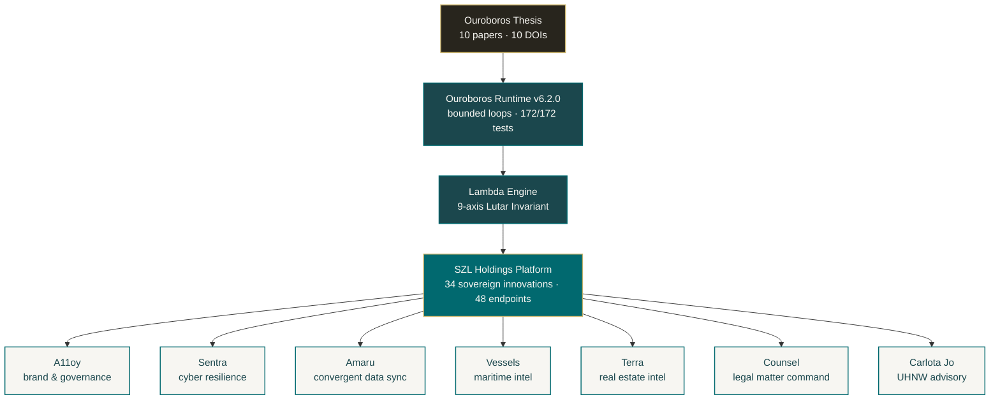

<!-- Organization profile README — rendered at github.com/szl-holdings -->

# SZL Holdings

> Sovereign decision intelligence. **Bounded recursion** as a system primitive. Auditable AI by construction.

  
  
  
  
  
  

  
  
  

---

SZL Holdings builds **A11oy** and a portfolio of vertical operator surfaces — Sentra, Amaru, Vessels, Terra, Counsel, Carlota Jo — on top of one research foundation: the **Ouroboros Thesis**. Bounded loops with measurable convergence and machine-verifiable audit closure as a first-class primitive for governed AI.

## Architecture at a glance

---

## Repositories

### Core infrastructure

| Repository | What it is | Status |
|---|---|---|
| [**szl-holdings-platform**](https://github.com/szl-holdings/szl-holdings-platform) | TypeScript monorepo: 34 sovereign innovations, 48 API endpoints, 7 domain surfaces | Active development |
| [**ouroboros**](https://github.com/szl-holdings/ouroboros) | Bounded-loop runtime implementing the Lutar Invariant | v6.2.0 · 172/172 tests |
| [**ouroboros-thesis**](https://github.com/szl-holdings/ouroboros-thesis) | 10 published papers (v1 → v10) with Zenodo DOIs | All 10 minted · concept DOI active |
| [**.github**](https://github.com/szl-holdings/.github) | Org-wide policy, reusable workflows, templates, SECURITY, SBOM, security.txt | 11 reusable workflows · SHA-pinned |

### Product surfaces

| Product | Domain | Repository |
|---|---|---|
| [**A11oy**](https://github.com/szl-holdings/a11oy) | Brand orchestration and AI governance | Cross-domain agent fabric |
| [**Sentra**](https://github.com/szl-holdings/sentra) | Cyber resilience command | Threat modeling, posture drift |
| [**Amaru**](https://github.com/szl-holdings/amaru) | Convergent data sync | Append-only delta logs |
| [**Vessels**](https://github.com/szl-holdings/vessels) | Maritime fleet intelligence | Sanctions, dark-vessel detection |
| [**Terra**](https://github.com/szl-holdings/terra) | Real-estate intelligence | Distress pipeline scoring |
| [**Counsel**](https://github.com/szl-holdings/counsel) | Legal matter command | Policy-gated AI workflows |
| [**Carlota Jo**](https://github.com/szl-holdings/carlota-jo) | UHNW advisory operations | Proof-chain delivery |

---

## Research foundation — Ouroboros Thesis

Ten canonical papers, full DOI lineage, every formula bound to operational TypeScript code. The **concept DOI** [`10.5281/zenodo.19944926`](https://doi.org/10.5281/zenodo.19944926) always resolves to the latest version.

| Version | Title | DOI |
|---|---|---|
| v10 | EXHAUSTIVE-AUDIT — Audit Closure Operator Λ₁₀ | [`10.5281/zenodo.20053163`](https://doi.org/10.5281/zenodo.20053163) |
| v9 | UNIFIED-OPERATIONAL — Lutar Family v1 → v7 + Ω with Bianchi closure | [`10.5281/zenodo.20053148`](https://doi.org/10.5281/zenodo.20053148) |
| v8 | Free-Energy Active Inference + Predictive Coding + Cognitive Maps | [`10.5281/zenodo.20020849`](https://doi.org/10.5281/zenodo.20020849) |
| v7 | Sefirot Memory + Hopfield Associative Retrieval | [`10.5281/zenodo.20020848`](https://doi.org/10.5281/zenodo.20020848) |
| v6 | Hermetic Safety + Chinchilla-Lutar Scaling + Bifurcation | [`10.5281/zenodo.20020845`](https://doi.org/10.5281/zenodo.20020845) |
| v5 | Prisca-GraphRAG + Tawa SAE Interpretability | [`10.5281/zenodo.20020846`](https://doi.org/10.5281/zenodo.20020846) |
| v4 | Omega Formalism + EPR-Bell + Sacred Geometry | [`10.5281/zenodo.20020841`](https://doi.org/10.5281/zenodo.20020841) |
| v3 | The Lutar Invariant — axiomatic trust aggregator | [`10.5281/zenodo.19983066`](https://doi.org/10.5281/zenodo.19983066) |
| v2 | Empirical companion — A11oy / Sentra / Amaru case studies | [`10.5281/zenodo.19934129`](https://doi.org/10.5281/zenodo.19934129) |
| v1 | Position paper — bounded looped computation | [`10.5281/zenodo.19867281`](https://doi.org/10.5281/zenodo.19867281) |

---

## Key numbers

| Metric | Value |
|---|---|
| Sovereign innovations | **34** operational, API-served |
| API endpoints tested | **48 / 48** passing |
| Runtime tests | **172 / 172** passing |
| Published papers | **10** (v1 → v10) |
| Zenodo DOIs | **10 + concept DOI** |
| Domain verticals | **7** integrated products |
| Reusable security workflows | **11** SHA-pinned |
| Active rulesets | **33** |
| Open Dependabot · Secret-scan · CodeQL | **0 · 0 · 0** |

---

## Principles

1. **AI governance by design.** Agents cannot execute consequential actions without explicit human confirmation.
2. **Evidence-backed decisions.** Every recommendation includes source citations and retrieval provenance.
3. **Explicit over implicit.** Platform state is visible. No silent fallbacks. Failures surface.
4. **Proof-carrying execution.** Every decision produces a tamper-evident, hash-chained receipt.
5. **Supply-chain hygiene as a feature.** SHA-pinned actions, harden-runner egress policy, SBOM, OpenSSF Scorecard.

---

## Security & supply chain

- Private vulnerability reporting: [security policy](https://github.com/szl-holdings/.github/security/policy) · `security@szlholdings.com` · [security.txt (RFC 9116)](https://szlholdings.com/.well-known/security.txt)
- Org-wide CODEOWNERS, branch protection rulesets, signed commits required
- Reusable workflows (SHA-pinned) for **CodeQL, dependency-review, Trivy, gitleaks, SBOM (CycloneDX), secret-scan, scorecard, workflow-lint, release-please, docs-CI, node-CI**
- All third-party Actions SHA-pinned with `step-security/harden-runner` egress policy
- Real-time security pulse: weekday net-new alert digest (8am ET)

---

## Contact

**Stephen P. Lutar Jr.** — Principal · SZL Holdings
[ORCID `0009-0001-0110-4173`](https://orcid.org/0009-0001-0110-4173) · [`inquiries@szlholdings.com`](mailto:inquiries@szlholdings.com) · [`szlholdings.com`](https://szlholdings.com) · [`@szlholdings`](https://twitter.com/szlholdings)

© 2026 SZL Holdings. Runtime Apache-2.0 · Platform BUSL-1.1 (converts to Apache-2.0 on 2030-05-06) · Thesis text CC BY 4.0.
