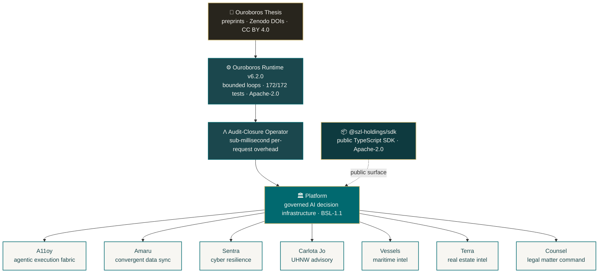

<!-- Organization profile README — rendered at github.com/szl-holdings -->
<!-- Series-A grade. Bounded recursion. Auditable AI by construction. -->

# SZL Holdings

### Governed AI infrastructure for high-consequence enterprise operations

**Bounded recursion as a system primitive. Proof-chain receipts on every decision. Sub-millisecond audit closure.**

 

---

## The thesis

Every enterprise AI deployment fails the same diligence question: **"prove what your model decided, why, and that it was within policy."** Most can't. We can. Our runtime emits a **proof-chain receipt** for every decision — bounded loop trace, policy gates traversed, evidence cited, convergence verified — recorded against an audit-closure operator (Λ) with sub-millisecond per-request overhead. The receipt is the deliverable. The loop is the product.

The math is published as a thesis. The runtime is shipped as a library. The fabric is shipped as a platform. Six product surfaces sit on top.

## Architecture

## Open source pillars

| Pillar | Repo | License | What it is |
|---|---|---|---|
| 📄 **Research** | [`ouroboros-thesis`](https://github.com/szl-holdings/ouroboros-thesis) | CC BY 4.0 | The thesis. Bounded recursive computation as a system primitive. Zenodo DOIs. |
| ⚙️ **Runtime** | [`ouroboros`](https://github.com/szl-holdings/ouroboros) | Apache-2.0 | Reference TypeScript implementation. 172/172 tests passing. Audit-closure operator Λ. |
| 📦 **SDK** | [`szl-sdk`](https://github.com/szl-holdings/szl-sdk) | Apache-2.0 | Public TypeScript SDK. `npm install @szl-holdings/sdk` to integrate with the platform. |
| 🛡️ **Trust** | [`trust`](https://github.com/szl-holdings/trust) | CC BY 4.0 | Public Trust Center. Security disclosures, sub-processors, SOC 2 roadmap, DPA template. |
| 📝 **Engineering** | [`engineering`](https://github.com/szl-holdings/engineering) | CC BY 4.0 | Technical posts on Λ, proof-chain, bounded recursion, governed AI architecture. |

## Product surfaces

| Surface | Repo | Domain |
|---|---|---|
| **A11oy** | [`a11oy`](https://github.com/szl-holdings/a11oy) | Governed agentic execution. Policy gates, proof ledger, human checkpoints. |
| **Amaru** | [`amaru`](https://github.com/szl-holdings/amaru) | Convergent multi-source data sync. Append-only delta logs, hash-verified ingest. |
| **Sentra** | [`sentra`](https://github.com/szl-holdings/sentra) | Cyber resilience. Posture drift, incident response, policy-gated remediation. |
| **Carlota Jo** | [`carlota-jo`](https://github.com/szl-holdings/carlota-jo) | UHNW advisory operations. Concierge workflow with proof-chain delivery. |
| **Vessels** | [`vessels`](https://github.com/szl-holdings/vessels) | Maritime fleet intel. Sanctions screening, dark-vessel detection, ownership graphs. |
| **Terra** | [`terra`](https://github.com/szl-holdings/terra) | Real estate intel. Deal pipeline scoring, AI-assisted underwriting. |
| **Counsel** | [`counsel`](https://github.com/szl-holdings/counsel) | Legal matter command. Document review, obligation mapping, proof-chain delivery. |

## How to engage

- **Builders / integrators** → start with the [SDK](https://github.com/szl-holdings/szl-sdk) and the [runtime](https://github.com/szl-holdings/ouroboros).
- **Researchers** → read the [thesis preprints](https://github.com/szl-holdings/ouroboros-thesis), cite via Zenodo DOI.
- **Security / procurement** → see the [Trust Center](https://github.com/szl-holdings/trust) and our [Security Policy](https://github.com/szl-holdings/.github/security/policy).
- **Enterprise customers** → [stephen@szlholdings.com](mailto:stephen@szlholdings.com)
- **Press / partnerships** → [stephen@szlholdings.com](mailto:stephen@szlholdings.com)

## Operating principles

1. **Bounded recursion is a system primitive.** Convergence is measurable; the loop trace is the audit deliverable.
2. **The receipt is the product.** Every decision emits a proof-chain receipt that downstream audit and procurement can consume.
3. **Policy gates are first-class.** Governance is not a wrapper. It is in the execution path.
4. **Sub-millisecond overhead is the bar.** Λ adds ≤ 0.59 ms median per request across our routes. Measured, not claimed.
5. **DOI-pinned research, SHA-pinned runtime, signed releases.** Provenance is non-negotiable.

---

**SZL Holdings, LLC** · Founded by [Stephen P. Lutar Jr.](https://orcid.org/0009-0001-0110-4173) · [szlholdings.com](https://szlholdings.com)

