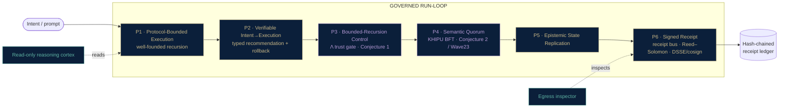

<!--
  SZL Holdings — organization profile README (szl-holdings/.github -> profile/README.md)
  GENIUS OVERHAUL v3 · 2026-06-10 · Honesty doctrine LOCKED.
  Canonical numbers (source of truth: lutar-lean@main, kernel c7c0ba17):
    Locked-proven (kernel-verified) = EXACTLY 8 formulas {F1, F4, F7, F11, F12, F18, F19, F22}
    ~185 machine-checked Lean theorems total (Waves 11-23); CUT-1 closed on its stated hypotheses
    Lambda-uniqueness = Conjecture 1 (unconditional uniqueness machine-checked FALSE; conditional Theorem U proven, axiom-free)
    Khipu BFT safety = Conjecture 2 (Wave23 conditional only)
    SLSA posture = L1 honest · L2 build-attested (Sigstore keyless) where attest-build-provenance runs+verifies; L3 = roadmap. No FedRAMP/Iron Bank/CMMC/ATO without "roadmap".
  Products: a11oy (governed-AI command platform; ships a11oy Code — Chaski), killinchu (counter-UAS / maritime C2), anatomy (3D living substrate). Honest internal roles only. No banned codenames.
  Banner: profile/assets/banner-org.png (1280x640 social-preview, complete headline "Governed AI you can prove.")
-->

<div align="center">


# SZL Holdings

### Governed AI you can prove.

**Governed autonomy with a checkable receipt for every decision.** SZL builds governed-AI
decision infrastructure — every autonomous action carries a machine-checked, tamper-evident
warrant: *under what authority it acted, on what trust evidence, and proof the record was not
quietly rewritten.* Three products run on one signed substrate.

[](https://github.com/szl-holdings/lutar-lean)
[](https://github.com/szl-holdings/lutar-lean)
[](https://github.com/szl-holdings/lutar-lean/blob/main/BOUNTY.md)
[](https://github.com/szl-holdings/khipu-consensus)
[](https://slsa.dev/spec/v1.0/levels)
[](https://search.sigstore.dev/)
[](https://github.com/szl-holdings)

</div>

> **In one breath** — SZL turns AI governance into a *substrate*: a proof chain where every
> decision is policy-checked, evidence-bound, scored by a single trust aggregator **Λ**, and
> sealed into a DSSE receipt over a SHA-256 hash chain that anyone can verify offline. The trust
> math is pinned in **Lean 4** — **8 formulas are kernel-locked**, ~**185** theorems are
> machine-checked, and the one uniqueness claim we cannot prove unconditionally we label
> **Conjecture 1**. We surface only what the kernel checks. The differentiator versus every
> observability and AI-security incumbent: **a machine-checked proof backbone they do not have.**

---

## Why it matters — without a PhD

Modern AI gives you answers. It does not give you **accountability**.

- **AI now *acts*, not just answers.** The same prompt can take a different action each run. SZL
  makes every action carry a signed receipt — a flight recorder for AI decisions.
- **Check the work without trusting us.** The trust math is proven by a machine (a Lean proof
  checker) and the receipts are cryptographically signed — anyone can verify them independently.
- **Honest by construction.** We publish exactly what is proven, what is still a conjecture, and
  where the guarantees stop. The trust score is **never 100%**. The moat is machine-verified honesty.

SZL was founded by **Stephen P. Lutar Jr.** to close the accountability gap with a missing layer —
not a smarter model, but a *machine for producing evidence*. Hand the receipt to a skeptical
auditor and they replay it offline, trusting no one. Tamper with a single byte and verification fails.

---

## Three products, one substrate

| Product | What it does | Open it |
|---|---|---|
| **a11oy** — governed-AI command platform | One pane of glass for governed AI: ask-and-act with deny-by-default safety gates, trust scoring with confidence intervals, a live decision feed, readiness and compliance, forecasting, signed receipts, and formal-proof status. Ships **a11oy Code — Chaski**, a governed agentic coding agent. | [a11oy.net →](https://a11oy.net) · [Space →](https://huggingface.co/spaces/SZLHOLDINGS/a11oy) |
| **killinchu** — counter-UAS & maritime C2 | Autonomous-systems field tool for air and sea: live track board, multi-sensor fusion, maritime picture (sanctions screening + dark-vessel detection), engagement rules, autonomy governance, and verify-it-yourself signed engagement receipts. | [Open killinchu →](https://szlholdings-killinchu.hf.space/elite) |
| **anatomy** — the living substrate | A 3D, navigable map of the governed organism: the organs (reasoning cortex, trust gate, receipt bus, consensus), how a decision flows through them, and where each proof and conjecture sits. | [Space →](https://huggingface.co/spaces/SZLHOLDINGS/anatomy) |

**a11oy is the orchestrator.** Its reasoning, policy, and operator capabilities are one
receipt-bound fabric, and it governs the field tool with the same trust scoring, consensus, and
signed receipts. The same governed run-loop drives both apps over one byte-identical command bus.

> **Not affiliated with Defense Unicorns.** SZL mark: **USPTO Serial 99831122**. UDS is a deployment
> target referenced for interoperability only — not an endorsement. We never claim a production ATO.

---

## The flagship — a11oy Code (Chaski), a governed agentic agent

**Chaski** is the Inca relay-runner who carries the *khipu*. a11oy Code — Chaski plans, retrieves,
calls tools, writes and runs code, and orchestrates **both** SZL apps — where **every step is
Λ-scored, DSSE/Khipu-receipted, and bounded by a machine-checked termination proof.** It is
Claude-Code-class in shape; the differentiator is *provable governance*, not raw model size.

The honest moat (seven points):

1. **Λ-gate every step** — an advisory trust score (Conjecture 1 / Theorem U conditional) on every
   action; surfaced, never silent. The control point is a deny-by-default gate.
2. **DSSE / Khipu receipts** — real ECDSA-P256-SHA256 signed, hash-chained, re-verifiable.
3. **Lean termination** — bounded-frontier receipt-DAG termination is proven; the loop provably halts.
4. **2-person quorum** — read-only PLAN mode; write actions require quorum approval (Khipu BFT).
5. **M2M envelope + `i_dont_know`** — low-support answers return `i_dont_know` instead of fabricating.
6. **One loop, two apps** — a byte-identical command bus orchestrates a11oy and killinchu.
7. **No-key → labeled stub** — an honest deterministic stub when no inference credential is present;
   goes live the instant a key/endpoint is wired, with no redeploy.

The headline proof: **prompt-injection and poisoned retrieval provably cannot flip a DENY into an
ALLOW** (a P3 non-interference result, Goguen–Meseguer 1982, core axiom-free) — a guarantee no
ungoverned agent can make. The brain is an open-weight model we legally downloaded and run
ourselves; we do **not** claim to have trained a frontier model.

---

## The thesis — a proof layer for consequential AI

```text
   decision ──▶  POLICY  ──▶  EVIDENCE  ──▶  Λ score  ──▶  DSSE receipt  ──▶  hash-chained ledger
                (gates)     (bound)       (trust)        (signed)          (replayable · tamper-evident)
                                                                                 │
                                             verify offline, trusting no one ◀───┘
```

Trust is scored by a single aggregator, **Λ**, a weighted geometric mean over four axes —
provenance, containment, coherence, convergence — and we are explicit about exactly how far that
math is proven (see below). Read the full thesis →
[szl-papers](https://github.com/szl-holdings/szl-papers) ·
DOI lineage on [Zenodo](https://doi.org/10.5281/zenodo.19944926).

<details>
<summary><strong>For engineers — the governed run-loop (P1–P6), in detail</strong></summary>



*The trust gate (P3) and the consensus step (P4) render in **conjecture violet** by design: Λ
unconditional uniqueness is **Conjecture 1** (conditional **Theorem U** proven, axiom-free) and
Khipu BFT safety is **Conjecture 2** (Wave23 conditional only). Codenames map to honest roles —
read-only reasoning cortex, Λ trust gate, receipt bus, egress inspector, consensus.*

</details>

---

## The math, explained — three honest labels

- **LOCKED-PROVEN** — sorry-free, kernel-checked, Lean-core axioms only. **Exactly 8.** Never inflated.
- **MACHINE-CHECKED (experimental)** — kernel-checked by CI in the experimental waves; real, but
  never folded into the locked 8.
- **CONJECTURE** — *not* a theorem. Stated honestly; sometimes with its negation proven.

### The 8 locked-proven formulas — `{F1, F4, F7, F11, F12, F18, F19, F22}`

| ID | What it proves (plain language) | Why it matters |
|---|---|---|
| **F1** — Replay determinism | Replaying the same recorded log from the same start yields a **bit-identical** trace. | This is what makes a receipt *replayable*: an auditor re-runs it and must get exactly your result. |
| **F4** — Khipu DAG acyclicity | The receipt DAG can never contain a cycle: a receipt cannot (transitively) reference itself. | Guarantees the ledger is a true history — no circular causation, no loop that hides a rewrite. |
| **F7** — Chaski FIFO ordering | Messages on a relay channel are delivered in first-in-first-out order. | The agent's relay (Chaski) cannot silently reorder steps; the receipt order matches the action order. |
| **F11** — Reciprocity conservation | Folding an append-only give/take ledger conserves its balance invariant. | Fair, auditable exchange between agents; the ledger cannot silently drift. |
| **F12** — Coupling boundedness (additive fragment) | Discretised coupling stays bounded under additive superposition. *Caveat: additive scaffolding only, not full nonlinear Kuramoto.* | Keeps multi-agent coupling from diverging; the caveat ships in the Lean docstring. |
| **F18** — Reed–Solomon recovery | `RS(10,6)`: data is recoverable **iff ≥ 6 of 10 shards survive.** | Resilience math for the receipt/payload encoding — survive up to 4 lost shards. |
| **F19** — Entropy budget (additive fragment) | Over a region partition, per-region entropy ≤ total. *Caveat: monotone scaffolding only, not the full Bekenstein bound.* | A conservative budgeting primitive; the caveat ships in the docstring. |
| **F22** — Khipu emit append-only monotonicity | Each emit strictly grows the ledger; no emit can shorten or overwrite prior receipts. | Append-only by proof: the record can only ever be extended, never quietly truncated. |

### Λ — uniqueness, told honestly

| Claim | Status |
|---|---|
| Λ unique under axioms **A1–A5**, *unconditionally* | **Conjecture 1 — machine-checked FALSE.** `Round13.maxAgg_ne_Lambda` shows `max`/`min` satisfy A1–A5 yet ≠ Λ. Stays Conjecture 1. |
| Λ unique **given slice-multiplicativity (separability)** | **MACHINE-CHECKED, axiom-free.** `lambda_unique_of_separable`, `#print axioms` ⊆ {propext, Classical.choice, Quot.sound} — no new axiom. |

> One line: Λ's unconditional uniqueness **remains Conjecture 1** (unconditional is provably false
> for A1–A5); we proved the strongest **axiom-free conditional** uniqueness (slice-multiplicativity
> ⇒ Λ), called **Theorem U**. Open bounty:
> [BOUNTY.md](https://github.com/szl-holdings/lutar-lean/blob/main/BOUNTY.md).

Across Waves 11–23 there are **~185 machine-checked theorems** (no `sorry`, no new axiom), including
the binary **Pinsker inequality** and **CUT-1** (the Aczél quasi-arithmetic representation theorem),
now **closed on its stated hypotheses**. These stay separate from the locked 8.

---

## Verify it yourself — trust nothing

```bash
# Pull the public signing key and a signed receipt from the live field node
curl -s https://szlholdings-killinchu.hf.space/cosign.pub -o cosign.pub
curl -s https://szlholdings-killinchu.hf.space/api/killinchu/v1/receipt/export > receipt.json

# Verify the DSSE signature offline      ->  "Verified OK"
# Tamper a single byte and re-verify      ->  "Verification failure"
```

A third party can confirm a decision happened, exactly as recorded, with zero trust in SZL.

> **Fleet-command demonstration:** the governance loop is real (policy → Λ → signed receipt), and the
> effector link is **simulated** — we label this honestly as a command *demonstration*, not a live
> weapons release.

---

## What we claim — and what we don't

| We claim | We do **not** claim |
|---|---|
| **8 formulas locked-proven in Lean** (machine-checked, sorry-free): `F1, F4, F7, F11, F12, F18, F19, F22`. | The remaining formulas as "proven." Newer waves are **experimental / CI-green**, labeled as such. |
| **~185 machine-checked theorems** (Waves 11–23); **CUT-1 closed on its stated hypotheses**. | These as part of the locked 8 — they never inflate the count. |
| **Λ-uniqueness is Conjecture 1** — conditional uniqueness proven axiom-free (slice-multiplicativity). | Λ as an unconditional theorem. Unconditional uniqueness is machine-checked **false**, and we say so. |
| **SLSA L1 honest · L2 build-attested** (Sigstore keyless) where `attest-build-provenance` runs + verifies. | **L3, FedRAMP, Iron Bank, CMMC, or a production ATO** — these are **roadmap**, never claimed today. |
| Receipts genuinely signed where a signing key is present; **honestly marked unsigned** otherwise. | Fabricated signatures or fabricated metrics — ever. |
| The **best governed coding agent** (a11oy Code — Chaski) within its governed envelope. | "Best LLM," or any frontier-weights training claim. |

**Canonical:** kernel `c7c0ba17` · `lake build` clean · trust capped below 1.00 by doctrine.

---

## Where to start

| If you want to… | Go to |
|---|---|
| **See the products** | [a11oy.net](https://a11oy.net) · [a11oy Space](https://huggingface.co/spaces/SZLHOLDINGS/a11oy) · [killinchu](https://szlholdings-killinchu.hf.space/elite) · [anatomy](https://huggingface.co/spaces/SZLHOLDINGS/anatomy) |
| **Read the math** | [lutar-lean](https://github.com/szl-holdings/lutar-lean) (Lean 4 kernel) · [szl-papers](https://github.com/szl-holdings/szl-papers) |
| **Build on it** | [developers](https://github.com/szl-holdings/developers) · [szl-cookbook](https://github.com/szl-holdings/szl-cookbook) · [hatun-mcp](https://github.com/szl-holdings/hatun-mcp) |
| **Deploy it** | [uds-bundles](https://github.com/szl-holdings/uds-bundles) · [szl-uds-deployment](https://github.com/szl-holdings/szl-uds-deployment) |
| **Verify the chain** | [szl-trust](https://github.com/szl-holdings/szl-trust) · [khipu-consensus](https://github.com/szl-holdings/khipu-consensus) |

---

## Collaborate

We are looking for design partners, auditors, and contributors who care about *provable* governance.
Open the bounty, run the kernel, break our receipts.
**[stephen@szlholdings.com](mailto:stephen@szlholdings.com)**

---

<div align="center">

Built by **Stephen P. Lutar Jr.** · Honest by design · [a11oy.net](https://a11oy.net) · [🤗 SZLHOLDINGS](https://huggingface.co/SZLHOLDINGS) · [github.com/szl-holdings](https://github.com/szl-holdings)

<sub>Not affiliated with Defense Unicorns · SZL mark USPTO Serial 99831122 · no production ATO claimed · SLSA L1 · L2 attested · L3 roadmap · Λ = Conjecture 1 · Khipu = Conjecture 2 · trust never 100%</sub>

</div>
