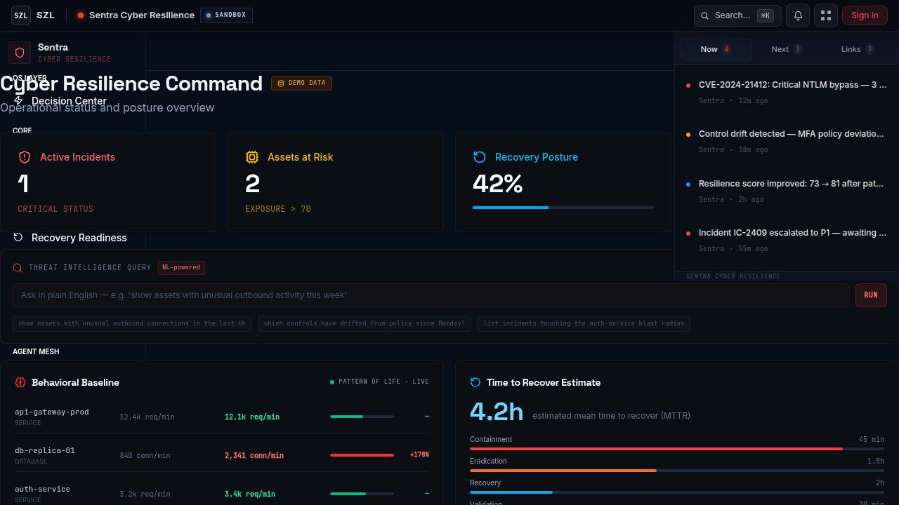
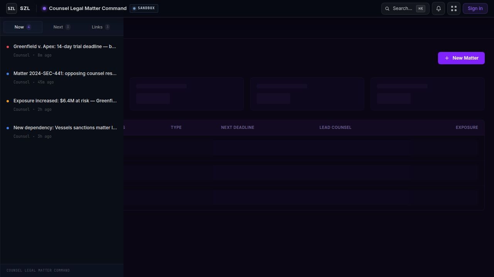
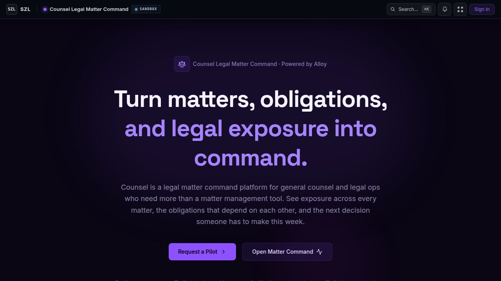
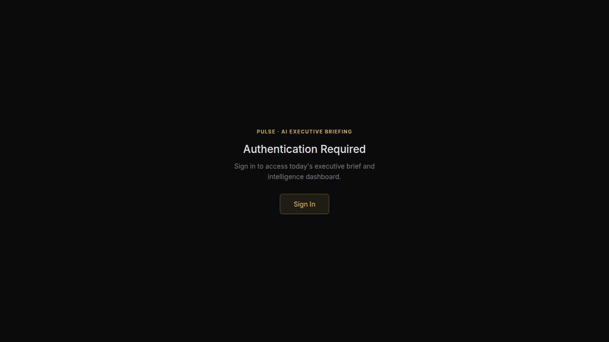

<p align="center">
    <strong>SZL HOLDINGS</strong>
  </p>

  <p align="center">
    <em>Governed decision infrastructure for enterprises that cannot afford silent failures, invisible risk, or unaccountable AI.</em>
  </p>

  <p align="center">
    <a href="https://szlholdings.com">Website</a>&nbsp;&nbsp;|&nbsp;&nbsp;<a href="https://github.com/szl-holdings/szl-holdings-platform">Platform Repository</a>&nbsp;&nbsp;|&nbsp;&nbsp;<a href="https://github.com/szl-holdings/szl-holdings-platform/blob/master/docs/investor/platform-thesis.md">Investor Thesis</a>&nbsp;&nbsp;|&nbsp;&nbsp;<a href="https://szlholdings.com/stephen/investor">Investor Dashboard</a>
  </p>

  <p align="center">
    <a href="https://github.com/szl-holdings/szl-holdings-platform/actions/workflows/ci.yml"></a>
    <a href="https://github.com/szl-holdings/szl-holdings-platform/actions/workflows/codeql.yml"></a>
    <a href="https://github.com/szl-holdings/szl-holdings-platform/actions/workflows/security.yml"></a>
  </p>

  <p align="center">
    
    
    
    
  </p>

  <p align="center">
    
    
    
    
    
  </p>

  ---

  ## What We Build

  SZL Holdings builds the **governed decision infrastructure layer** — the platform that connects what's observable to what's executable, under governance, with full attribution.

  **KORA** is the flagship command surface. **FORGE** is the execution fabric. **APEX** is the unified mobile command center. Domain intelligence packs — TENAX (cyber resilience), Counsel (legal), PARAGON (defense), SEXTANT (maritime), DOMAINE (real estate), Carlota Jo (private advisory), and LUMINA (executive briefing) — extend the same governance infrastructure into eight verticals.

  ```
  15 Registered Artifacts    798 Database Tables     2,816 API Endpoints
  11 Web Applications         40  Shared Libraries     450,000+ Lines of Code
   1 Mobile Command Center     8  Domain Packs         1 Founder
  ```

  ---

  ## Platform Overview

  ```
  SZL Holdings Platform
  ├── KORA         Flagship command surface — PRAXIS framework surfaces risk, drift, and friction before they compound
  ├── FORGE        Execution fabric — signal normalization, workflow orchestration, human-in-the-loop gates
  │
  ├── PARAGON      Unified defense & security intelligence command (SOC + SOAR + threat intel)
  ├── SEXTANT      Maritime fleet command, AIS tracking, sanctions screening, voyage economics
  ├── DOMAINE      Real estate intelligence — distress signals, ownership graph, deal pipeline
  ├── Carlota Jo   Premium advisory operations for UHNW clients
  ├── PRISM Counsel [archived] Legal matter command — archived (domain API routes retained)
  ├── IMPERIUM     [archived] Cloud sovereignty — merged into Command Portal
  │
  ├── APEX         Unified mobile command — all domain workspaces in one native app
  └── Command Portal Cross-domain ecosystem hub — real-time SSE, executive briefing, global Cmd+K search
  ```

  **KORA + FORGE** form the core platform. The active vertical platforms (PARAGON, SEXTANT, DOMAINE, Carlota Jo) run on this shared foundation and share intelligence through the FORGE Event Fabric — a cross-domain event system that makes every new vertical make the whole platform smarter.

  ---

  ## What Sets Us Apart

  Most enterprise platforms observe. SZL Holdings **acts** — under governance, with full attribution.

  ### The PRAXIS Framework
  A unified signal classification layer — **P**eople, **R**evenue, **A**rchitecture, **X**-domain intelligence, **I**nfrastructure, **S**ecurity — that normalizes signals from any vertical into a single traceable decision flow. Not a dashboard. An operating system for governed business observability.

  ### Cross-Domain Intelligence Fusion
  SEXTANT anomaly + PARAGON threat + Counsel legal exposure = a single compound risk signal. No other platform in our category connects maritime, security, legal, and business intelligence into one correlated model. The FORGE Event Fabric ensures every domain enriches every other.

  ### Human-in-the-Loop AI Governance
  Advisory agents cannot execute consequential actions without explicit human confirmation — enforced at the FORGE workflow layer, not as an option. Every AI recommendation includes source citations, confidence scores, and retrieval provenance. The governance is structural, not policy-based.

  ### Immutable Audit Trail
  Every action, approval, and AI recommendation generates an append-only audit event via `proof-chain`, cryptographically attributed to an actor with full decision provenance. Built for regulated industries from day one.

  ### Signal-to-Outcome Traceability
  From the raw signal that triggered an alert, through the routing logic that assigned it, through the human approval that authorized action, to the executed outcome — every step is logged, linked, and replayable. Zero black-box decisions.

  ### Compounding Architecture
  Each new vertical doesn't just add surface area — it makes the whole platform more intelligent. A maritime anomaly enriches a threat intelligence profile. A legal filing surfaces a distress property signal. A financial irregularity triggers a compliance workflow. This is **compounding moat architecture**.

  ### Unified Mobile Command (APEX)
  All active domain workspaces in a single Expo/React Native app. Biometric auth, cross-domain badge counts, workspace-adaptive AI copilot, and a unified command feed. Operators in the field have full platform coverage from one authenticated session on iOS or Android.

  ---

  ## Product Gallery

  ### SZL Holdings — Command Surface
  | Platform Hero | Ecosystem Architecture |
  |---|---|
  |  |  |

  *Governed business observability with explainable execution — Observe, Understand, Decide, Execute. One holding company. One architecture. Eight domain packs. Everything compounds.*

  ---

  ### PARAGON — Security & Defense Intelligence
  | Landing — Four Workspaces, One Intelligence Layer | SOC Command Center |
  |---|---|
  |  |  |
  | *PARAGON unifies defense, legal, command, and labs workspaces on a shared correlation engine* | *MITRE ATT&CK v14 mapping, SOAR playbooks, STIX/TAXII threat intel, XDR console, Sentinel AI agent* |

  ---

    ### TENAX — Cyber Resilience Command
    | Dashboard | Incident Feed |
    |---|---|
    |  |  |

    *Turn cyber posture, recovery readiness, and live incidents into command. Exposure mapping, behavioral baseline monitoring, asset risk graph, recovery readiness scoring, and incident commander. AI-powered threat intelligence query in natural language.*

    ---

    ### Counsel — Legal Matter Command
    | Matter Command | Obligation Feed |
    |---|---|
    |  |  |

    *Turn matters, obligations, and legal exposure into command. Matter board, obligation dependency graph, exposure quantification, court filing integration, and cross-domain signal fusion (SEXTANT sanctions + Counsel legal risk).*

    ---

    ### LUMINA — AI Executive Briefing
    | Executive Brief | Intelligence Dashboard |
    |---|---|
    |  |  |

    *Narrative intelligence reports synthesized from live platform signals. Daily executive briefings covering all active domain packs — threats, opportunities, and required decisions — in a single daily intelligence surface.*

    ---

  ### SEXTANT — Maritime Fleet Intelligence
  | Fleet Command | Mobile Fleet Tracking |
  |---|---|
  |  |  |

  *AIS telemetry, sanctions screening, dark vessel detection, voyage economics, commodity trading, and marine insurance — all in one command surface. Helmsman AI agent. 83 components.*

  ---

  ### DOMAINE — Real Estate Intelligence
  | Property Intelligence | Mobile Property View |
  |---|---|
  |  |  |

  *NYC distress property pipeline, ownership entity graph, deal pipeline, MLS ingestion, broker workflow, and market signal intelligence. 77 components.*

  ---

  ### KORA — Command Surface *(Unified under Command Portal)*
  | Command Center | Executive Action Queue |
  |---|---|
  |  |  |

  *PRAXIS framework — People, Revenue, Architecture, X-domain, Infrastructure, Security. Signal timeline, correlation engine, priority action queue, and AIOps. 142 components. KORA has been unified into the Command Portal — all capabilities remain active under `/command/`.*

  ---

  ### PRISM Counsel — Legal Matter Command *(Archived)*

  PRISM Counsel has been superseded by **Counsel** (see above), the next-generation legal matter command workspace with full agentic capabilities. The domain API routes remain active; source is retained in the monorepo. New deployments should use Counsel (`/counsel/`).

  ---

  ### Command Portal — Ecosystem Intelligence Hub
  
  *Real-time 8-domain dashboard with SSE updates, composite health scoring, global Cmd+K search, and executive briefing view. The cross-domain nerve center of the platform.*

  ---

  ### Carlota Jo — Premium Advisory
  
  *White-glove advisory operations for UHNW clients. Private intake, client portal, service catalog, booking, document delivery, and client messaging. 60 components.*

  ---

  ## Architecture

  ```
                  External Signals (integrations, telemetry, intelligence feeds)
                                        |
                                        v
                            Signal Normalization (FORGE)
                                        |
                                        v
                       Context Engine (correlation, attribution, scoring)
                                        |
                                        v
                         Routing (priority, role assignment, domain)
                                   /              \
                                  v                v
                      Auto-Execute             Human Review Gate
                     (policy-approved)              |
                                  \                /
                                   v              v
                             Action Execution
                                        |
                                        v
                        Immutable Audit Trail (proof-chain)
  ```

  ### Technology

  | Layer | Stack |
  |-------|-------|
  | **Language** | TypeScript (full stack, strict mode) |
  | **Frontend** | React 19, Vite 7, Tailwind CSS 4, Framer Motion, Recharts |
  | **Mobile** | Expo SDK 53 / React Native, NativeWind |
  | **Backend** | Express 5, Node.js 22 |
  | **Database** | PostgreSQL 16, Drizzle ORM, 798 tables |
  | **AI** | Multi-provider (Anthropic, OpenAI, Gemini, Groq), evidence-backed retrieval |
  | **Auth** | OIDC/PKCE, 11-role RBAC, SCIM 2.0, Azure AD multi-tenant SSO |
  | **Infra** | pnpm monorepo, 40 packages, Azure (App Service, PostgreSQL Flexible, Key Vault) |
  | **CI/CD** | GitHub Actions — lint, typecheck, test, build, CodeQL, dependency review, Lighthouse |

  ---

  ## Trust & Governance

  | Concern | Approach |
  |---------|----------|
  | AI without oversight | Advisory agents require explicit human confirmation — enforced at the workflow layer |
  | Opaque AI outputs | All recommendations include source citations, confidence scores, and retrieval provenance |
  | Audit accountability | Every action generates an immutable audit event with actor attribution via proof-chain |
  | Access control | 11-role RBAC with org-scoped tenant isolation, every route access-controlled |
  | Multi-tenancy | All queries include org_id scoping — cross-tenant access architecturally prevented |
  | Data security | TLS 1.3, HMAC-signed WebSocket tickets (5-min TTL), encryption at rest |

  ---

  ## Flagship Repository

  → **[szl-holdings/szl-holdings-platform](https://github.com/szl-holdings/szl-holdings-platform)**

  The canonical platform monorepo. 15 registered artifacts (11 web, 1 mobile, 1 video, 1 design, 1 agentic layer), 40 shared libraries, 798 database tables, 2,816 API endpoints. TypeScript throughout.

  ---

  ## For Investors & Evaluators

  | Resource | Link |
  |----------|------|
  | Investor Dashboard | [Live Dashboard](https://szlholdings.com/stephen/investor) |
  | Platform Thesis | [docs/investor/platform-thesis.md](https://github.com/szl-holdings/szl-holdings-platform/blob/master/docs/investor/platform-thesis.md) |
  | Trust Center | [docs/trust/trust-center.md](https://github.com/szl-holdings/szl-holdings-platform/blob/master/docs/trust/trust-center.md) |
  | Security Policy | [SECURITY.md](https://github.com/szl-holdings/szl-holdings-platform/blob/master/SECURITY.md) |

  ---

  **Contact:** [inquiries@szlholdings.com](mailto:inquiries@szlholdings.com) | [szlholdings.com](https://szlholdings.com) | [LinkedIn](https://linkedin.com/in/stephen-l-279315240)

  *Open to design partner conversations, enterprise evaluation, and investment introductions.*
  