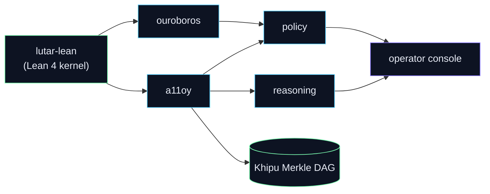

<!--
  SZL Holdings — organization profile README (szl-holdings/.github → profile/README.md)
  Genius Series-A grade. Honesty doctrine v11 LOCKED.
  Canonical invariants (source of truth: lutar-lean@main, kernel c7c0ba17):
    749 declarations · 14 unique axioms · 163 tracked sorries
    Proven (locked kernel) = exactly 5 formulas {F1, F11, F12, F18, F19}
    Λ-uniqueness = Conjecture 1 (never a theorem)
    SLSA Build L1 + L2 on service images (NOT L3 / FedRAMP / Iron Bank / CMMC)
  Two-product end-state: a11oy (command platform) + killinchu (drones & vessels).
  Zero user-facing dead-organ references — internal capabilities are presented as reasoning / policy / operator.
  IMAGE POLICY: all raster assets referenced by ABSOLUTE raw.githubusercontent URLs (relative
  paths break on the org profile render); all diagrams use native mermaid so they ALWAYS render.
-->

<div align="center">


# SZL Holdings

### Governed AI you can *prove*.

**Every AI decision becomes a cryptographically signed, replayable, tamper-evident receipt** — accountability that no observability or AI-security incumbent ships today. Two live products run on one substrate.

<a href="https://github.com/szl-holdings"></a>

[](https://github.com/szl-holdings/.github/tree/main/doctrine)
[](https://slsa.dev/spec/v1.0/levels)
[](https://search.sigstore.dev/)
[](https://github.com/szl-holdings/lutar-lean)
[](https://github.com/szl-holdings/lutar-lean/blob/main/BOUNTY.md)
[](https://github.com/szl-holdings)

</div>

---

## Two products, one substrate

| Product | What it does | Open it |
|---|---|---|
| **a11oy — Command Platform** | One pane of glass for governed AI: ask &amp; act, deny-by-default safety gates, trust scoring with confidence intervals, a live decision feed, readiness &amp; compliance, forecasting, signed receipts, formal-proof status, a live threat library (CVE / KEV / MITRE), and model routing. | [Open a11oy →](https://szlholdings-a11oy.hf.space/) |
| **killinchu — Drones &amp; Vessels** | Autonomous-systems field tool for air and sea: live track board, multi-sensor fusion, maritime picture (sanctions screening + dark-vessel detection), engagement rules, swarm / autonomy governance, and **verify-it-yourself** signed engagement receipts. | [Open killinchu →](https://szlholdings-killinchu.hf.space/elite) |

**a11oy is the orchestrating brain.** Its reasoning, policy, and operator capabilities are built in as one receipt-bound fabric, and it governs the field tool with the same trust scoring, consensus, and signed receipts. The platform runs every Warhacker challenge problem end to end.

---

## The thesis — a proof layer for consequential AI

Modern AI gives you answers; it does not give you **accountability**. SZL turns the governance layer into a substrate — a **Proof Chain** where each decision is policy-checked, evidence-bound, and replayable, then sealed in a DSSE receipt over a SHA-256 hash chain. Trust is scored by a single aggregator, **Λ**, over four axes — provenance, containment, coherence, and convergence — and we are explicit about exactly how far that math is proven.


### The substrate — how a governed run flows



Read the full thesis (v23, *“The Unified Substrate”*) → [szl-papers/thesis/v23](https://github.com/szl-holdings/szl-papers) · DOI lineage on [Zenodo](https://doi.org/10.5281/zenodo.19944926).

---

## Proven formulas — what is machine-checked, and exactly how far

The honest core never moves. **Five formulas are formally proven and locked** in the Doctrine-v11 kernel (`c7c0ba17`, `749 / 14 / 163`, `lake build` clean). Everything newer is **experimental / CI-green** in [lutar-lean](https://github.com/szl-holdings/lutar-lean) and is never folded into the locked count. **Λ-uniqueness is Conjecture 1** — proven *only conditionally*, machine-checked *false* unconditionally.

### Locked kernel — proven, sorry-free (5)

| Formula | Status | Kernel |
|---|---|---|
| **F1, F11, F12, F18, F19** | **PROVEN** — sorry-free, Lean-core axioms only | `c7c0ba17` · `749 / 14 / 163` |

### Experimental, kernel-verified (CI-green) — labeled experimental, NOT in the locked 5

| Campaign | Result | PR | CI-green head |
|---|---|---|---|
| **Agentic loop P1–P6** | Governed RAG→MCP→kernel→receipt loop proven as a **system** (14 axiom-free; P5 axiom-gated on hash-CR) | [#188](https://github.com/szl-holdings/lutar-lean/pull/188) | `2ede47a2` |
| **Wave-5** | AM–GM, Cauchy–Schwarz, conformal coverage, receipt-collision pigeonhole, optional-stopping (11) | [#186](https://github.com/szl-holdings/lutar-lean/pull/186) | `b71114cf` |
| **Wave-6** | Graph substrate: Λ-graph iso-invariance, GNN≤1-WL ceiling, spectral contraction, DAG termination (11) | [#189](https://github.com/szl-holdings/lutar-lean/pull/189) | `dc7ae26d` |
| **Wave-7** | Conformal rank-count/p-value, Doob two-sided audit envelope, PAC-Bayes routing envelope (10) | [#190](https://github.com/szl-holdings/lutar-lean/pull/190) | `d6a232ba` |
| **Mathlib-bump C3/C4/C5** | Concentration / KL re-exports, CI-green | [#187](https://github.com/szl-holdings/lutar-lean/pull/187) | — |
| **Coder formulas** | Code-substrate formula ports, CI-green | [#193](https://github.com/szl-holdings/lutar-lean/pull/193) | — |
| **Λ-uniqueness (Set α + Set δ)** | Conditional uniqueness within **strengthened** axiom classes, CI-green (3 declared, cited bridge axioms) | [#192](https://github.com/szl-holdings/lutar-lean/pull/192) | `5f0bb5ee` |

### Λ — the honest line on uniqueness

> **What we proved:** Λ (the geometric-mean trust aggregator) is **unique within strengthened axiom classes** — Set α `{symmetry, idempotency, all-strict-monotonicity, continuity, multiplicativity}` and Set δ `{reflexivity, symmetry, bisymmetry, per-argument strict monotonicity, multiplicativity}` — each *conditional on explicitly declared, cited bridge axioms*, CI-green ([PR #192](https://github.com/szl-holdings/lutar-lean/pull/192) @ `5f0bb5ee`). Λ-membership and all ten impostor-deaths (AM, HM, PM², max, min) are **axiom-free**.
>
> **What we don't claim:** unconditional uniqueness under the original weaker axioms A1–A5. That statement is **machine-checked false** (`Round13.maxAgg_ne_Lambda`, in-tree). Λ-uniqueness therefore stays **Conjecture 1** — never a theorem. Open bounty: [BOUNTY.md](https://github.com/szl-holdings/lutar-lean/blob/main/BOUNTY.md).

Full proof table with verbatim `#print axioms`, run IDs, and per-result maturity → **[PROVEN_FORMULAS.md](https://github.com/szl-holdings/lutar-lean/blob/main/PROVEN_FORMULAS.md)** · methodology → [lutar-lean](https://github.com/szl-holdings/lutar-lean).

---

## Verify it yourself — trust nothing

Engagement decisions on the **killinchu** surface are signed with a real ECDSA-P256 cosign key. Verify a receipt **offline**, trusting neither us nor the server:

```bash
curl -s https://szlholdings-killinchu.hf.space/cosign.pub -o cosign.pub
curl -s https://szlholdings-killinchu.hf.space/api/killinchu/v1/receipt/export > receipt.json
# verify the DSSE signature offline   ->  "Verified OK"
# tamper a single byte and re-verify   ->  "Verification failure"
```

That is the whole product in one command: a third party can confirm a decision happened, exactly as recorded, with zero trust in SZL.

---

## What we claim — and what we don't

We surface only what is machine-checked as fact. Everything else is labeled honestly in the apps.

| We claim | We do **not** claim |
|---|---|
| **5 formulas formally proven in Lean** (machine-checked, sorry-free): `F1, F11, F12, F18, F19`. | The remaining formulas as “proven.” Newer waves (3 / 5 / 6 / 7 + the agentic loop) are **experimental / CI-green**, labeled as such — not part of the locked proven set. |
| **Λ-uniqueness is Conjecture 1** — unique *only conditionally* (strengthened axiom classes, CI-green). Open bounty: [BOUNTY.md](https://github.com/szl-holdings/lutar-lean/blob/main/BOUNTY.md). | Λ as an unconditional theorem. Unconditional uniqueness is machine-checked **false**, and we say so. |
| **SLSA Build L1 + L2** on all service images (cosign + `slsa.dev/provenance/v0.2` attestation). | L3, FedRAMP, Iron Bank, or CMMC. |
| Receipts are genuinely signed where a signing key is present, **honestly marked unsigned** otherwise. | Fabricated signatures or fabricated metrics — ever. |
| Maritime AIS uses a clearly-labeled **sample / replay** dataset. | A live production AIS feed. |

**Locked doctrine: v11** · kernel `c7c0ba17` · **749** declarations / **14** unique axioms / **163** tracked sorries · `lake build` clean.

---

## Deploy the whole mesh — one signed bundle

```bash
uds deploy oci://ghcr.io/szl-holdings/szl-mesh:0.4.0 --confirm
```

Cosign-signed bundle; each service image carries its own SLSA L2 provenance. The deployment story lives in [uds-bundles](https://github.com/szl-holdings/uds-bundles), [szl-mesh](https://github.com/szl-holdings/szl-mesh), [uds-mesh](https://github.com/szl-holdings/uds-mesh), [szl-uds-deployment](https://github.com/szl-holdings/szl-uds-deployment), and [szl-fleet-overlay](https://github.com/szl-holdings/szl-fleet-overlay).

---

## Where to start

| If you want to… | Go to |
|---|---|
| **See the product** | [a11oy](https://szlholdings-a11oy.hf.space/) · [killinchu](https://szlholdings-killinchu.hf.space/elite) |
| **Read the math** | [lutar-lean](https://github.com/szl-holdings/lutar-lean) (Lean 4 kernel) · [PROVEN_FORMULAS.md](https://github.com/szl-holdings/lutar-lean/blob/main/PROVEN_FORMULAS.md) · [szl-papers](https://github.com/szl-holdings/szl-papers) (thesis v1→v23) |
| **Build on it** | [developers](https://github.com/szl-holdings/developers) (API hub) · [szl-cookbook](https://github.com/szl-holdings/szl-cookbook) (recipes) · [docs-site](https://github.com/szl-holdings/docs-site) |
| **Deploy it** | [uds-bundles](https://github.com/szl-holdings/uds-bundles) · [szl-mesh](https://github.com/szl-holdings/szl-mesh) · [hatun-mcp](https://github.com/szl-holdings/hatun-mcp) |
| **Verify the chain** | [szl-trust](https://github.com/szl-holdings/szl-trust) (public proof portal) · [khipu-consensus](https://github.com/szl-holdings/khipu-consensus) |

---

<div align="center">

Built by **Stephen P. Lutar Jr.** · Honest by design · Counsel-governed · [🤗 SZLHOLDINGS](https://huggingface.co/SZLHOLDINGS) · [github.com/szl-holdings](https://github.com/szl-holdings)

</div>
