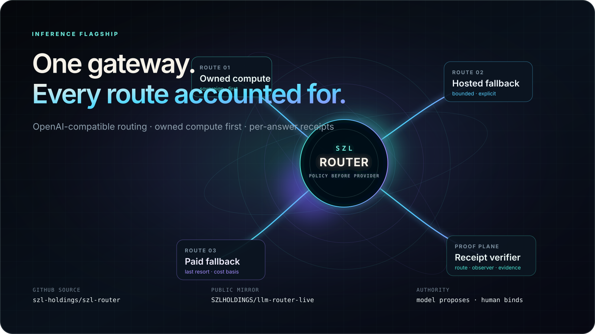

<!-- markdownlint-disable MD013 MD033 MD041 -->

# SZL Holdings

**Control before action. Evidence after.**

[**Product**](https://a-11-oy.com) ·
[**Router**](https://huggingface.co/spaces/SZLHOLDINGS/llm-router-live) ·
[**Proof**](https://a11oy.net) ·
[**GitHub**](https://github.com/szl-holdings) ·
[**Hugging Face**](https://huggingface.co/SZLHOLDINGS)

## Governed loop

**Signal** → **reason** → **policy** → **bounded action** → **receipt** → **verification**.

## Inference flagship

  

**SZL Router** is the source-owned OpenAI-compatible gateway: owned compute first, explicitly configured fallback second, with provenance and a receipt for every routed answer.

[**Space**](https://huggingface.co/spaces/SZLHOLDINGS/llm-router-live) ·
[**Source**](https://github.com/szl-holdings/szl-router) ·
[**A11oy view**](https://a-11-oy.com/code) ·
[**Proof**](https://a11oy.net)

A routing score is advisory. A receipt proves scoped integrity and provenance. Human and deployment policy bind consequential action.

## Estate map

Three commercial flagships: **A11oy, Killinchu, Forge**.

One inference flagship: **SZL Router**.

Five public domain bodies: **Terra, Killinchu, PRISM Counsel, PURIQ Finance, LYTE**.

Six internal engines: **Sentra, Lyte, Killinchu, Finance, Terra, Counsel**.

**17 public Spaces, 45 models, 34 datasets.** Portfolio authority is narrower: **16 portfolio Spaces** plus **1 inventory-only Space**, Yarqa, with `governedKeep=false` and disposition `FOLD`.

Hub inventory is registry-only—not availability, operational readiness, or publication policy. KEEP authority: [`docs/CANONICAL_FLEET.md`](https://github.com/szl-holdings/.github/blob/main/docs/CANONICAL_FLEET.md).

## Current state

- Provider routes are available only when explicitly configured.
- Killinchu public actuation is **SIMULATED** unless separately authorized.
- [`SZLHOLDINGS/SZLHOLDINGS`](https://huggingface.co/datasets/SZLHOLDINGS/SZLHOLDINGS) is **HISTORICAL**.
- Λ uniqueness remains **Conjecture 1 OPEN**.
- Estate is **not READY**; HTTP 200 is not a production certificate.

[Security](https://github.com/szl-holdings/.github/security/policy) · [Trust boundary](https://github.com/szl-holdings/.github/blob/main/TRUST.md)
