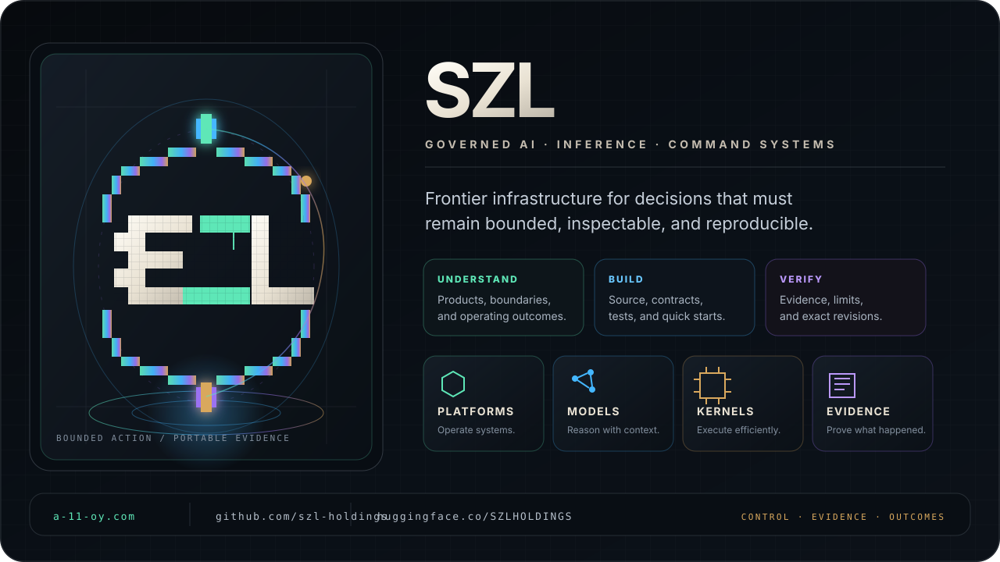

<!-- markdownlint-disable MD013 MD033 MD041 -->

<div align="center">



# Governed decision infrastructure

SZL Holdings builds systems that can reason, act within authority, and return
evidence that another party can verify.

[**Open a11oy**](https://a-11-oy.com) ·
[**Inspect evidence**](https://a11oy.net) ·
[**Build with SZL**](https://holdings.a-11-oy.com/docs-site/) ·
[**Models and data**](https://huggingface.co/SZLHOLDINGS)

</div>

---

## The category

AI capability is moving faster than institutional control. SZL closes the gap
between a model recommendation and an authorized real-world action.

```text
signal → reason → policy → bounded action → receipt → independent verification
                     ↑                                      │
                     └──────────── verified feedback ───────┘
```

The result is a governed loop: the system must identify its authority, preserve
its evidence boundary, and leave a portable record of what happened.

## Two products, one substrate

| Product | Mission | Enter | Verify |
| --- | --- | --- | --- |
| **a11oy** | Governed inference and agentic execution for regulated operations | [Product](https://a-11-oy.com) · [Source](https://github.com/szl-holdings/a11oy) | [Proof registry](https://a11oy.net) |
| **Killinchu** | Counter-UAS and maritime command demonstration for operators | [Demonstration](https://szlholdings-killinchu.hf.space/elite) · [Source](https://github.com/szl-holdings/killinchu) | [Evidence routes](https://a-11-oy.com/trust) |

Both products use the same control and evidence primitives. The experiences are
different because the operators, workflows, and consequences are different.

## The system

| Layer | What it contributes | Canonical entry point |
| --- | --- | --- |
| **Command** | Operator workflows, policy gates, bounded tools, and explicit refusal | [a11oy](https://github.com/szl-holdings/a11oy) |
| **Evidence** | Signed receipts, replay, provenance, and independent verification | [Receipt specification](https://github.com/szl-holdings/governed-receipt-spec) · [szl-lake](https://github.com/szl-holdings/szl-lake) |
| **Runtime** | Sovereign routing, model serving, kernels, telemetry, and failure isolation | [Platform](https://github.com/szl-holdings/platform) · [Substrate](https://github.com/szl-holdings/szl-substrate) |
| **Formal methods** | Lean sources and formula admission with explicit theorem boundaries | [lutar-lean](https://github.com/szl-holdings/lutar-lean) · [Formula ledger](https://github.com/szl-holdings/szl-formula-ledger) |
| **Models and data** | Qualified model families, datasets, evaluations, and demonstrations | [SZLHOLDINGS on Hugging Face](https://huggingface.co/SZLHOLDINGS) · [Forge](https://github.com/szl-holdings/szl-forge) |

## Start with the evidence

| If you are evaluating… | Open this first |
| --- | --- |
| Product behavior | [a11oy command system](https://a-11-oy.com/console) |
| Runtime availability | [A11oy readiness](https://a-11-oy.com/api/a11oy/v1/readiness) |
| Decision integrity | [Offline receipt verifier](https://a-11-oy.com/verify) |
| Public proof artifacts | [a11oy.net](https://a11oy.net) |
| Model and dataset lineage | [Hugging Face portfolio](https://huggingface.co/SZLHOLDINGS) |
| Architecture and integration | [Documentation](https://holdings.a-11-oy.com/docs-site/) |
| Research lineage | [Papers](https://github.com/szl-holdings/szl-papers) |

Reachability is not capability. A signed receipt proves integrity and origin
within its stated scope; it does not automatically prove accuracy, safety,
performance, compliance, or authorization to deploy.

## Builder path

1. Read the [architecture boundary](https://github.com/szl-holdings/a11oy/blob/main/docs/architecture.md).
2. Emit or verify a receipt with
   [`szl-receipt`](https://github.com/szl-holdings/szl-receipt).
3. Add governed tools through
   [Hatun MCP](https://github.com/szl-holdings/hatun-mcp).
4. Inspect shared runtime packages in
   [`szl-substrate`](https://github.com/szl-holdings/szl-substrate).
5. Reproduce a complete path from the
   [documentation hub](https://holdings.a-11-oy.com/docs-site/).

The organization-wide public contract is defined in the
[SZL public experience standard](https://github.com/szl-holdings/.github/blob/main/docs/PUBLIC_EXPERIENCE_STANDARD.md).
Repository lifecycle and canonical successors are recorded in the
[estate lifecycle map](https://github.com/szl-holdings/.github/blob/main/docs/ESTATE_LIFECYCLE.md).

## Evidence language

Every public claim uses a named class. Operational state remains separate.

| Evidence class | Meaning |
| --- | --- |
| **PROVED** | Machine-checked statement with exact theorem or artifact scope |
| **MEASURED** | Direct observation with instrument, time, and context |
| **REPORTED** | Identified upstream statement, not independently measured here |
| **MODELED** | Simulation, projection, or analytical derivation |
| **CONJECTURE** | Open hypothesis; never rendered as proved |
| **ROADMAP** | Planned work with no operational claim |

Operational states are **OPERATIONAL**, **PARTIAL**, **DEGRADED**,
**UNAVAILABLE**, and **HISTORICAL**.

At canonical Lean revision
[`675d62b`](https://github.com/szl-holdings/lutar-lean/blob/675d62bd6f035047283fd3798440edad049635c2/README.md#tier-1--locked-proven-sorry-free-count-machine-enforced),
the corpus machine-enforces exactly eight locked-proven formulas. Lambda
uniqueness remains **Conjecture 1**, not a theorem.

## Trust, support, and diligence

- [Security policy](https://github.com/szl-holdings/.github/security/policy)
- [Trust posture](https://github.com/szl-holdings/.github/blob/main/TRUST.md)
- [Privacy](https://github.com/szl-holdings/.github/blob/main/PRIVACY.md)
- [Support](https://github.com/szl-holdings/.github/blob/main/SUPPORT.md)
- [Contributing](https://github.com/szl-holdings/.github/blob/main/CONTRIBUTING.md)

No production authorization, regulatory approval, universal safety guarantee,
or investment outcome is claimed by this organization profile.

---

<div align="center">

**Govern · execute · prove**

[a-11-oy.com](https://a-11-oy.com) ·
[a11oy.net](https://a11oy.net) ·
[Documentation](https://holdings.a-11-oy.com/docs-site/) ·
[Hugging Face](https://huggingface.co/SZLHOLDINGS)

</div>
