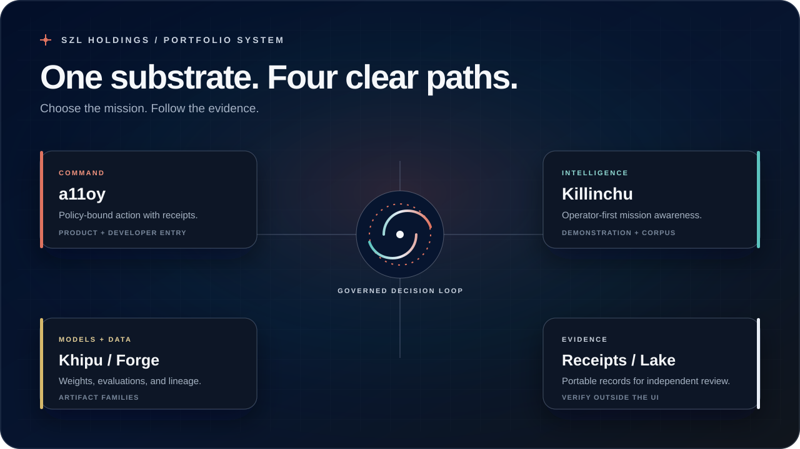

<!-- markdownlint-disable MD013 MD033 MD041 -->

# Governed decision infrastructure

**Control before action. Evidence after.**

Systems that reason, act inside declared authority, and return evidence another
party can verify.

[**Evaluate SZL**](#investor-path) ·
[**Build with SZL**](#builder-path) ·
[**Inspect artifacts**](https://huggingface.co/SZLHOLDINGS) ·
[**Check current state**](#current-state)

---

## One governed loop

**Signal** → **reason** → **policy** → **bounded action** → **receipt** →
**independent verification**.

The model proposes. The controller validates authority and evidence. The
runtime stays inside the bound. The receipt makes the result portable.

## Four ways in

### 01 / Command

[**a11oy**](https://a-11-oy.com) is governed inference and agentic execution
for regulated workflows. [Open source](https://github.com/szl-holdings/a11oy)
or [inspect evidence](https://a11oy.net).

### 02 / Intelligence

[**Killinchu**](https://szlholdings-killinchu.hf.space/elite) is a public
observation, fusion, and operator-decision surface. Detection, classification,
and the governed-decision layer are LIVE. Physical effector engagement is
operator-owned, not exercised here. It does not command a live
weapon or establish production authorization. [Open source](https://github.com/szl-holdings/killinchu).

### 03 / Models + data

Weights, software, surrogates, datasets, and Spaces are separate artifact
classes. Type, downloads, and reachability do not establish quality or
readiness. [Inspect the portfolio](https://huggingface.co/SZLHOLDINGS).

### 04 / Evidence

Receipts, provenance, evaluation, and formal sources make claims inspectable.
[Verify a receipt](https://a-11-oy.com/verify) or follow the
[research lineage](https://github.com/szl-holdings/szl-papers).

## Five verticals

**REPORTED**; never adoption or revenue. [a11oy.net](https://a11oy.net).

- Inference: [a11oy](https://github.com/szl-holdings/a11oy)
- Defense: [killinchu](https://github.com/szl-holdings/killinchu); decision layer LIVE; effector engagement operator-owned
- Insurance: [David Leads](https://github.com/szl-holdings/david-leads)
- Finance: [szl-quant](https://github.com/szl-holdings/szl-quant); paper-only, not financial advice
- Real estate: **ROADMAP**; no surface yet

## Investor path

[Company front door](https://huggingface.co/spaces/SZLHOLDINGS/README) ·
[Evidence registry](https://a11oy.net) ·
[Security](https://github.com/szl-holdings/.github/security/policy) ·
[Trust](https://github.com/szl-holdings/.github/blob/main/TRUST.md) ·
[Support](https://github.com/szl-holdings/.github/blob/main/SUPPORT.md)

This profile does not claim production authorization, regulatory approval,
universal safety, customer adoption, or an investment outcome.

## Builder path

[Documentation](https://holdings.a-11-oy.com/docs-site/) ·
[a11oy source](https://github.com/szl-holdings/a11oy) ·
[Receipt tooling](https://github.com/szl-holdings/szl-receipt) ·
[Hatun MCP](https://github.com/szl-holdings/hatun-mcp) ·
[Runtime substrate](https://github.com/szl-holdings/szl-substrate)

Read each artifact's license and limits before use.
The [public experience standard](https://github.com/szl-holdings/.github/blob/main/docs/PUBLIC_EXPERIENCE_STANDARD.md)
and [estate lifecycle map](https://github.com/szl-holdings/.github/blob/main/docs/ESTATE_LIFECYCLE.md)
define the shared contract.

## Current state

- [Served org-card source](https://szlholdings-readme.static.hf.space/deployment.json)
- [a11oy readiness](https://a-11-oy.com/api/a11oy/v1/readiness)
- [Killinchu build identity](https://szlholdings-killinchu.hf.space/api/build-info)
- [Killinchu public-risk status](https://szlholdings-killinchu.hf.space/api/public-risk-status)
- [Killinchu readiness](https://szlholdings-killinchu.hf.space/api/killinchu/readyz)

The dataset [`SZLHOLDINGS/SZLHOLDINGS`](https://huggingface.co/datasets/SZLHOLDINGS/SZLHOLDINGS)
is a **HISTORICAL** mirror, not a current card or runtime source.

## Truth language

Claims use **PROVED**, **MEASURED**, **REPORTED**, **MODELED**,
**CONJECTURE**, or **ROADMAP**. Runtime state is separate:
**OPERATIONAL**, **PARTIAL**, **DEGRADED**, **UNAVAILABLE**, or
**HISTORICAL**. Lambda uniqueness remains **Conjecture 1**, not a theorem.

A signature establishes integrity and origin within scope—not accuracy,
safety, performance, compliance, or authorization to deploy.

---

**Govern · execute · prove**

[a-11-oy.com](https://a-11-oy.com) ·
[a11oy.net](https://a11oy.net) ·
[Documentation](https://holdings.a-11-oy.com/docs-site/) ·
[GitHub](https://github.com/szl-holdings) ·
[Hugging Face](https://huggingface.co/SZLHOLDINGS)

