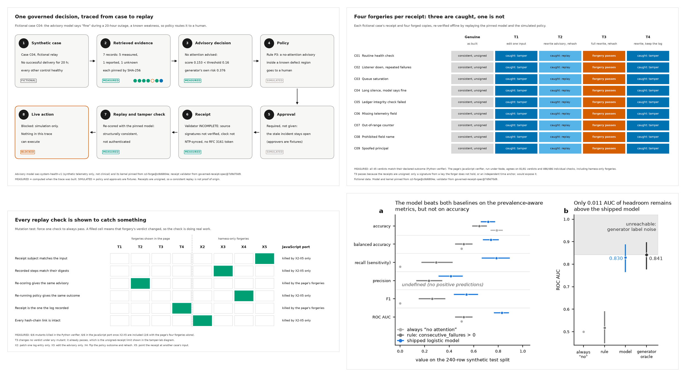

# Governed intelligence. Checkable results.

SZL builds AI software, models, and research tools with source-linked evidence.

[**Explore A11oy →**](https://huggingface.co/spaces/SZLHOLDINGS/a11oy) · [**Build with the source →**](https://github.com/szl-holdings)

## Repeat a public calculation

[Repeat a public calculation](https://github.com/szl-holdings/governed-receipt-spec/tree/320983d22e76fc9b26af0b2cd20799c5000543fc/examples/public-single-cell) — input → code → result → limits

Receipt unsigned; no biological claim.

## Choose a path

- **Explore:** [Command Lab](https://huggingface.co/spaces/SZLHOLDINGS/szl-command-lab) — portfolio.
- **Use:** [A11oy](https://a-11-oy.com) — tools with live capability state.
- **Build:** [models, kernels, datasets, Spaces](https://huggingface.co/SZLHOLDINGS) · [PyPI packages](https://pypi.org/user/betterwithage/).
- **Verify:** [a11oy.net](https://a11oy.net) — records, limits, [evidence diagrams](https://a11oy.net/diagrams/).

## What we build

**A11oy** governs workflows; **[SZL Router](https://github.com/szl-holdings/szl-router)** routes models via [A11oy Code](https://a-11-oy.com/code) ([status](https://huggingface.co/spaces/SZLHOLDINGS/llm-router-live)). **Killinchu** observes with **SIMULATED** effectors; **Forge** hosts research.

## The flagship estate

- **A11oy** — governed runtime, x402 APIs
- **Living Anatomy** — the anatomy engine · [Space](https://szlholdings-anatomy.hf.space)
- **Second Brain** — the memory plane · [Space](https://huggingface.co/spaces/SZLHOLDINGS/szl-second-brain)
- **hatun-mcp** — production MCP · [repo](https://github.com/szl-holdings/hatun-mcp)
- **killinchu** — counter-UAS · [killinchu.a-11-oy.com](https://killinchu.a-11-oy.com)

## Pushing the frontier

[Ring-0 receipts](https://huggingface.co/datasets/SZLHOLDINGS/frontier-54-runs) · [x402-metered inference](https://inference.a-11-oy.com) · [Estate math](https://github.com/szl-holdings/lutar-lean).
- **khipu-x1** → [PyPI v0.1.1](https://pypi.org/project/khipu-x1/) → [source](https://github.com/szl-holdings/khipu-x1) → governed LLM accelerator reference, trusted-publisher releases.
- **Ouroboros ring receipts** → [mesh/ring/ouro](https://huggingface.co/datasets/SZLHOLDINGS/frontier-54-runs/tree/main/mesh/ring/ouro) → chained self-training lap receipts, honest SERVE/LEARN NOT_RUN boundaries.

### Measured live gateway

**Observed 2026-11-17T19:29Z** (authorized operations path):

- [Health](https://inference.a-11-oy.com/health) → **HTTP 200**, status `ok`
- [Model registry](https://inference.a-11-oy.com/v1/models) → **HTTP 200**, model `ternary-bonsai-2-27b-pq2_0`
- [Web UI](https://inference.a-11-oy.com/) → **HTTP 200**
- Unpaid `POST /v1/chat/completions` → **HTTP 402**, x402 v2 payment challenge on Base/USDC for $0.02

Scope: reachability only; not quality, SLA, paid latency, or paid receipts.

## Measured: the confabulation floor

Receipts: [battery](https://huggingface.co/datasets/SZLHOLDINGS/model-eval-receipts) · [P8](https://doi.org/10.5281/zenodo.24043620) · [P9](https://doi.org/10.5281/zenodo.24043622).

- Estate students 0.8B–4B: 0–2/6 FAIL · Qwen3-8B/14B: 1/6 FAIL
- Copy-constrained decoding: 21.9% capture — 16× the floor

## Current state

<!-- szl:public-inventory:start -->
The source-bound public inventory records **22 public Spaces, 121 model repositories, 14 native kernels, 69 datasets** at **2026-11-15T03:48:57Z** under `hf-public-author-membership/v2`. This is a dated observation, not a live count. Native kernel IDs may also appear in the model namespace; these figures do not count unique projects or trained language models. [Inventory binding](https://github.com/szl-holdings/.github/blob/main/profile/public-inventory.json) · [Exact source](https://github.com/szl-holdings/a11oy/blob/177fc4d95ed45ad88e3c7f1db09ea8b76763e82a/docs/huggingface-ecosystem-manifest.json) · [Current Hub listing](https://huggingface.co/SZLHOLDINGS). Hub inventory is registry evidence, not availability, operational readiness, or publication policy. It does not establish model quality.
<!-- szl:public-inventory:end -->

**HISTORICAL (not current):** three commercial flagships (A11oy, Killinchu, Forge), one inference flagship (SZL Router), six internal engines, five public domain bodies (Terra; PRISM Counsel; PURIQ Finance; LYTE); previous registry: 16 portfolio Spaces, 1 inventory-only Space, 45 models, 34 datasets. Registry does not establish availability, operational readiness, or publication policy.

